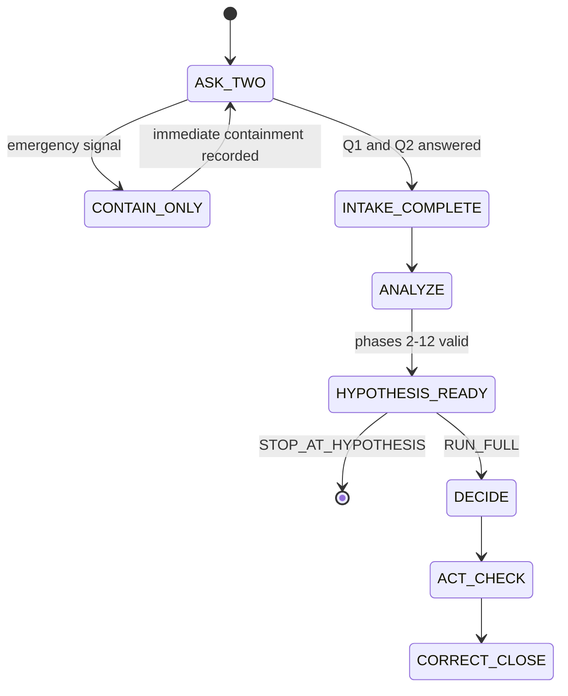
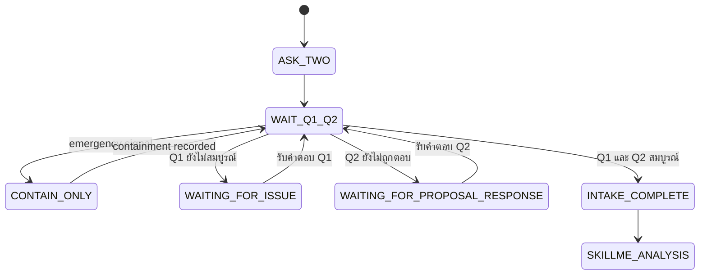
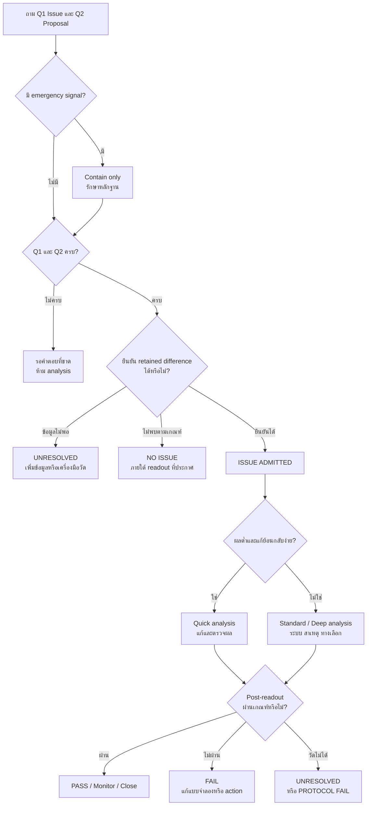

# SkillMe
## ปรัชญาการวิเคราะห์ประเด็นสากลบนฐาน Readout Genesis และ Information Discrete Mathematics

**Document ID:** `SKILLME-CORE`  
**Version:** `0.4.10`  
**Status:** `STANDALONE_REFERENCE_SPECIFICATION_WITH_EXECUTABLE_PROTOCOL_KERNEL`  
**Authorial lineage:** Yaoharee Lahtee — Readout Genesis → Information Discrete Mathematics → SkillMe  
**Intended use:** human reasoning, AI reasoning, organizational analysis, policy analysis, research, software incidents, social issues, and everyday decisions  
**Claim boundary:** เอกสารนี้เป็นการสังเคราะห์เชิงปรัชญาและสถาปัตยกรรมระดับ `Dr` จนกว่านิยามใหม่แต่ละส่วนจะมีตัวพิสูจน์ โปรแกรมทดสอบ หลักฐานภาคสนาม และการตรวจสอบอิสระของตนเอง คำว่า `Universal` หมายถึงภาษากลางและ protocol ที่เปิดรับ domain adapters ไม่ได้หมายความว่าระบบบรรจุความรู้ทั้งหมดของโลกหรือรับประกันคำตอบถูกต้องในทุกกรณี

---

## 0. Standalone use and normative authority

เอกสารนี้เป็น specification ที่อ่านและใช้งานได้โดยไม่ต้องอ่านรุ่นก่อนหรือบทสนทนาที่สร้างมันขึ้นมา ส่วน executable companion คือ `skillme_protocol_kernel.py` ซึ่งใช้ Python standard library เท่านั้น มี schema checks, state transitions, emergency-containment bypass, hypothesis-evidence challenge, resumable hypothesis checkpoint, protocol verdicts และ end-to-end fixtures อยู่ในไฟล์เดียว

ลำดับอำนาจเมื่อข้อความหลายส่วนดูเหมือนขัดกัน:

1. `Protocol invariants` ใน §11
2. `Canonical 20-phase workflow` ใน §6.14
3. machine-readable contract ใน §10
4. glossary, enum registry และ transition rules ใน §3.1–§3.2 และ §6.15
5. ตารางหรือ workflow อื่นทั้งหมด ซึ่งเป็น **views, checklists หรือ adapter projections** ของ canonical workflow ไม่ใช่ protocol อิสระ

กฎการตีความ:

- คำว่า `MUST`, `REQUIRED`, `BLOCK`, `PROTOCOL_FAIL` และ “ต้อง/ห้าม” เป็น normative
- ตัวอย่าง สูตรให้คะแนน และ adapter recommendations เป็น informative จนกว่าจะถูก freeze ใน run
- runtime ตรวจ **ความสมบูรณ์และความสอดคล้องของ protocol** ไม่รับรองว่าความรู้ domain, causal claim หรือ candidate ที่ป้อนเข้ามาเป็นจริง
- `[SimulatedData]` ใช้เฉพาะ fixture หรือ benchmark สังเคราะห์ ห้ามรายงานเป็น field evidence
- หากเอกสารกับ runtime ไม่ตรงกัน ให้หยุดที่ `SPEC_RUNTIME_DRIFT` และเปิด correction record

**2026-08-01 known drift (documented, not yet reconciled inline in this narrative
spec):** `skillme_protocol_kernel.py`'s `validate()` gained two runtime-only extensions
that this document's inline schema fragments (e.g. §ที่มี `authority_assumptions:
[REQUIRED_NONEMPTY]` และ `review_mode: SYSTEMATIC_RAPID_SCOPING_TARGETED`) do not
yet reflect — per the drift rule above, the **runtime is authoritative**:
1. `hypothesis_evidence_challenge.review_mode` accepts a new value
   `"INTERNAL_DATA_AUDIT"` (alongside the existing `TARGETED_SEARCH`/etc.), which
   swaps each `citation_cards[*]` entry's required fields from the
   literature-citation vocabulary to an internal-system-of-record vocabulary
   (`source_system`, `query_or_filter`, `record_id_or_url`) — all other rigor is
   unchanged.
2. `hypothesis_portfolio.hypothesis_cards[*].authority_assumptions` may be an
   empty list, but only when that same card has `legal_relevance: "NONE"` AND
   `legal_status: "NOT_REQUIRED"` — otherwise `REQUIRED_NONEMPTY` still applies
   exactly as written throughout this document.

**For the current, generated (never hand-edited, always in sync with the
kernel's actual `ENUMS`/`LANES`/`*_REQUIRED` constants) field list, see
`docs/FIELD_REFERENCE.md`** (regenerate via `tools/generate_field_reference.py`
after any kernel schema change). Treat this narrative document's inline schema
fragments as an architectural walkthrough, not the field-by-field source of
truth for validator behavior.

### 0.1 Claim-preserving continuation contract

SkillMe v0.4.6 **ไม่ลด** canonical workflow, claim boundary หรือความสามารถของ phases 13–19 แต่เพิ่มจุดหยุดที่ตรวจด้วยเครื่องได้หลัง Phase 12:

```yaml
run_control:
  continuation_policy:
    one_of:
      - STOP_AT_HYPOTHESIS
      - RUN_FULL
  requested_by: REQUIRED
  continuation_record: REQUIRED
```

- `STOP_AT_HYPOTHESIS` สร้าง `HYPOTHESIS_PORTFOLIO_READY` แล้วหยุดโดยไม่สร้าง decision, intervention หรือ field-truth claim
- `RUN_FULL` ใช้ artifact และ lineage ชุดเดียวกันเดินต่อ Phase 13–19
- การหยุดไม่ใช่ closure, success หรือการยกเลิก workflow; เป็น resumable checkpoint
- การเดินต่อห้ามสร้าง issue, proposal, hypothesis หรือ evidence ledger ชุดใหม่โดยเงียบ ต้องอ้าง `continuation_record` เดิมและบันทึก correction หากข้อมูลเปลี่ยน

## 1. Thesis

> **Issue ไม่ใช่สิ่งที่วางอยู่ในโลกอย่างมีชื่อสำเร็จรูป และไม่ใช่เพียงความรู้สึกของผู้สังเกต แต่คือความแตกต่างที่ถูกรักษาไว้ ซึ่งภายใต้บริบท คำถาม และขอบเขตหนึ่ง มีผลต่อความสามารถของ agency ในการคงอยู่ กระทำ รู้ อ้างสิทธิ์ รับผิดชอบ หรือเปลี่ยนเส้นทางของระบบ**

สิ่งหนึ่งจะยังไม่เป็น issue เพียงเพราะ “มันแตกต่าง” ความแตกต่างนั้นต้องผ่านอย่างน้อยห้าส่วน:

1. มีความแตกต่างที่ถูกรักษาไว้จริง
2. มีระบบหรือ agency ที่สามารถรับหรือได้รับผลจากความแตกต่างนั้น
3. มีบริบทและขอบเขตที่ประกาศ
4. มีคำถาม เกณฑ์ คุณค่า เป้าหมาย หรือสิทธิที่ทำให้ความแตกต่างนั้นเกี่ยวข้อง
5. มี readout ที่แยกได้ว่า issue ถูกยืนยัน ไม่พบภายใต้เกณฑ์ ยังตัดสินไม่ได้ หรือ protocol ใช้ไม่ได้

ดังนั้น SkillMe ไม่เริ่มจากคำว่า “ปัญหาคืออะไร” แต่เริ่มจากคำถามว่า:

> **ความแตกต่างใดถูกเก็บไว้ ใครหรืออะไรสามารถอ่านหรือได้รับผลจากมัน ภายใต้บริบทใด และเรามีสิทธิ์กล่าวอ้างได้ไกลเพียงใด**

---

## 2. Philosophical position

SkillMe เป็นปรัชญาแบบ:

- **discrete-first:** เริ่มจากเหตุการณ์ บันทึก ขั้นตอน และความแตกต่างที่มีขอบเขต
- **readout-first:** สิ่งที่รายงานได้ต้องผ่าน operator และเกณฑ์การอ่านที่ประกาศ
- **relational but not arbitrary:** issue สัมพันธ์กับ agency และบริบท แต่ยังต้องตอบต่อแรงต้าน หลักฐาน และผลของโลก
- **fallibilist:** คำตอบแก้ไข ลดระดับ หรือถอนได้
- **anti-authoritarian epistemically:** ตำแหน่งหรือสถาบันไม่แทนหลักฐานและ inference
- **rights-aware:** สิทธิ คุณค่า และอำนาจต้องประกาศ ไม่ซ่อนเป็นข้อเท็จจริง
- **intervention-accountable:** การวิเคราะห์ไม่จบที่คำอธิบาย แต่ต้องติดตามผลและผลข้างเคียงของการกระทำ

SkillMe ไม่ยืนยันว่าโลกโดยตัวมันเองเป็น discrete ทั้งหมด และไม่ยืนยันว่า continuum ไม่มีอยู่ ข้อผูกพันขั้นต่ำมีเพียงว่า การวัด การคำนวณ การสื่อสาร และการตัดสินใจจริงทุกครั้งมาถึงเราเป็น finite readout

**คำเตือนเรื่อง false precision เมื่อ reader คือประสาทสัมผัสมนุษย์ (เพิ่ม 2026-08-01, พบจาก 10-domain fit test):** คำว่า "retained difference" (\(\delta_R\)) ฟังดูเหมือนสัญญาว่าเป็นปริมาณที่วัดได้แม่นยำ ซึ่งจริงเมื่อ reader \(R\) คือเซนเซอร์หรือ log — แต่เมื่อ \(R\) คือประสาทสัมผัส/สุนทรียะของมนุษย์ (หูของ conductor ที่ฟัง ensemble, ลิ้นของพ่อครัวที่ชิม, สายตาของโค้ชที่ดู form) ตัว \(\delta_R\) เองก็ยังเป็น readout ที่ถูกต้องตามนิยาม (มีขอบเขต จำกัด ประกาศได้) แต่ **reproducibility ของมันต่ำกว่าที่คำว่า "retained difference" อาจชวนให้เข้าใจ** — หูของ conductor คนเดียวกันอาจได้ readout ต่างกันข้ามคืน ผู้ใช้ (มนุษย์หรือ AI) ต้องระบุ reader/instrument ที่ใช้จริงเสมอ (ตรงตาม §3.1's \(R\) = "เครื่องอ่าน เกณฑ์ หรือกระบวนการที่แยกสถานะ") และห้ามให้คำศัพท์ทางการของ SkillMe ทำให้ readout ที่ reproducibility ต่ำดูน่าเชื่อถือกว่าที่เป็นจริง — นี่คือกฎการเขียนที่ใช้ได้ทุกครั้งที่ reader เป็นประสาทสัมผัสมนุษย์ ไม่ใช่แค่คำเตือนเฉพาะกรณีดนตรี

---

## 3. Root grammar

Readout Genesis ให้ราก — quote ตรงจาก `readout_genesis/READOUT_GENESIS_CORE.md`, **พร้อม tier tag ต่อ link ที่เคยถูกตัดออกไปในรุ่นก่อนหน้า (แก้ 2026-08-01):**

\[
\delta_R=(a\mathrel{\#}b)
\;\vdash_{[\mathrm{Th\_coqc}]}\;
L_R=D_W-W
\;\vdash_{[\mathrm{Dr}]}\;
F\ (\text{MQ.08 stepper})
\;\equiv\;
\{\,q_D : q_D\circ F=F_D^\#\circ q_D\,\}
\]

Tier tag ไม่ใช่ของตกแต่ง — เป็นส่วนที่ทำให้สมการนี้ตรง Axiom A12 (Tier Honesty, §5) ของ SkillMe เอง: link แรก (`L_R=D_W-W`) เป็น machine-checked axiom-free over ℚ ในต้นทาง (`Th_coqc`) ส่วน link ที่สอง (`F` ในฐานะ MQ.08 stepper) เป็นเพียง **declared bridge** (`Dr`) — คำกล่าวที่อ่อนกว่า ห้าม promote ให้แรงเท่ากันโดยไม่ประกาศ

สำหรับ SkillMe เราแปลรากนี้เป็น:

\[
\text{Retained Difference}
\rightarrow
\text{Relation Graph}
\rightarrow
\text{Contextual Dynamics}
\rightarrow
\text{Agency Readout}
\rightarrow
\text{Issue Verdict}
\rightarrow
\text{Intervention}
\rightarrow
\text{Corrected Readout}.
\]

Issue จึงไม่ถูกใส่เข้าไปใน root รากมีเพียงความแตกต่าง การรักษาไว้ ลำดับ ความสัมพันธ์ และ lineage ส่วนคำว่า “issue”, “risk”, “problem”, “opportunity”, “injustice” หรือ “failure” เกิดภายหลังการแปลผ่าน agency, context, values, rights และ query

**External lineage (2026-08-01 consolidation):** SkillMe ไม่ได้พัฒนา root grammar นี้อย่างโดดเดี่ยว — มี sibling repo อีก 3 ตัวในสาย Yaoharee Lahtee ที่ใช้รากเดียวกันหรือใกล้เคียงกัน และก่อนหน้านี้ SkillMe ไม่เคยเชื่อมกับสามตัวนั้นบน disk เลย ครั้งนี้ตรวจสอบและเชื่อมอย่างเป็นทางการครั้งแรก:

- **`readout_genesis`** — ต้นทางจริงของสมการข้างบนตรงๆ (quote ตรง ไม่ใช่ paraphrase) และเป็นเจ้าของระบบ tier 4 ระดับที่ SkillMe ใช้ทั่วทั้งเอกสาร: `Th_coqc` (machine-checked axiom-free เหนือ ℚ) > `finite_diagnostic` (วัด/รันจริงแบบจำกัด) > `Dr` (declared bridge / narrative ของมนุษย์) > `Open` (ยังไม่ established) นอกจากนี้ยังมี domain-registration standard ที่เป็นทางการกว่า SkillMe §6.9-6.11 มาก (ดู §6.9.1 ด้านล่าง ซึ่งดึงโครงมาใช้)
- **`research_universal_solver`** — สาย downstream ของ readout_genesis (ไม่ใช่ root เอง) ที่ประยุกต์รากนี้กับ physics/chemistry/biology จริง เป็นตัวอย่างที่แสดงว่า protocol การขึ้นทะเบียนโดเมนแบบ R0-R5 ใช้งานได้จริงกับโดเมนที่ตรวจสอบได้เข้มงวด (Th_coqc/finite_diagnostic tier)
- **`readout_universe`** ("Philosophy and Logic of Everything") — control layer คู่ขนาน 13 gates (G1-G13) ที่ผูกกับ `research_universal_solver` เป็นหลัก ไม่เคยเชื่อมกับ SkillMe มาก่อนเช่นกัน มี Lens Law/Ω_all translation loop ที่โครงสร้างคล้าย domain-mapping ของ SkillMe เอง (อ้างอิงเสริมที่ §6.9.3)
- **`information-discrete-math`** — จุดยืนเดียวกับ SkillMe §2 เป๊ะ (readout-not-ontology, ปฏิเสธ continuum เป็นสิ่งที่ "อ่านได้" ตรงๆ) แต่มี operational toolkit ที่ SkillMe เองยังไม่มี: contaminated-concept table 12 รายการและ discrete number ladder ที่ machine-checked แล้ว 194 theorem (ใช้เป็น guard ที่ §6.9.2)

**คำเตือนสำคัญที่ต้องพูดตรงๆ ณ จุดนี้ (ตอบคำถาม "ไม่เป็นการเคลมวิทยาศาสตร์"):** `readout_genesis`/`research_universal_solver` ใช้กับโดเมนที่พิสูจน์ทางคณิตศาสตร์/ฟิสิกส์ได้ถึงระดับ `Th_coqc` จริง แต่ SkillMe เองใช้กับโดเมน organizational/software/policy/everyday decision ที่ **ไม่มีทางพิสูจน์ระดับ `Th_coqc` ได้** — การดึงโครงสร้าง domain-registration มาใช้ (§6.9.1) จึงยกระดับแค่ **ความมีวินัยของกระบวนการ** (explicit quotient, explicit tier ceiling, explicit forbidden-claims) ไม่ใช่การยกระดับ evidence tier ของ SkillMe เอง ผลลัพธ์จาก domain-mapping method นี้จึงอยู่ที่ `Dr` tier เป็นอย่างสูงเสมอ และจบที่ hypothesis portfolio (phase 12, `STOP_AT_HYPOTHESIS`) เท่านั้น — ไม่ใช่ verdict, ไม่ใช่ field-confirmed truth, ไม่ใช่การเคลมทางวิทยาศาสตร์ในตัวมันเอง (ตรงตาม Invariant #46: `VALID_CHECKPOINT` ไม่ใช่ decision/intervention/field confirmation/success/closure) — แต่ใช้สร้างสมมติฐานที่มีวินัยได้ในทุกศาสตร์ เพราะ "การสร้าง hypothesis ที่มีวินัย" ไม่ต้องการ `Th_coqc` proof แต่ต้องการแค่ explicit tier + explicit falsifier + explicit quotient ซึ่งเป็นของที่ทุกโดเมนประกาศได้โดยไม่ต้องพิสูจน์ทางคณิตศาสตร์

### 3.1 Normative symbol glossary

| Symbol | Type | Meaning in this specification |
|---|---|---|
| \(R\) | reader/readout specification | เครื่องอ่าน เกณฑ์ หรือกระบวนการที่แยกสถานะ |
| \(\delta_R(x,y)\) | finite readout | ความแตกต่างระหว่าง \(x,y\) ที่ reader \(R\) รักษาไว้ |
| \(D_W\) | ordered retained record | record domain ที่มีลำดับ/ความสัมพันธ์ตาม window \(W\) |
| \(W\) | window/boundary | ช่วงข้อมูล เวลา หรือขอบเขตที่กำลังอ่าน |
| \(L_R=D_W-W\) | retained loss/difference structure | โครงสร้างความแตกต่างที่เหลือหลังเทียบ record กับขอบเขตอ้างอิง; เครื่องหมายลบไม่จำเป็นต้องเป็น arithmetic subtraction |
| \(F\) | source dynamics | การเปลี่ยนสถานะในระบบต้นทาง |
| \(q_D\) | quotient/projection | การย่อระบบต้นทางให้เหลือ distinction ที่ query ต้องใช้ |
| \(F_D^\#\) | induced target dynamics | พลวัตในระบบที่ย่อแล้ว ถ้ามีและรักษาการเปลี่ยนที่จำเป็น |
| \(q_D\circ F=F_D^\#\circ q_D\) | commutation obligation | วิเคราะห์ก่อนหรือย่อก่อนต้องให้ readout ที่จำเป็นตรงกัน มิฉะนั้นรายงาน loss/drift |
| \(A\) | agency record | ความสามารถและบทบาทของระบบ/ผู้เกี่ยวข้องภายใต้ context |
| \(C\) | context record | boundary, horizon, query, resolution, constraints, values, rights และ permissions |
| \(Q\) | query | คำถามหรือ decision ที่ run ต้องตอบ |
| \(\rho\) | resolution | ความละเอียดที่ readout แยกได้ |
| \(H\) | horizon | ช่วงเวลาที่ผลและ agency ถูกนับ |
| \(G_I\) | retained issue graph | กราฟของ events, states, claims, resources, rules, agencies และ typed relations |
| \(\Pi_A\) | agency readout operator | สิ่งที่ agency \(A\) สามารถรับรู้หรืออ่านได้ |
| \(U\) | intervention | การกระทำที่มีสิทธิและเงื่อนไขการหยุด/ย้อนกลับ |
| \(\mathcal T\) | lineage | ประวัติข้อมูล การแปล claim การแก้ไข และเวอร์ชัน |
| \(0\) | zero under declared readout | ไม่เหลือความแตกต่างที่เกี่ยวข้องภายใต้ operator ที่ประกาศ |
| \(\bot\) | unresolved/bottom | หลักฐาน เกณฑ์ เครื่องมือ หรือ resolution ยังตัดสินไม่ได้ |
| \(\kappa\) | conditioning/sensitivity bound | ขอบเขตการขยายความคลาดเคลื่อนของ computation ที่ประกาศ |
| \(u\) | arithmetic error unit | ขอบเขตความคลาดเคลื่อนของ representation/operation |
| \(\delta\) | decision margin | ระยะห่างจาก threshold ที่ verdict จะเปลี่ยน |
| \(\kappa u<\delta\) | stability certificate | เงื่อนไขพอเพียงที่ error bound ยังเล็กกว่า decision margin; ไม่ใช่กฎสากลโดยไม่มีแบบจำลอง error |

### 3.2 Canonical enums and claim tiers

ชื่อ enum เป็น case-sensitive และห้ามสร้าง alias เงียบ:

```yaml
canonical_enums:
  continuation_policy:
    - STOP_AT_HYPOTHESIS
    - RUN_FULL
  proposal_mode:
    - AUTO
    - USER_PROPOSAL_INTEGRATED
    - AI_INDEPENDENT
    - HYBRID_BLIND_COMPARE
  intake_status:
    - WAITING_FOR_ISSUE
    - WAITING_FOR_PROPOSAL_RESPONSE
    - INTAKE_COMPLETE
    - INTAKE_PROTOCOL_FAIL
  emergency_status:
    - NOT_TRIGGERED
    - CONTAINMENT_ACTIVE
    - CONTAINMENT_ENDED
    - CONTAINMENT_PROTOCOL_FAIL
  stakeholder_map_status:
    - CLOSED
    - OPEN
    - UNRESOLVED
  issue_status:
    - ISSUE_ADMITTED
    - NO_ISSUE_UNDER_DECLARED_READOUT
    - UNRESOLVED
    - PROTOCOL_FAIL
    - DRIFT
  candidate_status:
    - CANDIDATE_SET_COMPLETE
    - CANDIDATE_SET_PARTIAL_2
    - CANDIDATE_SET_PARTIAL_1
    - INFORMATION_ONLY
    - NO_ADMISSIBLE_SOLUTION
  hypothesis_portfolio_status:
    - HYPOTHESIS_PORTFOLIO_READY
    - HYPOTHESIS_PORTFOLIO_PARTIAL
    - HYPOTHESIS_PORTFOLIO_BLOCKED
  legal_relevance:
    - NONE
    - CONTEXTUAL
    - LOAD_BEARING
  legal_status:
    - NOT_REQUIRED
    - NOT_REVIEWED
    - PRELIMINARY
    - VERIFIED_FOR_DECLARED_SCOPE
    - UNRESOLVED
  hypothesis_causal_tier:
    - MECHANISM_HYPOTHESIS
    - ASSOCIATIONAL_HYPOTHESIS
    - STRUCTURAL_HYPOTHESIS
    - NORMATIVE_HYPOTHESIS
    - DESIGN_HYPOTHESIS
    - UNRESOLVED
  legitimacy_status:
    - DIRECTLY_GROUNDED
    - MIXED_GROUNDING
    - INFERRED_NOT_FIELD_CONFIRMED
    - BLOCKED_PENDING_REPRESENTATION
  proposal_relation:
    - INDEPENDENT
    - SUPPORTS_USER_PROPOSAL
    - CHALLENGES_USER_PROPOSAL
    - REFRAMES_USER_PROPOSAL
    - NOT_APPLICABLE
  evidence_challenge_status:
    - EVIDENCE_CHALLENGE_COMPLETE
    - EVIDENCE_CHALLENGE_PARTIAL
    - LOCAL_EVIDENCE_NOT_FOUND
    - CITATION_VERIFICATION_FAIL
    - SEARCH_PROTOCOL_FAIL
    - EVIDENCE_INSUFFICIENT
  evidence_balance:
    - SUPPORTS
    - LEAN_SUPPORTS
    - MIXED
    - LEAN_CHALLENGES
    - CHALLENGES
    - INSUFFICIENT
  global_certainty:
    - HIGH
    - MODERATE
    - LOW
    - VERY_LOW
    - INSUFFICIENT
  local_applicability:
    - HIGH
    - MODERATE
    - LOW
    - UNRESOLVED
    - NO_ELIGIBLE_EVIDENCE_FOUND
  transfer_status:
    - DIRECTLY_APPLICABLE_WITH_DECLARED_SCOPE
    - ADAPT_WITH_CONDITIONS
    - TRANSFER_UNCERTAIN
    - LOCALLY_INFORMATIVE_GLOBAL_MIXED
    - LOCAL_SIGNAL_REQUIRES_TEST
    - LOCALLY_CONTRADICTED
    - NOT_TRANSFERABLE
    - INSUFFICIENT_EVIDENCE
  proposal_outcome:
    - ADMITTED_AS_HYPOTHESIS
    - REFRAMED_AS_HYPOTHESIS
    - CHALLENGED_BY_HYPOTHESIS_PORTFOLIO
    - ADMITTED_AS_CANDIDATE
    - ADMITTED_AS_INFORMATION
    - MERGED_DUPLICATE
    - COMPLEMENTARY_COMPONENT
    - NEEDS_REVISION
    - BLOCKED_BY_RIGHTS
    - OUT_OF_SCOPE
    - HELD_OUT_BY_MODE
    - UNRESOLVED
    - NOT_APPLICABLE
```

`HYBRID_BLIND` เป็น alias เก่าที่ **ไม่ valid**; ต้อง migrate เป็น `HYBRID_BLIND_COMPARE` พร้อม versioned correction record

Claim tier เรียงตามชนิด warrant ไม่ใช่คะแนน prestige:

| Tier | Meaning | Allowed claim |
|---|---|---|
| `Th_coqc` | theorem checked by declared Coq environment and assumptions | เฉพาะ theorem ที่ artifact ตรวจจริง |
| `exact` | finite/exact derivation with reproducible inputs | ผลคำนวณหรือ predicate ภายใต้ inputs ที่ประกาศ |
| `finite_diagnostic` | deterministic diagnostic/benchmark over retained finite records | ผลตรวจ protocol หรือ fixture นั้น |
| `Dr` | design rationale / architectural synthesis | ข้อเสนอออกแบบที่ยังต้องทดสอบ |
| `Open` | unresolved research or field claim | คำถามหรือ claim ที่ยังยืนยันไม่ได้ |

weakest load-bearing link เป็นผู้กำหนด tier ของข้อสรุปรวม ห้ามเฉลี่ย tier ขึ้น

---

## 4. Core entities

### 4.1 Retained difference

\[
d_n=\delta_R(x_n,y_n)
\]

คือความแตกต่างระหว่างสองสถานะ เหตุการณ์ คำกล่าว เส้นทาง หรือช่วงเวลา ซึ่งระบบยังมีบันทึกหรือผลตกค้างพอให้ตรวจได้

ความแตกต่างที่ไม่ถูกเก็บไว้ไม่อาจถูกใช้เป็นหลักฐานโดยตรง แม้อาจเคยเกิดขึ้นจริงก็ตาม

### 4.2 Context

\[
C_n=(B_n,H_n,Q_n,\rho_n,\mathcal K_n,\mathcal V_n,\mathcal R_n,\mathcal P_n)
\]

โดย:

- \(B_n\): boundary — ขอบเขตระบบ
- \(H_n\): horizon — ช่วงเวลาหรือระยะผล
- \(Q_n\): query — คำถามที่ต้องตอบ
- \(\rho_n\): resolution — ความละเอียด
- \(\mathcal K_n\): constraints — ข้อจำกัด
- \(\mathcal V_n\): declared values — คุณค่าที่ประกาศ
- \(\mathcal R_n\): rights — สิทธิและข้อห้าม
- \(\mathcal P_n\): permissions — สิทธิ์เข้าถึงและกระทำ

Context ไม่ใช่ย่อหน้าเกริ่นนำ แต่เป็น operator ที่กำหนดว่าความแตกต่างใดเกี่ยวข้อง การกระทำใดทำได้ และข้อสรุปใดเกินขอบเขต

### 4.3 Agency

> **Agency คือความสามารถของระบบในการรับความแตกต่าง รักษาสถานะภายใต้ข้อจำกัด เลือกหรือปรับเส้นทาง กระทำ และแก้ไขตัวเองจากผลตอบกลับ**

Agency ไม่เท่ากับเจตจำนงเสรี ไม่จำเป็นต้องเป็นมนุษย์ และไม่เท่ากับความรับผิดชอบโดยอัตโนมัติ

\[
A_n=(S_A,\Pi_A,M_A,K_A,P_A,T_A)
\]

โดย:

- \(S_A\): retained state ของ agency
- \(\Pi_A\): reader/readout operator
- \(M_A\): memory หรือ tape
- \(K_A\): constraints และ capacity
- \(P_A\): policy หรือกฎเลือกการตอบสนอง
- \(T_A\): intervention/transport operator

Agency มีระดับ ไม่ใช่ค่า yes/no เดียว:

1. **affected agency** — ได้รับผล
2. **observing agency** — อ่านหรือบันทึกได้
3. **knowledge agency** — มีความรู้เฉพาะที่ระบบอื่นไม่มี
4. **voice agency** — สามารถเสนอ คัดค้าน หรือให้ความยินยอม
5. **decision agency** — เลือกทางได้
6. **intervention agency** — เปลี่ยนระบบได้
7. **resource agency** — ถือทรัพยากรที่ action ต้องใช้
8. **veto agency** — ระงับ action ได้ตามสิทธิหรือกติกา
9. **accountable agency** — มีหน้าที่ตอบต่อผล
10. **oversight agency** — ตรวจสอบ ทบทวน หรือบังคับใช้กติกา
11. **represented agency** — ได้รับผลแต่ไม่สามารถเข้าร่วมได้โดยตรง จึงต้องมีผู้แทนที่ประกาศฐานการเป็นตัวแทน
12. **future/latent agency** — ยังไม่ปรากฏในวงตัดสินใจปัจจุบัน แต่จะรับผลใน horizon ที่ประกาศ

บุคคลหนึ่งอาจอยู่หลายบทบาท หรือมีอำนาจตัดสินใจแต่ไม่มีสิทธิเข้าถึงข้อมูลบางชนิดก็ได้

**Stakeholder ไม่เท่ากับ agency:** stakeholder คือบุคคล กลุ่ม สถาบัน หรือระบบที่มีความสัมพันธ์เชิงผลประโยชน์ สิทธิ ความเสี่ยง ทรัพยากร หรือผลกระทบกับ issue ส่วน agency คือความสามารถที่มันมีจริงภายใต้บริบทนั้น stakeholder อาจได้รับผลแต่ไม่มีเสียง ขณะที่ actor บางรายอาจมีอำนาจสูงแต่ไม่ได้รับผลโดยตรง

### 4.4 Issue

ให้ \(d_n\) เป็น retained difference และ \(A,C,Q\) เป็น agency, context และ query

\[
\iota_n=\langle d_n,A_n,C_n,Q_n,\ell_n\rangle
\]

คือ **issue candidate** โดย \(\ell_n\) คือ lineage ของข้อมูลและการแปล

กำหนด relevance operator:

\[
\chi_{A,C,Q}(d_n)=
\begin{cases}
1,&\text{ถ้า }d_n\text{ เปลี่ยน feasible states, actions, claims, rights หรือ persistence}\\
0,&\text{ถ้าไม่เปลี่ยนภายใต้ขอบเขตที่ประกาศ}\\
\bot,&\text{ถ้า resolution หรือหลักฐานยังไม่พอตัดสิน}
\end{cases}
\]

นิยาม:

> **Issue คือ issue candidate ที่ relevance operator ไม่เป็นศูนย์ภายใต้ query และ context ที่ประกาศ และมีผลต่อ agency อย่างตรวจสอบย้อนกลับได้**

นี่เป็นนิยามเชิง operational ไม่ใช่คำประกาศว่าผู้อ่านเข้าถึงสภาวะจริงทั้งหมดของโลกแล้ว

### 4.5 Problem

Issue ไม่เท่ากับ problem

\[
\text{Problem}=
\text{Issue}
+
\text{blocked admissible state}
+
\text{declared demand for intervention}.
\]

ประเภท issue ขั้นต้น:

- `ANOMALY` — สิ่งที่อ่านได้เบี่ยงจากรูปแบบอ้างอิง
- `GAP` — สถานะปัจจุบันต่างจากสถานะที่ประกาศว่าต้องการ
- `CONFLICT` — constraints, claims, values หรือ actions เข้ากันไม่ได้
- `RISK` — มีเส้นทางอนาคตที่อาจสร้างความเสียหาย
- `OPPORTUNITY` — มีความต่างที่เปิด feasible states ใหม่
- `UNCERTAINTY` — readout ยังไม่แยกสถานะสำคัญ
- `RIGHTS_CONSTRAINT` — การกระทำหรือข้อมูลติดขอบเขตสิทธิ
- `PROTOCOL_DEVIATION` — กระบวนการไม่เป็นไปตามกติกาที่ freeze ไว้

### 4.6 Cause

Cause ไม่ใช่สิ่งเดียวกับสิ่งที่เกิดก่อน และไม่ใช่ชื่อที่สะดวกที่สุด

ใน SkillMe causal claim ต้องประกาศชนิด:

- `SEQUENCE_ONLY`
- `ASSOCIATION`
- `MECHANISM_CANDIDATE`
- `INTERVENTION_SUPPORTED`
- `COUNTERFACTUAL_SUPPORTED`
- `FORMALLY_DERIVED`

คำว่า root cause ใช้ได้ต่อเมื่อการตัดปัจจัยนั้นเปลี่ยน issue readout ภายใต้แบบจำลองและขอบเขตที่ประกาศ ไม่ใช่เพียงเพราะถาม “ทำไม” ครบหลายครั้ง

---

## 5. Axioms and guards

### SKILLME-A0 — Finite Answerability

ทุกข้อสรุปที่นำไปใช้ต้องจบลงใน finite record พร้อมขอบเขต แหล่งที่มา และสถานะ

### SKILLME-A1 — Retained-Difference Primacy

ห้ามใส่ชื่อ issue, domain หรือ cause เข้า root ก่อนมี retained difference และ lineage รองรับ

### SKILLME-A2 — Reader Relativity without Relativism

readout ขึ้นกับ reader แต่ไม่เป็นไปตามใจ reader เพราะต้องตอบต่อข้อมูล controls ผลของ intervention และแรงต้านของระบบ

### SKILLME-A3 — Context Indexing

\[
I=I(A,C,Q,\rho,H)
\]

ข้อสรุปที่ใช้ได้ในบริบท \(C\) ไม่ถูกย้ายไป \(C'\) โดยอัตโนมัติ

### SKILLME-A4 — Non-Identity

- record \(\neq\) world
- symptom \(\neq\) cause
- meaning \(\neq\) truth
- efficacy \(\neq\) truth
- authority \(\neq\) evidence
- issue \(\neq\) problem
- power \(\neq\) responsibility
- absence of readout \(\neq\) absence of state

### SKILLME-A5 — Minimal Sufficient Quotient

วิเคราะห์เฉพาะโครงสร้างที่จำเป็นต่อ query แต่ห้ามยุบความแตกต่างที่จำเป็นต่อ readout, rights, invariants หรือ intervention

\[
q_I\circ F=F_I^\#\circ q_I
\]

หาก square นี้ไม่ commute ต้องรายงาน `LOST_INFORMATION`, `CONTEXT_MISMATCH`, `INSUFFICIENT_RESOLUTION`, `TARGET_LACKS_VARIABLES`, `MISTRANSLATION` หรือ `NO_CLOSURE`

### SKILLME-A6 — Zero/Bottom Separation

\[
0\neq\bot
\]

- \(0\): ภายใต้ operator นี้ ไม่เหลือความแตกต่างที่เกี่ยวข้องกับ query
- \(\bot\): เครื่องมือ หลักฐาน หรือ resolution ยังตัดสินไม่ได้

ดังนั้น “ไม่พบปัญหา” ห้ามใช้แทน “ยังตรวจไม่พบ” และ zero readout ห้ามถูกขยายเป็นคำกล่าวว่าไม่มีความแตกต่างอยู่จริงทั้งหมด

### SKILLME-A7 — Agency Separation

ผู้ได้รับผล ผู้สังเกต ผู้ตัดสินใจ ผู้ลงมือ และผู้รับผิดชอบต้องไม่ถูกสมมติว่าเป็นคนเดียวกัน

### SKILLME-A8 — Rights and Values Declaration

ข้อห้าม สิทธิ คุณค่า และเป้าหมายเป็น inputs เชิง normative ที่ต้องประกาศ ห้ามปลอมเป็น empirical fact

### SKILLME-A9 — Decision-Boundary Exactness

เมื่อผลอยู่ใกล้เกณฑ์ตัดสิน มี cancellation, near-singularity หรือ exact predicate ให้ใช้ exact rational, interval หรือ certified fallback

\[
\kappa u<\delta
\]

เป็นเขตที่ float อาจปลอดภัยต่อ decision; เมื่อเงื่อนไขนี้ไม่ผ่าน ห้ามให้ความเร็วแทนความถูกต้องของ verdict

### SKILLME-A10 — Maker–Checker Firewall

ผู้สร้างแบบจำลองต้อง freeze คำถาม เกณฑ์ แบบจำลอง และ prediction ก่อน checker เปิดผล holdout หรือ outcome ที่ใช้ตัดสิน

### SKILLME-A11 — Correction Is Reliability

ระบบที่ถอน ลดระดับ หรือแก้ claim พร้อมรักษา lineage ได้ มีความน่าเชื่อถือมากกว่าระบบที่รักษาคำตอบเดิมด้วยการซ่อนข้อผิดพลาด

### SKILLME-A12 — Tier Honesty

ทุก claim ต้องอยู่ที่ tier ของ weakest load-bearing link:

- `Th_coqc`
- `exact`
- `finite_diagnostic`
- `Dr`
- `Open`

---

## 6. Philosophy-First Domain Translation System

### 6.1 หลักสถาปัตยกรรม

SkillMe ต้องทำงานแบบสองภาษาโดยผู้ใช้ไม่จำเป็นต้องรู้ศัพท์ภายใน:

\[
\boxed{
\text{ภาษาผู้ใช้}
\xrightarrow{\tau_{\mathrm{in}}}
\text{SkillMe canonical issue}
\xrightarrow{\mathcal A_D}
\text{domain analysis}
\xrightarrow{\tau_{\mathrm{out}}}
\text{คำตอบในภาษาผู้ใช้}
}
\]

- \(\tau_{\mathrm{in}}\): แปลคำแจ้งเข้า retained difference, context, agency, rights, evidence และ query
- \(\mathcal A_D\): ชุด adapter ของ domain ที่ระบบเลือกตาม topology และงานตัดสินใจ
- \(\tau_{\mathrm{out}}\): แปลผลกลับเป็นภาษาวิชาชีพหรือภาษาธรรมดาที่ผู้ใช้ใช้จริง

ระบบต้อง **คิดผ่านปรัชญา SkillMe ก่อน** แต่ไม่ควรบังคับให้ผู้ใช้พูดว่า `retained difference`, `agency readout`, `quotient` หรือ `warrant` เว้นแต่ผู้ใช้ร้องขอระดับเทคนิค

กฎสำคัญ:

1. เก็บถ้อยคำต้นฉบับของผู้ใช้เป็น immutable raw record
2. การแปลเข้า SkillMe เป็น hypothesis ที่แก้ไขได้ ไม่ใช่ความหมายแท้เพียงหนึ่งเดียว
3. ตรวจการสูญเสียความหมายทั้งขาเข้าและขาออก
4. domain adapter เพิ่มความรู้เฉพาะทางได้ แต่เปลี่ยน root philosophy, rights หรือ evidence tier ไม่ได้
5. ผลที่แปลกลับต้องรักษา `zero`, `unresolved`, uncertainty, dissent และข้อจำกัดเดิม

### 6.2 Canonical issue representation

คำแจ้งจากทุก domain ถูก compile เป็น:

\[
\mathfrak I=
(R,D,C,Q,S,H_A,\mathcal R,\mathcal V,P,E,G,W,U,\mathcal T)
\]

โดย:

- \(R\): raw report ที่ยังไม่ตีความ
- \(D\): retained differences
- \(C\): context, boundary, horizon และ resolution
- \(Q\): คำถามและ decision ที่ต้องรองรับ
- \(S\): stakeholder/agency set
- \(H_A\): agency-role and asymmetry matrix
- \(\mathcal R\): rights, duties, permissions และ prohibitions
- \(\mathcal V\): values, objectives และ contested claims
- \(P\): power, participation และ representation structure
- \(E\): evidence, missingness และ provenance
- \(G\): retained issue graph
- \(W\): warrant และ claim tier
- \(U\): candidate interventions
- \(\mathcal T\): translation, decision และ correction lineage

ชื่อใน domain เช่น `bug`, `customer complaint`, `nonconformity`, `risk`, `policy failure`, `research anomaly` หรือ `family conflict` เป็น **domain projection** ของ \(\mathfrak I\) ไม่ใช่ root entity

### 6.3 Stakeholder–Agency discovery

ระบบห้ามเริ่มจากรายชื่อผู้เข้าประชุมเพียงอย่างเดียว เพราะรายชื่อดังกล่าวมักมองไม่เห็นผู้ได้รับผลที่ไม่มีอำนาจหรือยังไม่ปรากฏ

ให้สร้าง candidate set:

\[
S_0=
S_{\mathrm{named}}
\cup S_{\mathrm{affected}}
\cup S_{\mathrm{dependency}}
\cup S_{\mathrm{rights}}
\cup S_{\mathrm{resource}}
\cup S_{\mathrm{oversight}}
\cup S_{\mathrm{future}}
\cup S_{\mathrm{represented}}.
\]

จากนั้นทำ closure แบบมีขอบเขต:

1. **Named scan:** ใครถูกกล่าวถึงโดยตรง
2. **Impact scan:** ใครรับต้นทุน ประโยชน์ ความเสี่ยง หรือผลข้างเคียง
3. **Dependency scan:** action ต้องพึ่งข้อมูล ระบบ คน งบประมาณ หรือบริการของใคร
4. **Rights scan:** ใครมีสิทธิ ความยินยอม หน้าที่คุ้มครอง หรือสิทธิอุทธรณ์
5. **Power scan:** ใครตัดสินใจ ระงับ บังคับใช้ หรือเปลี่ยนทรัพยากรได้
6. **Knowledge scan:** ใครเห็นข้อมูลหรือมีประสบการณ์ที่คนอื่นเข้าไม่ถึง
7. **Representation scan:** ใครไม่มีเสียงและใครอ้างว่าเป็นตัวแทนของเขา
8. **Horizon scan:** ใครจะได้รับผลภายหลังหรือเมื่อระบบขยาย scale
9. **Adversarial scan:** ใครได้ประโยชน์จากการนิยาม issue แบบหนึ่ง หรือเสียประโยชน์จากอีกแบบ
10. **Boundary challenge:** มีใครถูกกันออกเพียงเพราะขอบเขตถูกวาดโดยผู้มีอำนาจหรือไม่

หยุดขยายเมื่อ agency ใหม่ไม่เปลี่ยน query, rights gate, graph, intervention หรือ readout ภายใน tolerance ที่ประกาศ หากยังเปลี่ยนได้ให้สถานะ `STAKEHOLDER_MAP_OPEN`

IAP2 วางหลักว่าผู้ได้รับผลจากการตัดสินใจควรมีโอกาสเข้าร่วม และระดับการมีส่วนร่วมต้องสัมพันธ์กับอำนาจต่อการตัดสินใจ ไม่ใช่ใช้คำว่า “มีส่วนร่วม” แบบเดียวทุกกรณี:  
https://www.iap2.org/page/pillars

OECD เสนอให้ systems framing พิจารณา impacts, feedbacks, trade-offs, emergence และ stakeholders ร่วมกัน:  
https://www.oecd.org/en/publications/2020/02/systemic-thinking-for-policy-making_a95b3226/full-report/component-24.html

### 6.4 Agency-role and asymmetry matrix

ให้แถว \(i\) เป็น stakeholder/agency และคอลัมน์ \(j\) เป็นบทบาท:

\[
H_A[i,j]\in\{0,1,\bot\}
\quad\text{หรือ}\quad
H_A[i,j]=[\underline h_{ij},\overline h_{ij}]
\]

คอลัมน์ขั้นต่ำ:

| Code | บทบาทที่ต้องตรวจ |
|---|---|
| `AFF` | ได้รับผลโดยตรงหรือโดยอ้อม |
| `OBS` | สังเกตและสร้างหลักฐานได้ |
| `KNW` | มีความรู้เฉพาะหรือประสบการณ์ตรง |
| `VOC` | มีช่องทางเสนอ คัดค้าน หรือให้ความยินยอม |
| `DEC` | ตัดสินใจได้ |
| `INT` | ลงมือเปลี่ยนระบบได้ |
| `RES` | ถือทรัพยากรสำคัญ |
| `VET` | ระงับ action ได้ |
| `ACC` | ต้องตอบต่อผล |
| `OVR` | ตรวจสอบหรือบังคับใช้ |
| `REP` | เป็นผู้แทนของ agency ที่ไม่อยู่ในวง |
| `DEP` | พึ่งพาหรือถูกพึ่งพาโดยระบบ |

\(\bot\) หมายถึงยังไม่ทราบ ห้ามแปลงเป็น \(0\)

สร้าง asymmetry indicators:

\[
\alpha_i^{\mathrm{power}}
=
h_{i,\mathrm{DEC}}+h_{i,\mathrm{INT}}+h_{i,\mathrm{VET}}+h_{i,\mathrm{RES}}
\]

\[
\alpha_i^{\mathrm{exposure}}
=
h_{i,\mathrm{AFF}}+h_{i,\mathrm{DEP}}
\]

\[
\alpha_i^{\mathrm{voicegap}}
=
\max(0,\alpha_i^{\mathrm{exposure}}-h_{i,\mathrm{VOC}}-h_{i,\mathrm{REP}})
\]

ตัวเลขเหล่านี้เป็น diagnostic readout ไม่ใช่ค่าศีลธรรมหรือเหตุผลให้เสียงของคนหนึ่งหายไป สิทธิขั้นพื้นฐานและข้อห้ามเป็น gates จึงไม่ถูกชดเชยด้วยคะแนนประโยชน์รวม

### 6.5 Multi-perspective issue prism

retained difference เดียวกันอาจปรากฏต่างกันต่อแต่ละ agency:

\[
\iota_i=\Pi_{A_i,C,Q}(D,G,E).
\]

ระบบต้องรักษา perspective vector:

\[
\mathbf I_S=(\iota_1,\iota_2,\ldots,\iota_m)
\]

ก่อนสร้าง consolidated issue \(\widehat I\) และต้องเก็บ dissent ledger เมื่อ projection ขัดกัน

ตัวอย่างเดียวกันอาจเป็น:

| Agency/domain | ภาษาปัญหาที่เห็น |
|---|---|
| ผู้ใช้ | ทำงานไม่สำเร็จหรือเสียเวลา |
| ฝ่ายปฏิบัติการ | ขั้นตอนค้างหรือ handoff ขาด |
| วิศวกร | incident, defect หรือ observability gap |
| การเงิน | reconciliation หรือ revenue exposure |
| กฎหมาย/กำกับ | compliance, consent หรือ notification duty |
| ผู้บริหาร | continuity, reputation หรือ strategic risk |

ห้ามเลือกมุมมองของผู้มีอำนาจเป็น “ภาพรวม” โดยอัตโนมัติ ภาพรวมต้องระบุว่าอะไรเห็นร่วมกัน อะไรขัดกัน และใครรับผลแต่ไม่มี readout ในระบบ

### 6.6 Invisible stakeholder guard

ระบบต้องถามหากเกี่ยวข้อง:

- ผู้ที่ได้รับผลแต่ไม่ได้อยู่ในห้องคือใคร
- ผู้ที่มีข้อมูลแต่พูดไม่ได้หรือไม่ปลอดภัยที่จะพูดมีหรือไม่
- ใครเป็นผู้แทน และผู้แทนได้รับ mandate จากไหน
- ผู้ใช้ปลายทาง ผู้ดูแลหลังบ้าน และผู้ซ่อมระบบถูกนับหรือยัง
- third party, supplier, regulator, local community หรือระบบข้างเคียงได้รับผลหรือไม่
- คนในอนาคต กลุ่มขนาดเล็ก rare cases และ non-human/ecological interests ต้องมี proxy หรือไม่
- ข้อมูลที่ไม่ถูกเก็บทำให้ agency ใด “หายไป” จากการวิเคราะห์

ถ้า action มีผลสูงแต่ไม่สามารถตรวจ affected/rights-bearing agencies ได้ ให้คืน `UNRESOLVED` หรือ `BLOCK_PENDING_REPRESENTATION` ไม่ใช่สรุปว่าไม่มี stakeholder อื่น

### 6.7 Domain detection without user burden

ผู้ใช้ควรตอบเพียงภาษาธรรมดา:

1. เกิดอะไรขึ้น
2. ปกติหรือสิ่งที่ควรเป็นคืออะไร
3. ใครได้รับผลหรือกังวลเรื่องนี้
4. ต้องตัดสินใจหรือทำอะไร
5. มีอะไรต้องหยุดหรือคุ้มครองทันที
6. มีหลักฐานอะไร และอะไรยังไม่รู้

ระบบอนุมาน `domain candidates` จากวัตถุ กริยา constraints และ decision แล้วให้คะแนน:

\[
p(D_k\mid R,C,Q)
\]

หากหลาย domain มีผลต่อคำตอบ ให้ route เป็น `HYBRID` แทนบังคับเลือกเพียงหนึ่ง domain ผู้ใช้เห็นเพียงคำแปลกลับและคำถามยืนยันที่จำเป็น เช่น “ประเด็นนี้เกี่ยวทั้งการทำงานของระบบและสิทธิของลูกค้า ใช่หรือไม่”

### 6.8 Bidirectional translation contract

ทุก translation ต้องมี record:

```yaml
translation_record:
  raw_user_expression: REQUIRED_IMMUTABLE
  inferred_domain_candidates: []
  canonical_skillme_mapping:
    retained_difference: REQUIRED
    context: REQUIRED
    query: REQUIRED
    agency_candidates: []
    rights_and_values: []
    evidence_status: REQUIRED
  domain_projection:
    domain_issue_name: REQUIRED
    domain_terms_used: []
    user_facing_statement: REQUIRED
  loss_audit:
    preserved_distinctions: []
    unresolved_terms: []
    omitted_as_irrelevant_to_query: []
    prohibited_collapses:
      - ZERO_AS_UNKNOWN
      - REPORT_AS_FACT
      - STAKEHOLDER_AS_DECISION_OWNER
      - POWER_AS_EVIDENCE
      - ASSOCIATION_AS_CAUSE
      - SIMULATION_AS_REALITY
    verdict: PASS_OR_REVISE_OR_BLOCK
```

translation ผ่านได้เมื่อ:

1. ความต่างที่จำเป็นต่อ decision ยังแยกได้
2. agency, rights และ dissent ที่มีผลไม่ถูกยุบ
3. domain term ไม่เพิ่ม causal certainty
4. สถานะ `UNRESOLVED` ยังคงเป็น `UNRESOLVED`
5. สามารถย้อนจาก domain claim ไปยัง raw record และ inference ได้

### 6.9 Universal Adapter Card

adapter ไม่ใช่เพียงชื่อเครื่องมือ แต่เป็น compiler contract:

```yaml
adapter_card:
  adapter_id: REQUIRED
  source_method_and_version: REQUIRED
  source_authority: OFFICIAL_OR_PRIMARY_OR_SECONDARY
  domain_family: REQUIRED
  purpose: REQUIRED
  accepted_topologies: []
  rejected_topologies: []
  required_inputs: []
  skillme_input_mapping: {}
  native_operations: []
  native_outputs: []
  skillme_output_mapping: {}
  stakeholder_requirements: []
  rights_constraints: []
  assumptions: []
  known_failure_modes: []
  information_preserved: []
  information_lost: []
  claim_tier_ceiling: REQUIRED
  positive_control: REQUIRED
  negative_control: REQUIRED
  stop_and_fallback: REQUIRED
  translation_tests: []
  source_links: []
  not_established: []       # 2026-08-01, §6.9.1 — what this domain mapping does NOT yet answer
  forbidden_claims: []      # 2026-08-01, §6.9.1 — sentences this mapping must never be allowed to assert
```

กฎการดูดความรู้:

- **Preserve:** รักษาความหมาย วิธีใช้ สมมติฐาน และชื่อของต้นทาง
- **Translate:** แปลง input/output เป็น canonical SkillMe โดยเปิดเผย mapping
- **Constrain:** adapter ใช้ได้เฉพาะ topology และ domain ที่ระบุ
- **Test:** ต้องมี positive/negative control หรือข้อกำหนดตรวจสอบที่เหมาะกับวิธี
- **No promotion:** adapter ห้ามยกระดับ evidence หรือ causal tier ของต้นทาง
- **No overwrite:** ข้อมูลใหม่เข้ามาเป็น versioned correction ไม่เขียนทับ lineage
- **Return defects:** หากแปลไม่ได้ต้องคืน `MISTRANSLATION`, `DOMAIN_MISMATCH`, `NO_CLOSURE` หรือ `INSUFFICIENT_INPUT`

### 6.9.1 Domain mapping method — quotient declaration + registration discipline (2026-08-01, Dr-tier only)

Adapter Card ข้างบน (§6.9) คือ compiler contract อยู่แล้ว แต่ไม่เคยประกาศตัวเองอย่างเป็นทางการว่าเป็น **quotient** — คำที่ readout_genesis/research_universal_solver ใช้เจาะจงสำหรับ "การย่อระบบต้นทางให้เหลือ distinction ที่ query ต้องใช้" (สัญลักษณ์ \(q_D\) ใน §3.1 ของ SkillMe เองอยู่แล้ว) มาตรานี้เชื่อมสองฝั่งให้ตรงกันอย่างชัดเจน โดยดึงวินัยของ **domain-registration standard** จาก `readout_genesis/domains/DOMAIN_REGISTRATION_STANDARD.md` (โครงเดียวกับที่ `research_universal_solver` ใช้ขึ้นทะเบียนโดเมน chem/relativity/quantum/biology จริง) — **ดึงมาแค่โครงวินัยของกระบวนการ ไม่ใช่ authority หรือ tier ของต้นทาง** ตามที่ประกาศไว้ใน external-lineage note ท้าย §3

ขั้นตอน map โดเมนใดๆ (organizational, software, policy, clinical, financial, ฯลฯ) เข้าสู่ root grammar ของ SkillMe:

1. **ประกาศ quotient \(q_D\)** — Adapter Card's `skillme_input_mapping`/`skillme_output_mapping` **คือ** \(q_D\) นั่นเอง เพียงแต่ต้องเขียนให้เห็นชัดว่าอะไรถูกทิ้ง (information_lost) ไม่ใช่แค่อะไรถูกเก็บ
2. **ประกาศ tier ceiling ก่อนเห็นผล** — `claim_tier_ceiling` ต้องเป็น `Dr` เสมอสำหรับโดเมนที่ไม่มี machine-checked proof (คือเกือบทุกโดเมนที่ SkillMe ใช้งานจริง) ห้ามเผื่อไว้ว่า "อาจจะเป็น Th_coqc ทีหลัง" โดยไม่มีเหตุผล — การประกาศ ceiling ต่ำแต่แรกคือสิ่งที่ทำให้ mapping นี้ "ไม่เป็นการเคลมวิทยาศาสตร์" ตรงตามที่ต้องการ
3. **ประกาศสิ่งที่ยังไม่ established** — ทุก adapter card ต้องมี field ใหม่ `not_established: []` คู่กับ `information_lost` (ยืมโครงจาก `CLAIM_BOUNDARY_<D>.json`'s `established[]`/`not_established[]`) — ระบุตรงๆ ว่าโดเมนนี้ยังตอบอะไรไม่ได้ ไม่ใช่แค่บอกว่าตอบอะไรได้
4. **ประกาศ forbidden claims** — ทุก adapter card ต้องมี field ใหม่ `forbidden_claims: []` (ยืมโครงจาก `RULE_REGISTRY_<D>.json`) ระบุประโยคเฉพาะที่ mapping นี้ **ห้าม** ให้ระบบพูด เช่น "พิสูจน์แล้วว่า X" หรือ "เป็นสาเหตุที่แท้จริงของ Y" — เขียนไว้ล่วงหน้า ไม่ใช่แก้ทีหลังตอนมีคนอ้างเกินจริง
5. **ผลลัพธ์จบที่ hypothesis เท่านั้น** — ทุก domain-mapping run ที่ผ่านขั้นตอนนี้ต้อง route เข้า Phase 9-11/§6.17-6.18 (Hypothesis Evidence Challenge → Three-Lane Candidate) และหยุดที่ `HYPOTHESIS_PORTFOLIO_READY`/`STOP_AT_HYPOTHESIS` เป็นค่าเริ่มต้น — การเดินต่อไป `RUN_FULL` เป็นทางเลือกที่ต้องขอเพิ่ม ไม่ใช่ default

ต่างจาก `research_universal_solver`'s R0-R5 ตรงที่ไม่มีขั้นตอน R3 (`DRIFT_CONTRACT` + dual-implementation checker แบบ machine-verified) เพราะ dual-implementation checking ต้องการ formal proof system ที่โดเมนแบบ organizational/policy ไม่มีให้ตรวจ — **ช่องว่างนี้เปิดเผยตรงๆ ที่นี่ ไม่ปิดบัง**: การขึ้นทะเบียนโดเมนใน SkillMe เข้มงวดน้อยกว่า physics/chemistry domains ใน readout_genesis จริง เพราะธรรมชาติของโดเมนต่างกัน ไม่ใช่เพราะ SkillMe เข้มงวดน้อยกว่าโดยเจตนา

### 6.9.2 Contaminated-concept guard (from `information-discrete-math` v1.5.1)

เมื่อ hypothesis หรือ candidate แตะแนวคิดที่มาจากคณิตศาสตร์ต่อเนื่อง (continuum) — มุม, ระยะทาง, อนุพันธ์, ศูนย์, อนันต์ — ต้องเช็คตาราง contaminated-concept นี้ก่อน เพื่อไม่ให้ non-readout (สิ่งที่ไม่มีทาง "อ่าน" ได้จริง) หลุดเข้ามาเป็น claim โดยไม่ประกาศ (ตรงกับ SkillMe §2's "ทุกครั้งมาถึงเราเป็น finite readout" — ตารางนี้คือ checklist ปฏิบัติของหลักการนั้น ไม่ใช่หลักการใหม่):

| แนวคิดที่มีปัญหา (continuum-contaminated) | ตัวแทนที่ discrete-correct |
|---|---|
| real number ℝ / completeness | ℝ = readout ของ discrete (Bishop regular Cauchy sequence ของ ℚ); เห็นได้แค่ ℚ-approximant จำกัด |
| จุด (point, r=0) | node / retained distinction (graph vertex จำกัด มี neighbour) |
| ศูนย์ในฐานะ state ที่ถูกครอบครอง | non-readout ที่ถูกปฏิเสธ หรือ kernel ของ \(L_R\) = indistinguishability (ไม่ใช่ความว่างเปล่า) |
| อนันต์ (`+∞`, `N→∞`, limit ที่ "ไปถึง") | ℚ ไม่มี `+∞`; "limit" คือการเข้าใกล้แบบจำกัด ไม่ใช่จุดปลายทาง |
| การแบ่งได้ไม่จำกัด (`h→0`) | ขั้นจำกัด / floor \(\tau_c\) ที่ machine-checked |
| มุม/องศา | overlap fraction (rational, ไม่ใช้ trig/π/ℝ) |
| continuity/"smooth" แบบ ε–δ เหนือ ℝ | discrete Lipschitz/non-expansive map |
| ระยะทาง = ผลต่างพิกัด | retained resistance สะสมตามเส้นทาง optimal (graph geodesic) |
| เส้น/continuum ในฐานะ primitive | continuum คือ readout ของ discrete graph |
| π, e, φ ในฐานะ "ตัวเลข" | readout-invariant; เห็นได้แค่ ℚ-approximant จำกัด |
| อนุพันธ์/อินทิกรัลแบบ continuum limit | discrete difference Δ + sum Σ |
| operator เหนือ continuum (เช่น \(\partial^2\)) | graph Laplacian \(L_R\) (symmetric, PSD, axiom-free) |

ตารางเต็ม + การพิสูจน์ 194 theorem อยู่ที่ `information-discrete-math/textbook/INFORMATION_DISCRETE_MATHEMATICS.md` — มาตรานี้แค่ผูก pointer ไม่ได้ copy เนื้อหาทั้งหมดมา (cite-don't-copy ตามที่ workspace นี้ใช้เป็นมาตรฐาน)

### 6.9.3 Alternate translation-loop reference (`readout_universe` Lens Law, informative only)

`readout_universe`'s Lens Law/Ω_all 8-step loop (translate → grammar-gate → locate → bridge-audit → residual-form → identifiability-gate → tagged answer → translate-back-with-falsifier) มีรูปร่างขนานกับ §6.9.1 ข้างบน แต่ผูกกับ `research_universal_solver` เป็นหลัก ไม่ใช่ SkillMe — ใส่ไว้ที่นี่เป็น **การอ้างอิงเสริมเท่านั้น** (informative, ไม่ใช่ normative) สำหรับใครที่อยากเทียบโครงสร้างสองระบบ ไม่ใช่ requirement ใหม่ของ SkillMe

### 6.9.4 Two refinements from a 10-domain fit test (2026-08-01)

หลัง §6.9.1-6.9.3 ถูก merge เข้าโครงสร้างหลัก ultracode Workflow รัน issue→hypothesis จริงข้าม 10 โดเมนใหม่ (ดาราศาสตร์, เกษตรกรรม, ดนตรี, กฎหมาย, กีฬา, ผังเมือง, นิเวศวิทยา, วิทยาศาสตร์การอาหาร, ภาษาศาสตร์, military logistics) เพื่อเช็คว่าเชื่อมกับ root grammar ได้จริงไหม (ไม่ใช่แค่โครงสร้าง) ผล: `VALID_CHECKPOINT` 10/10, `GENUINE_FIT` 9/10 — แกนกลาง (\(\delta_R\), 3-lane hypothesis, `Dr`-tier discipline) ไม่มีจุดบกพร่องเลยแม้แต่โดเมนเดียว แต่พบ pattern friction ซ้ำ 2 จุดที่ไม่ใช่ที่แกน แต่ที่ schema รอบข้าง — แก้แล้วทั้งคู่:

1. **Agency-taxonomy fields ไม่ได้บังคับทั้งหมดจริง — เอกสารแค่ไม่เคยพูดชัด** ตรวจสอบแล้วว่า kernel (`AGENCY_ROLE_EMPTY`) บังคับแค่ 5 field (`affected`, `observers`, `decision_owners`, `intervention_owners`, `accountable_parties`) ส่วนอีก 8 list-type field (`voice_holders`, `veto_or_consent_holders`, `oversight_parties`, `represented_or_absent_parties`, `resource_holders`, `knowledge_holders`, `future_or_indirect_parties`, `power_exposure_voice_gaps` — field สุดท้ายเป็น derived gap-analysis field ไม่ใช่หนึ่งใน 12 role ที่ §4.3 ตั้งชื่อไว้ ดังนั้น "5 บังคับ + 8 ไม่บังคับ" รวมเป็น 13 field เทียบกับ 12 role ไม่ใช่ตัวเลขขัดกันเอง) **ไม่เคยถูกบังคับเลย** — โดเมนที่มีผู้เกี่ยวข้องจริงแค่ 2-3 คนคุยกันตรงๆ (เกษตรกรคนเดียว, โค้ชกับนักกีฬา 1 คน, ensemble ดนตรีขนาดเล็ก) ปล่อยให้ 8 field นี้เป็น `[]` ได้เลยโดยไม่ต้อง manufacture เนื้อหา — รายละเอียดเต็มดูที่ `docs/FIELD_REFERENCE.md`'s agency section (auto-generated, ไม่ต้องแก้ตรงนี้อีกถ้า kernel เปลี่ยน)
2. **เพิ่ม `review_mode` ที่สาม: `"FIELD_OBSERVATION_LOG"`** — ต่อจาก `TARGETED_SEARCH` (literature) และ `INTERNAL_DATA_AUDIT` (internal system log) ใน §6.17/kernel's `citation_cards[*]` schema สำหรับโดเมนที่หลักฐานจริงคือ sensory/field observation ณ จุดที่สังเกต (แป้งขนมปังใต้มือพ่อครัว, ต้นไม้ที่ tag ไว้ ณ วัน census, บันทึกเซสชันของโค้ช) ไม่ใช่เอกสารอ้างอิงหรือ log ระบบ — ใช้ `observer`/`observation_method`/`observed_at`/`location_or_context` แทน field แบบวรรณกรรม/ระบบ ความเข้มงวดอื่นเหมือนเดิมทั้งหมด (falsifier, `source_classes_searched`, `citation_audit == "PASS"` ฯลฯ) รายละเอียดเต็มที่ `docs/FIELD_REFERENCE.md`

**ไม่แก้**: `Dr`-tier ceiling ของ §6.9.1 — เป็นส่วนที่ทำงานแม่นที่สุดในทั้ง 10 โดเมน แม้แต่โดเมนที่มี substrate เข้มงวดกว่าปกติ (ดาราศาสตร์: orbital mechanics ที่พิสูจน์ทางคณิตศาสตร์ได้) ก็ยังสรุปว่า claim ระดับ per-target disposition ควรอยู่ที่ `Dr` ไม่ใช่ `Th_coqc` อยู่ดี — ดูรายละเอียดที่ agent astronomy's fit_reasoning ในบันทึก session นี้

### 6.10 Open adapter registry

คำว่า “สกัดความรู้ทั้งโลก” ใช้งานได้จริงในฐานะ **registry ที่ขยายได้** ไม่ใช่การอ้างว่ารวบรวมทุกทฤษฎีแล้ว:

| Adapter family | ตัวอย่างเครื่องมือ | สิ่งที่ SkillMe รับเข้า |
|---|---|---|
| Rapid triage | Incident command, OODA-style loop | urgency, containment, owner, communication |
| Linear causal | 5 Whys, Fishbone, RCA | candidate chain, categories, counterevidence |
| Quality/prevention | PDCA, DMAIC, 8D, FMEA | defect, controls, severity, occurrence, detection |
| Process/organization | SIPOC, BPMN, value-stream map, RACI | handoff, queue, ownership, dependency |
| Stakeholder/participation | stakeholder map, power-interest, IAP2 spectrum | affected parties, voice, decision promise, legitimacy |
| Risk/safety | ISO 31000, bow-tie, HAZOP | objectives, uncertainty, threats, barriers, consequences |
| Causal inference | DAG, experiment, counterfactual analysis | estimand, assumptions, intervention evidence |
| Systems/complexity | causal-loop map, system dynamics, ABM, scenarios | feedback, delay, emergence, adaptation |
| Innovation/UX | Double Diamond, service blueprint, journey map | discovery, reframing, unmet need, co-design |
| Decision | MCDA, decision tree, real options | alternatives, criteria, trade-offs, reversibility |
| Research/science | hypothesis test, replication, sensitivity analysis | claim, method, falsifier, uncertainty |
| Software/data | SRE incident analysis, observability, data lineage | traces, metrics, logs, dependency and failure propagation |
| Legal/governance | obligation map, due process, audit | authority, rights, duties, appeal, evidence chain |
| Learning/improvement | after-action review, retrospective, PDCA | outcome readout, correction, prevention, institutional memory |

ตัวอย่างแหล่งต้นทางที่ registry ใช้อ้างอิง:

- ASQ — 8D, FMEA, Fishbone และ DMAIC:  
  https://asq.org/quality-resources/eight-disciplines-8d  
  https://asq.org/quality-resources/fmea  
  https://asq.org/quality-resources/fishbone  
  https://asq.org/quality-resources/dmaic
- Design Council — Double Diamond/Framework for Innovation:  
  https://www.designcouncil.org.uk/resources/framework-for-innovation/
- Google SRE และ OpenTelemetry — incident response, postmortem และ telemetry:  
  https://sre.google/workbook/incident-response/  
  https://sre.google/sre-book/postmortem-culture/  
  https://opentelemetry.io/docs/concepts/observability-primer/
- ISO 31000 — risk integrated with objectives, decisions, roles and continual improvement:  
  https://www.iso.org/standard/65694.html
- NIST SP 800-61 Rev. 3 — incident response across Govern, Identify, Protect, Detect, Respond และ Recover:  
  https://csrc.nist.gov/pubs/sp/800/61/r3/final
- OECD — systemic thinking, interaction, feedback, emergence และ stakeholder inclusion:  
  https://www.oecd.org/en/publications/systemic-thinking-for-policy-making_879c4f7a-en.html

registry ต้องบันทึก version และ access date เพราะมาตรฐานและแนวปฏิบัติอาจเปลี่ยน

### 6.11 Adapter routing logic

ระบบเลือก adapter จาก:

\[
\operatorname{Route}
=
\arg\min_{\mathcal A}
\left[
\operatorname{Loss}(\mathcal A,Q)
+\operatorname{ComplexityCost}(\mathcal A)
+\operatorname{RightsRisk}(\mathcal A)
\right]
\]

ภายใต้เงื่อนไข:

\[
\operatorname{Coverage}(\mathcal A,\mathfrak I)\ge\tau_C,
\qquad
\operatorname{EvidenceFit}(\mathcal A,E)\ge\tau_E.
\]

router พิจารณาอย่างน้อย:

- topology: chain, pattern, network, nonlinear, scale, generative หรือ hybrid
- decision urgency และ reversibility
- evidence availability และ observability
- stakeholder plurality, conflict และ power asymmetry
- rights gates และ consent requirements
- domain maturity และ availability ของผู้เชี่ยวชาญ
- cost of analysis เทียบกับ value of information

ถ้าเครื่องมือง่ายเพียงพอ ให้ใช้เครื่องมือง่าย หาก adapter ใดไม่มีข้อมูลตาม precondition ให้ไม่เรียกใช้แทนการเติมค่าเดา

### 6.12 Conflict, participation and legitimacy protocol

การรวม stakeholder views ไม่ใช่การเฉลี่ยความคิดเห็น:

1. แยก empirical disagreement, value conflict, interest conflict และ rights conflict
2. ตรวจว่าแต่ละฝ่ายเข้าถึงหลักฐานเดียวกันหรือไม่
3. เปิดเผย decision authority และสิ่งที่การมีส่วนร่วมสามารถเปลี่ยนได้จริง
4. ห้ามเชิญรับฟังเพื่อสร้างภาพว่าร่วมตัดสินใจ หาก decision ถูก freeze ไปแล้ว
5. rights constraint มาก่อน utility aggregation
6. minority/rare-case readout ต้องถูกทดสอบแยกเมื่อการเฉลี่ยทำให้หาย
7. เก็บ dissent และเหตุผลที่ไม่เลือกข้อเสนอไว้ใน Decision Ledger
8. ระบุ appeal, review และ correction path

ผลลัพธ์ด้านความชอบธรรมมีสถานะ:

- `LEGITIMACY_SUPPORTED`
- `PARTICIPATION_LIMITED`
- `REPRESENTATION_UNRESOLVED`
- `CONFLICT_UNRESOLVED`
- `RIGHTS_BLOCK`

สถานะเหล่านี้ไม่สามารถพิสูจน์จาก graph topology หรือคะแนน stakeholder เพียงอย่างเดียว

### 6.13 Human-facing output contract

ผู้ใช้ควรได้รับคำตอบในลำดับนี้:

1. **Intake:** ยืนยันว่าได้รับคำตอบ Q1 และ Q2 แล้ว
2. **ปัญหาในภาษาของงาน:** เกิดอะไร ต่างจากอะไร และมีขอบเขตใด
3. **ผู้ได้รับผลและผู้เกี่ยวข้อง:** รวมฝ่ายที่ไม่มีเสียงหรือได้รับผลทางอ้อม
4. **สิ่งที่ต้องทำทันที:** containment/protection ถ้ามี
5. **สิ่งที่ยืนยันแล้ว:** observation และ evidence
6. **สิ่งที่เป็นเพียงสมมติฐาน:** cause candidates และ alternative explanations
7. **ข้อเสนอของผู้ใช้:** มีหรือไม่ อยู่ใน mode ใด และผ่าน/ไม่ผ่าน gate ใด
8. **ทางเลือก:** ผลคาดหมาย trade-offs, rights, cost และ reversibility
9. **ใครทำ/ใครตัดสินใจ/ใครตรวจ:** ไม่ยุบเป็น owner คนเดียว
10. **วิธีรู้ว่าได้ผล:** post-readout, stop rule และ rollback
11. **สิ่งที่ยังไม่รู้:** missing evidence, excluded agencies และ correction trigger

ศัพท์ภายใน SkillMe แสดงในภาคเทคนิคหรือ audit trail เท่านั้น

### 6.14 End-to-end philosophy-first protocol

ส่วนนี้คือ **canonical source of truth** ของลำดับการทำงาน ทุก phase มีหมายเลข 0–19 และ artifact ที่สร้างขึ้น ตารางปฏิบัติใน §7.3, Full Protocol ใน §7.9 และ SKILLME-RGM execution protocol ใน §9.7 เป็น views/crosswalk ของลำดับนี้ ห้ามนำมาเรียงต่อกันเป็นหลาย workflow

| Phase | การทำงานภายใน | สิ่งที่ผู้ใช้เห็น |
|---|---|---|
| 0. Two-question intake | ถาม Q1–Q2 พร้อมกัน; ถ้ามี emergency signal อนุญาตให้ไป Phase 1 แบบ containment-only ได้ แต่ห้ามไป Phase 2 จนทั้งสองคำตอบสมบูรณ์ | สองคำถามบังคับก่อนเริ่ม analysis |
| 1. Protect | ตรวจ ongoing impact, rights และ urgent containment; ทำเฉพาะ action ที่จำเป็น ต่ำสุด ย้อนกลับได้ และไม่อ้าง causal conclusion | สิ่งที่ต้องหยุด จำกัด หรือคุ้มครองก่อน |
| 2. Read philosophically | แยก difference, readout, context, query, evidence | คำถามสั้นเฉพาะข้อมูลที่ขาด |
| 3. Map agencies | stakeholder closure, roles, asymmetry, representation | รายชื่อผู้ได้รับผลและผู้มีบทบาท |
| 4. Compile perspectives | สร้าง \(\mathbf I_S\) และ dissent ledger | มุมมองที่ตรงกัน/ขัดกัน |
| 5. Admit issue | ตัด `ADMITTED/NO_ISSUE/UNRESOLVED` | สถานะหลักฐานแบบภาษาธรรมดา |
| 6. Detect domain | จัด domain candidates และ vocabulary | ระบบใช้ศัพท์งานของผู้ใช้ |
| 7. Detect topology | chain/pattern/network/nonlinear/scale/generative | ระดับความซับซ้อนที่จำเป็น |
| 8. Route adapters | เลือก adapter cards และ fallbacks | วิธีวิเคราะห์ที่เหมาะโดยไม่ต้องตั้งชื่อทุกตัว |
| 9. Execute | รัน native methods และ controls | ผลวิเคราะห์ในภาษา domain |
| 10. Integrate | รวม outputs เข้ากราฟ claim/warrant | กลไก สมมติฐาน และความมั่นใจ |
| 11. Challenge hypotheses with evidence | freeze search; ค้นหลักฐานสนับสนุนและคัดค้านทุกสมมติฐาน แยก international track กับ local-context track; ตรวจ citation, quality, directness และ transferability | หลักฐานสองด้าน งานสากล งานท้องถิ่น และช่องว่างที่ค้นไม่พบ |
| 12. Route proposal and certify hypothesis portfolio | resolve `INTEGRATED/AI_INDEPENDENT/HYBRID_BLIND_COMPARE`; freeze independent track เมื่อทำได้; compile three hypothesis lanes; ตรวจ legal annotation, causal discriminability, representation lineage และออก checkpoint certificate | ระบบบอกว่าข้อเสนอถูกใช้แบบใด พร้อมสมมติฐานสามแนวทางและสถานะ `HYPOTHESIS_PORTFOLIO_READY/PARTIAL/BLOCKED` |
| 13. Generate candidates | สร้าง `Known–Direct`, `Cross–Adaptive`, `Generative–Transformative` และ merge proposal ตาม mode | สามทางเลือกที่ต่างกันจริง หรือสถานะว่าทำไมยังสร้างไม่ได้ |
| 14. Audit candidates | ตรวจ evidence-ledger refs, diversity, falsifier, agency effects, rights และ feasibility ด้วยเกณฑ์เดียวกัน | ผลประเมินข้อเสนอผู้ใช้และ AI พร้อมเหตุผล |
| 15. Audit translation | ตรวจ semantic loss, local applicability, rights และ tier | ข้อจำกัด สิ่งที่ยังไม่รู้ และความเสี่ยงจากการย้ายหลักฐานข้ามบริบท |
| 16. Decide | Pareto set, decision ledger, authority, participation promise | ทางเลือกที่แนะนำให้ทดลองก่อนพร้อมผู้ตัดสินใจ |
| 17. Act | freeze action, owner, stop, rollback | แผนปฏิบัติ |
| 18. Verify | post-readout และ side effects ทุก agency สำคัญ | ผ่าน/ไม่ผ่าน/ยังตัดสินไม่ได้ |
| 19. Correct | update model, evidence ledger, proposal outcome, candidate generator, adapter และ lineage | สิ่งที่เรียนรู้และสิ่งที่ต้องแก้ |

Canonical transition rule:



`CONTAIN_ONLY` ไม่ใช่ทางลัดเข้าสู่ analysis การกระทำในสถานะนี้ต้องมี `reason`, `scope`, `rights_check`, `owner`, `stop_rule`, `rollback_rule`, `evidence_preservation` และ `review_due_at` หากไม่สามารถบันทึกขั้นต่ำเหล่านี้ได้ ให้ทำเฉพาะการหยุดระบบ/กระบวนการที่ reversible และส่งต่อผู้มีอำนาจตามบริบทโดยไม่สร้าง causal verdict

### 6.15 Two-Question Intake Gate

SkillMe ทุก run ใหม่ต้องเริ่มด้วย **คำถามอัตโนมัติสองข้อในข้อความเดียวกัน**:

1. **Q1 — Issue:** `Issue คืออะไร? กรุณาอธิบายสิ่งที่เกิดขึ้นหรือประเด็นที่ต้องการให้วิเคราะห์`
2. **Q2 — User proposal:** `คุณมีข้อเสนอหรือแนวคิดเกี่ยวกับประเด็นนี้ไหม? หากไม่มี ตอบว่า “ไม่มี” ได้`

นี่คือ gate สำหรับเข้า analysis ไม่ใช่แบบสอบถามทั่วไป ระบบห้ามเริ่ม philosophy-first translation, stakeholder mapping, causal analysis หรือ candidate generation จนกว่าจะมี answer record ของทั้ง Q1 และ Q2 ข้อยกเว้นเดียวคือ `EMERGENCY_CONTAINMENT_BYPASS` ซึ่งอนุญาตเฉพาะ Phase 1 `Protect` เพื่อจำกัดผลกระทบที่กำลังดำเนินอยู่ โดยไม่อนุญาตให้สรุป issue, cause, candidate หรือ decision แทนผู้ใช้

Q1 บังคับให้มีเนื้อหา issue ที่ไม่ว่าง ส่วน Q2 **บังคับให้ตอบ แต่ไม่บังคับให้มีข้อเสนอ** ดังนั้นคำตอบว่า `ไม่มี`, `ไม่มีข้อเสนอ`, `ข้าม` หรือถ้อยคำที่มีความหมายเทียบเท่าเป็นคำตอบที่สมบูรณ์และต้องถูกเก็บเป็น `PROPOSAL_ABSENT_DECLARED` ไม่ใช่ missing value และไม่ใช่ numerical zero



#### 6.15.1 Gate schema

```yaml
two_question_intake:
  gate: REQUIRED_BEFORE_ANALYSIS
  delivery: ASK_BOTH_TOGETHER
  question_count: EXACTLY_2

  q1:
    prompt: "Issue คืออะไร? กรุณาอธิบายสิ่งที่เกิดขึ้นหรือประเด็นที่ต้องการให้วิเคราะห์"
    answer: REQUIRED_NONEMPTY
    answer_verbatim: REQUIRED_FOR_INTAKE_COMPLETE
    status: ANSWERED_OR_WAITING

  q2:
    prompt: "คุณมีข้อเสนอหรือแนวคิดเกี่ยวกับประเด็นนี้ไหม? หากไม่มี ตอบว่า “ไม่มี” ได้"
    answer: REQUIRED_RESPONSE
    answer_verbatim: REQUIRED_FOR_INTAKE_COMPLETE
    normalized_presence:
      one_of:
        - PROPOSAL_PRESENT
        - PROPOSAL_ABSENT_DECLARED
        - UNANSWERED
    status: ANSWERED_OR_WAITING

  entry_status:
    one_of:
      - WAITING_FOR_ISSUE
      - WAITING_FOR_PROPOSAL_RESPONSE
      - INTAKE_COMPLETE
      - INTAKE_PROTOCOL_FAIL

  analysis_entry:
    allowed_only_if: entry_status == INTAKE_COMPLETE

  emergency_containment_bypass:
    allowed_before_intake_complete: true
    scope: CONTAINMENT_ONLY
    analysis_allowed: false
    causal_or_solution_verdict_allowed: false
    required_record:
      - reason
      - scope
      - rights_check
      - owner
      - stop_rule
      - rollback_rule
      - evidence_preservation
      - review_due_at
```

#### 6.15.2 Transition and routing table

| Q1 issue | Q2 response | Intake status | Proposal route |
|---|---|---|---|
| มีเนื้อหา | มีข้อเสนอ | `INTAKE_COMPLETE` | `PROPOSAL_PRESENT`; `AUTO` → `HYBRID_BLIND_COMPARE` |
| มีเนื้อหา | ประกาศว่าไม่มี | `INTAKE_COMPLETE` | `PROPOSAL_ABSENT_DECLARED`; `AUTO` → `AI_INDEPENDENT` |
| ว่าง/ยังไม่ชัด | ตอบแล้วหรือยังไม่ตอบ | `WAITING_FOR_ISSUE` | ยังไม่ route |
| มีเนื้อหา | ไม่ตอบ | `WAITING_FOR_PROPOSAL_RESPONSE` | ห้ามอนุมานว่าไม่มีข้อเสนอ |

หากขาดเพียงคำตอบเดียว ระบบถามซ้ำเฉพาะข้อนั้น แต่ยังคงหลักว่า intake มีเพียง Q1 และ Q2 ห้ามเพิ่มคำถามบังคับข้อที่สามก่อนเข้า analysis คำถามขยายความอื่นเกิดได้ **หลัง** `INTAKE_COMPLETE` ในฐานะขั้นวิเคราะห์ ไม่ใช่ intake gate

#### 6.15.3 Automatic prompt and prefilled API rule

- conversational UI ใหม่ใช้ `ASK_BOTH_TOGETHER` โดยไม่รอให้ผู้ใช้รู้ schema
- ห้ามใช้ inference จากถ้อยคำเงียบหรือการไม่กล่าวถึงข้อเสนอแทนคำตอบ Q2
- ถ้าพบ emergency signal ระบบต้องแสดง Q1–Q2 ต่อไปพร้อมเปิด `CONTAIN_ONLY`; bypass นี้ไม่ออก `Two-Question Intake Certificate`
- API/client อาจข้ามการแสดง prompt ได้เฉพาะเมื่อส่ง Q1 และ Q2 เป็น fields แบบ `PREFILLED_EXPLICIT` ที่ตรวจแล้วทั้งคู่
- casual prose ที่กล่าว issue อย่างเดียวไม่ถือว่า Q2 ถูก prefill
- หลัง gate ผ่าน ระบบออก `Two-Question Intake Certificate` แล้วจึงเปิด workflow ส่วนที่เหลือ

\[
J_2=(Q_1,A_1,Q_2,A_2)
\quad;\quad
\operatorname{EnterAnalysis}(J_2)
\iff
A_1\neq\bot\ \land\ A_2\neq\bot
\]

โดย \(A_2=\text{“ไม่มี”}\) เป็นค่าประกาศที่ถูกต้อง ส่วน \(\bot\) คือยังไม่มีคำตอบ ทั้งสองอย่างห้ามยุบรวมกัน

#### 6.15.4 Deterministic intake procedure

```text
on_start():
  emit(Q1, Q2)                         # exactly two prompts, together
  state := WAIT_Q1_Q2

on_emergency_signal(signal):
  record_minimal_containment_contract(signal)
  perform_minimal_reversible_containment()
  preserve_evidence()
  state := WAIT_Q1_Q2                   # analysis remains blocked

on_answers(A1, A2):
  if blank_or_unusable(A1):
    return WAITING_FOR_ISSUE
  if no_response(A2):
    return WAITING_FOR_PROPOSAL_RESPONSE
  if declares_no_proposal(A2):
    proposal_presence := PROPOSAL_ABSENT_DECLARED
    resolved_mode := AI_INDEPENDENT
  else:
    proposal_presence := PROPOSAL_PRESENT
    resolved_mode := HYBRID_BLIND_COMPARE
  issue_tape := retain_verbatim(A1)
  proposal_tape := retain_verbatim(A2)
  issue_intake_certificate()
  return INTAKE_COMPLETE
```

`blank_or_unusable` ตรวจเพียงว่ามี issue content พอให้เปิด analysis หรือไม่ ไม่ทำ full analysis ล่วงหน้า ส่วน `declares_no_proposal` ต้องรองรับถ้อยคำเทียบเท่าตามภาษาและบริบท แต่ต้องเก็บคำตอบเดิมไว้ให้ตรวจย้อนกลับได้ หากความหมายกำกวมให้คง `WAITING_FOR_PROPOSAL_RESPONSE` และถามซ้ำเฉพาะ Q2

#### 6.15.5 Emergency containment bypass

Bypass ถูกต้องเมื่อครบทุกเงื่อนไข:

1. มีผลกระทบที่กำลังดำเนินอยู่และการรอ Q1/Q2 อาจเพิ่มผลกระทบ
2. action จำกัดอยู่ที่การหยุด แยก จำกัดสิทธิ์ชั่วคราว สำรองหลักฐาน หรือย้อนกลับสู่สถานะปลอดภัยที่ประกาศ
3. action ไม่ใช้เป็นหลักฐานยืนยัน causal hypothesis
4. ผู้ลงมือมี authority/permission หรือส่งต่อผู้มี authority ทันที
5. มี stop และ rollback rule
6. หลัง containment ระบบกลับไปถาม/รอ Q1–Q2; ไม่มี full analysis จน `INTAKE_COMPLETE`

สถานะ:

- `CONTAINMENT_ACTIVE` — action ชั่วคราวยังทำงาน
- `CONTAINMENT_ENDED` — หยุดหรือส่งต่อแล้วและมี record
- `CONTAINMENT_PROTOCOL_FAIL` — action เกิน scope, ไม่มี record หรือถูกใช้ลัดเข้าสู่ conclusion

Emergency bypass ไม่ยกเว้น rights gate และไม่อนุญาตการกระทำที่ย้อนกลับไม่ได้เพียงเพราะติดป้ายว่าเร่งด่วน

### 6.16 Optional User Proposal Input Protocol

ผู้แจ้ง issue อาจมีข้อเสนอ วิธีแก้ สมมติฐาน หรือความรู้เฉพาะอยู่แล้ว ระบบต้องรับสิ่งนั้นเป็น input ได้ แต่ต้องแยกออกจาก raw issue เพื่อไม่ให้ solution ที่เสนอไว้ล่วงหน้ากำหนดนิยามปัญหาและสาเหตุโดยอัตโนมัติ

\[
\mathcal I_{\mathrm{in}}
=
\left(
R_{\mathrm{issue}},
P_u^{?},
M_p
\right)
\]

โดย:

- \(R_{\mathrm{issue}}\): คำแจ้ง issue ตามถ้อยคำเดิม
- \(P_u^{?}\): ข้อเสนอของผู้ใช้ ซึ่งมีหรือไม่มีก็ได้
- \(M_p\): proposal-processing mode

#### 6.16.1 Input modes

| Mode | ใช้เมื่อ | พฤติกรรมระบบ |
|---|---|---|
| `AUTO` | ผู้ใช้ไม่ได้เลือก mode | ถ้ามีข้อเสนอใช้ `HYBRID_BLIND_COMPARE`; ถ้าไม่มีใช้ `AI_INDEPENDENT` |
| `USER_PROPOSAL_INTEGRATED` | ต้องการให้ข้อเสนอเข้าสู่ candidate pool โดยตรง | วิเคราะห์ แปลง และทดสอบข้อเสนอด้วย gates เดียวกับ candidate อื่น |
| `AI_INDEPENDENT` | ไม่มีข้อเสนอ หรือผู้ใช้ต้องการให้ AI คิดทั้งหมด | AI สร้างสาม lane เองโดยไม่ต้องรอ proposal |
| `HYBRID_BLIND_COMPARE` | ต้องการทั้งข้อเสนอผู้ใช้และความคิดอิสระของ AI | freeze AI candidates ที่ไม่ใช้ proposal ก่อน แล้วจึงเปิด proposal เพื่อ merge และเปรียบเทียบ |

หาก implementation แยกข้อมูลระหว่าง independent generator กับ proposal evaluator ไม่ได้จริง ห้ามอ้างว่า blind ให้บันทึก `ANCHORING_CONTROL_LIMITED`

#### 6.16.2 Proposal input schema

```yaml
proposal_input:
  presence: PROPOSAL_PRESENT_OR_PROPOSAL_ABSENT_DECLARED
  mode:
    one_of:
      - AUTO
      - USER_PROPOSAL_INTEGRATED
      - AI_INDEPENDENT
      - HYBRID_BLIND_COMPARE

  proposer:
    proposer_id_or_role: OPTIONAL
    relationship_to_issue: OPTIONAL
    affected_agency: YES_NO_UNRESOLVED
    decision_or_intervention_power: OPTIONAL
    conflicts_of_interest: []

  proposal:
    verbatim: REQUIRED_IF_PRESENT
    intended_goal: OPTIONAL
    claimed_problem_or_cause: OPTIONAL
    proposed_action: OPTIONAL
    expected_result: OPTIONAL
    supporting_reason_or_evidence: []
    constraints_or_nonnegotiables: []
    permission_to_adapt: YES_NO_UNRESOLVED

  routing:
    resolved_mode: REQUIRED
    anchoring_control:
      one_of:
        - BLIND_FREEZE_VERIFIED
        - SEPARATE_TRACK_ONLY
        - ANCHORING_CONTROL_LIMITED
        - NOT_APPLICABLE
    include_in_candidate_pool: YES_NO_AFTER_FREEZE
```

ผู้ใช้ไม่จำเป็นต้องกรอกทุก field ระบบเก็บ `proposal.verbatim` ก่อน แล้วค่อย extract ส่วนอื่นเป็น inference ที่แก้ไขได้ หากผู้ใช้ตอบ Q2 ว่าไม่มี proposal ให้ดำเนินต่อใน `AI_INDEPENDENT` โดยไม่ถามซ้ำ

#### 6.16.3 Dual-tape rule

raw issue และ user proposal ต้องอยู่คนละ tape:

\[
\mathcal T_I\neq\mathcal T_P
\]

- \(\mathcal T_I\): observation, impact, context และสิ่งที่ผู้ใช้ต้องการให้ตัดสิน
- \(\mathcal T_P\): solution, hypothesis, preference และเหตุผลของผู้เสนอ

การแยกนี้ป้องกัน:

- proposal ถูกอ่านเป็น fact
- proposed cause ถูกเลื่อนเป็น verified cause
- desired outcome ถูกใช้เป็นหลักฐานว่า action จะได้ผล
- อำนาจหรือสถานะของ proposer ถูกใช้แทน warrant

ทั้งสอง tape เชื่อมกันด้วย lineage แต่ห้ามเขียนทับกัน

#### 6.16.4 Proposal normalization

เมื่อมี \(P_u\) ระบบแปลงเป็น:

\[
\Gamma(P_u)=
(K_u,H_u,U_u,Y_u,A_u,E_u,F_u)
\]

โดย:

- \(K_u\): ความรู้หรือที่มาที่ผู้เสนอใช้
- \(H_u\): mechanism hypothesis
- \(U_u\): proposed intervention
- \(Y_u\): expected readout
- \(A_u\): agencies ที่ได้ผล รับภาระ ตัดสินใจ หรือลงมือ
- \(E_u\): evidence และ reasoning ที่แนบ
- \(F_u\): falsifier, failure, stop และ correction conditions

ส่วนที่ผู้ใช้ไม่ได้ให้ต้องเป็น `UNRESOLVED` ห้ามเติมเป็นข้อเท็จจริง ระบบเสนอ inference ให้ตรวจแก้ได้

#### 6.16.5 Independent–proposal merge

ใน `HYBRID_BLIND_COMPARE`:

1. compile issue model จาก \(\mathcal T_I\)
2. สร้างและ freeze \(\mathcal C_{\mathrm{AI}}^{0}\) โดยไม่ใช้ \(\mathcal T_P\)
3. normalize \(\Gamma(P_u)\) ในอีก track
4. เปิดทั้งสองชุดหลัง freeze
5. ตรวจ duplicate, complement, conflict และ novel contribution
6. ส่งทุก candidate ผ่าน rights, evidence, feasibility, diversity และ testability gates เดียวกัน

\[
\mathcal C^\star
=
\operatorname{Gate}
\left[
\operatorname{Diverse}
\left(
\mathcal C_{\mathrm{AI}}^{0}
\cup
\{\Gamma(P_u)\}
\right)
\right]
\]

ข้อเสนอผู้ใช้ไม่ถูกบังคับให้เป็น candidate หนึ่งในสาม หากซ้ำ ไม่ผ่านสิทธิ หรือยังทดสอบไม่ได้ แต่ต้องได้รับ outcome และเหตุผลที่ตรวจย้อนกลับได้

#### 6.16.6 Proposal outcomes

| Status | ความหมาย |
|---|---|
| `ADMITTED_AS_CANDIDATE` | ผ่านขั้นต่ำและเข้าสู่ candidate portfolio |
| `ADMITTED_AS_INFORMATION` | เพิ่มความรู้หรือ constraint แต่ยังไม่ใช่ solution candidate |
| `MERGED_DUPLICATE` | กลไกซ้ำ candidate อื่น จึงรวมโดยรักษา attribution |
| `COMPLEMENTARY_COMPONENT` | เหมาะเป็นส่วนหนึ่งของ candidate แบบประกอบ |
| `NEEDS_REVISION` | มีศักยภาพแต่ขาดกลไก หลักฐาน สิทธิ หรือวิธีทดสอบ |
| `BLOCKED_BY_RIGHTS` | action ขัดสิทธิหรือ permission |
| `OUT_OF_SCOPE` | ไม่ตอบ query/boundary ปัจจุบัน |
| `HELD_OUT_BY_MODE` | เก็บไว้ใน lineage แต่ไม่ใช้ เพราะเลือก `AI_INDEPENDENT` |
| `UNRESOLVED` | ข้อมูลยังไม่พอตัดสิน |
| `NOT_APPLICABLE` | ผู้ใช้ประกาศว่าไม่มีข้อเสนอ จึงไม่มี proposal ให้ประเมิน |

คำว่า `REJECTED` อย่างเดียวห้ามใช้ ต้องระบุ gate, evidence และ correction path

#### 6.16.7 Attribution and non-privilege

- เก็บผู้เสนอและถ้อยคำเดิมเพื่อ attribution
- หาก AI ดัดแปลง ให้สร้าง derivative candidate พร้อม link กลับต้นฉบับ
- การเสนอแนวคิดไม่เท่ากับ causal credit จนกว่าจะมีหลักฐาน
- ข้อเสนอผู้ใช้ไม่ได้รับคะแนนเพิ่มเพียงเพราะเป็นผู้แจ้ง ผู้บริหาร หรือ decision owner
- ข้อเสนอ AI ไม่ได้รับคะแนนเพิ่มเพียงเพราะระบบเป็นผู้สร้าง
- ทุก candidate ใช้ Candidate Card, falsifier และ rights gate เดียวกัน

#### 6.16.8 Processing after the intake gate

ระบบ resolve mode หลังรับ Q1–Q2 โดยไม่สร้างคำถาม intake ข้อที่สาม:

- Q2 มีข้อเสนอ + `AUTO` → `HYBRID_BLIND_COMPARE`
- Q2 ประกาศว่าไม่มี + `AUTO` → `AI_INDEPENDENT`
- mode ที่ API/client ส่งมาอย่างชัดแจ้งยังใช้ได้ แต่ไม่จำเป็นสำหรับ conversational intake

### 6.17 Hypothesis Evidence Challenge Protocol

หลัง Phase 10 สร้างสมมติฐานแล้ว SkillMe ห้ามส่งสมมติฐานไปสร้าง solution candidates โดยยังไม่ผ่าน **Evidence Challenge** ทุกสมมติฐานต้องมีการค้นสองทิศและสองระดับบริบท:

\[
\mathcal E(H_i)=
\left(
E^{+}_{G,i},
E^{-}_{G,i},
E^{+}_{L,i},
E^{-}_{L,i},
Q_i,D_i,T_i
\right)
\]

- \(E^{+}_{G,i}\), \(E^{-}_{G,i}\): หลักฐานสากลที่สนับสนุนและคัดค้าน/จำกัด
- \(E^{+}_{L,i}\), \(E^{-}_{L,i}\): หลักฐานจากบริบทที่ Issue เกิดซึ่งสนับสนุนและคัดค้าน/จำกัด
- \(Q_i\): quality/certainty
- \(D_i\): directness ต่อ population, mechanism, outcome, setting และเวลา
- \(T_i\): transferability จากความรู้สากลสู่บริบทจริง

คำว่า “สากล” ไม่ได้หมายถึงภาษาอังกฤษอย่างเดียว และ “ท้องถิ่น” ไม่ได้หมายถึงคุณภาพต่ำกว่า ทั้งสอง track ตอบคนละคำถาม:

- **Global track:** กลไกหรือความสัมพันธ์นี้ถูกศึกษาที่ใดและแข็งแรงเพียงใด
- **Local-context track:** กลไกนั้นปรากฏ ทำงาน หรือถูกจำกัดอย่างไรในประเทศ พื้นที่ กฎหมาย วัฒนธรรม โครงสร้างพื้นฐาน และประชากรที่ Issue เกิด

#### 6.17.1 Evidence-search freeze

ก่อนเปิดผลค้น ระบบต้อง freeze:

1. hypothesis และ falsifier
2. question type: mechanism, effect, diagnosis, prediction, implementation, experience, law/policy หรือ descriptive baseline
3. concepts, synonyms และ controlled vocabulary
4. inclusion/exclusion rules
5. time window และ language strategy
6. global sources
7. local-context sources และภาษาท้องถิ่น
8. search date, stopping rule, conflicts of interest และ access limits

หลัก transparency และ reproducibility รับจาก [PRISMA 2020](https://www.bmj.com/content/372/bmj.n71) และหลักการค้นอย่างเป็นระบบจาก [Cochrane Handbook Chapter 4](https://www.cochrane.org/authors/handbooks-and-manuals/handbook/current/chapter-04) แต่ SkillMe ไม่อ้างว่า Evidence Challenge ทุกครั้งเป็น systematic review เต็มรูปแบบ หากเวลาหรือขอบเขตไม่ถึง ต้องติดป้าย `RAPID_EVIDENCE_CHALLENGE`, `SCOPING_SEARCH` หรือ `TARGETED_SEARCH`

#### 6.17.2 Bidirectional search

ทุก hypothesis \(H_i\) ต้องสร้าง query families แยกกัน:

\[
\mathcal Q_i^{+}
=
\{\text{supports},\text{mechanism present},\text{effect observed}\}
\]

\[
\mathcal Q_i^{-}
=
\{\text{contradicts},\text{null effect},\text{failure},\text{boundary},
\text{adverse effect},\text{alternative mechanism}\}
\]

challenge queries ต้องค้น alternative explanations, null/negative findings, boundary conditions, subgroup differences, failed replications, unintended effects, retractions, corrections และ measurement definitions ที่ต่างออกไป ไม่ใช่เพียงเติมคำว่า “not” หน้า query เดิม

ผล “ค้นไม่พบหลักฐานคัดค้าน” ไม่เท่ากับ “สมมติฐานถูก” และ “มีงานสนับสนุน” ไม่เท่ากับ causal proof

#### 6.17.3 Global evidence track

เลือกแหล่งและ design ตามชนิดคำถาม:

| Question | Sources/designs ที่ควรค้น |
|---|---|
| intervention/effect | systematic reviews, trials, quasi-experiments, cohorts, registries |
| mechanism/cause | experiments, natural experiments, longitudinal data, process tracing, mechanistic studies |
| diagnostic/prediction | external validation, calibration, subgroup performance, decision evidence |
| implementation | implementation studies, qualitative evidence, workflow/process records |
| experience/meaning | qualitative studies, ethnography, participatory research |
| policy/law | statutes, regulations, decisions, policy evaluations |
| software/engineering | standards, incident reports, benchmarks, reproducible repositories, peer-reviewed studies |

High-impact Issue ต้องค้นมากกว่าหนึ่ง international source class; ฐานเดียวไม่ถือว่า `GLOBAL_SEARCH_COMPLETE`

#### 6.17.4 Local-context evidence track

ระบบสร้าง Country/Region Adapter จาก Issue Card:

```yaml
local_context_adapter:
  country: REQUIRED
  subnational_region: OPTIONAL
  local_languages: REQUIRED
  population_and_institutions: REQUIRED
  law_and_policy_sources: []
  local_journal_sources: []
  national_repositories: []
  official_statistics_and_open_data: []
  universities_and_professional_bodies: []
  implementation_or_practice_records: []
  community_or_stakeholder_knowledge: []
```

เมื่อ Issue เกิดในประเทศไทย อย่างน้อยให้พิจารณา:

- งานวารสารไทยจาก [ThaiJO](https://www.tci-thaijo.org/) ซึ่งเป็นฐานวารสารอิเล็กทรอนิกส์กลางของไทยที่ TCI ดูแล
- คลังผลงานวิจัยไทยจาก [Thai National Research Repository — TNRR](https://tnrr.nriis.go.th/)
- ข้อมูลของหน่วยงานรัฐ กระทรวง สำนักงานสถิติ หน่วยกำกับ และข้อมูลเปิดของภาครัฐ
- วิทยานิพนธ์ รายงานมหาวิทยาลัย สมาคมวิชาชีพ และงานประชุมไทย
- กฎหมาย ระเบียบ แนวปฏิบัติ และคำวินิจฉัยที่ใช้จริงในประเทศไทย
- implementation records จากองค์กรหรือพื้นที่ที่ Issue เกิด
- ความรู้ของผู้ได้รับผล ผู้ปฏิบัติงาน และชุมชน โดยติด tier ไม่ยกเป็น research evidence อัตโนมัติ

ต้องค้นทั้งภาษาไทยและภาษาอังกฤษ รวมคำเรียกท้องถิ่น ตัวย่อ ชื่อหน่วยงาน และศัพท์เก่า

หากค้นแล้วไม่พบ ให้ใช้ `LOCAL_EVIDENCE_NOT_FOUND` พร้อมแหล่ง query ภาษา วันที่และข้อจำกัด ห้ามใช้ `NO_LOCAL_EVIDENCE_EXISTS` และห้ามถือว่า global evidence ใช้กับไทยได้อัตโนมัติ

#### 6.17.5 Citation Card and verification

ทุกงานที่เป็น load-bearing evidence ต้องมี:

```yaml
citation_card:
  citation_id: REQUIRED
  title: REQUIRED
  authors_or_issuer: REQUIRED
  year: REQUIRED
  source_type: REQUIRED
  journal_or_repository: REQUIRED
  persistent_id_or_official_url: REQUIRED
  context_country_or_region: REQUIRED
  study_or_record_design: REQUIRED
  population_or_system: REQUIRED
  claim_supported_or_challenged: REQUIRED
  direction: SUPPORT_CHALLENGE_MIXED
  quality: HIGH_MODERATE_LOW_VERY_LOW_UNRESOLVED
  directness: DIRECT_PARTIAL_INDIRECT
  context_fit: HIGH_MODERATE_LOW_UNRESOLVED
  limitations: []
  funding_and_conflicts: []
  retraction_or_correction_check: REQUIRED
  metadata_verification: VERIFIED_OR_FAIL
  scope_verification: VERIFIED_OR_FAIL
  retrieved_at: REQUIRED
```

DOI metadata ตรวจได้กับ [Crossref REST API](https://www.crossref.org/documentation/retrieve-metadata/rest-api/) แต่ metadata match ยืนยันเพียงว่าระเบียนตรง ไม่ยืนยันว่าเนื้อหาสนับสนุน claim จึงต้องมีทั้ง `metadata_verification` และ `scope_verification` หากอ่านได้เพียงชื่อ/abstract ต้องประกาศ resolution นั้น ห้ามอ้างรายละเอียดที่ต้องอ่าน full text และห้ามสร้าง DOI ผู้แต่ง ปี หรือผลการศึกษาเติมเอง

#### 6.17.6 Evidence quality, directness and context

ระบบไม่ใช้จำนวน paper เป็นคะแนนเสียง:

\[
\operatorname{Balance}(H_i)
\neq
\#E_i^{+}-\#E_i^{-}
\]

\[
\operatorname{Balance}(H_i)
=
f(Q,D,C,B,P,U)
\]

โดย \(Q\)=quality/certainty, \(D\)=directness, \(C\)=context fit, \(B\)=risk of bias, \(P\)=precision/consistency และ \(U\)=publication/reporting/access uncertainty

แนวคิด certainty และ applicability ใช้ [GRADE](https://www.cochrane.org/learn/courses-and-resources/cochrane-methodology/grade) เป็น adapter ไม่ใช่ tier บังคับของทุก domain งาน qualitative, legal, engineering และ local knowledge ต้องใช้เกณฑ์ที่ตรงกับชนิดหลักฐาน

#### 6.17.7 Global–local transfer matrix

| Global evidence | Local applicability | Verdict |
|---|---|---|
| strong | high | `DIRECTLY_APPLICABLE_WITH_DECLARED_SCOPE` |
| strong | moderate/low | `ADAPT_WITH_CONDITIONS` |
| strong | ไม่พบ local evidence | `TRANSFER_UNCERTAIN` |
| mixed | high | `LOCALLY_INFORMATIVE_GLOBAL_MIXED` |
| weak/insufficient | high local signal | `LOCAL_SIGNAL_REQUIRES_TEST` |
| strong | local evidence contradicts | `LOCALLY_CONTRADICTED` |
| insufficient | unresolved | `INSUFFICIENT_EVIDENCE` |

การปรับหลักฐานโลกสู่บริบทประเทศใช้แนวคิด contextualization เช่น [WHO handbook on guideline contextualization](https://iris.who.int/bitstreams/63282011-3089-4189-b09d-40fc555fbafe/download) แต่ SkillMe ขยายจาก guideline สุขภาพไปยัง domain อื่นผ่าน Context Adapter

#### 6.17.8 Hypothesis Evidence Ledger

```yaml
hypothesis_evidence_challenge:
  search_protocol_id: REQUIRED
  frozen_at: REQUIRED
  target_context:
    country: REQUIRED
    region: OPTIONAL
    languages: []
    institutions_and_population: REQUIRED
  review_mode: SYSTEMATIC_RAPID_SCOPING_TARGETED
  synthesis_method: QUALITY_DIRECTNESS_CONTEXT_NOT_VOTE_COUNT
  hypotheses:
    - hypothesis_id: REQUIRED
      hypothesis: REQUIRED
      falsifier: REQUIRED
      international_track:
        support_queries: []
        challenge_queries: []
        sources_searched: []
        inclusion_rules: []
        exclusion_rules: []
        result_status: REQUIRED
      local_context_track:
        support_queries: []
        challenge_queries: []
        source_classes_searched: []
        sources_searched: []
        result_status: LOCAL_EVIDENCE_FOUND_OR_LOCAL_EVIDENCE_NOT_FOUND
      supporting_evidence: []
      challenging_evidence: []
      citation_cards: []
      global_certainty: HIGH_MODERATE_LOW_VERY_LOW_INSUFFICIENT
      local_applicability: HIGH_MODERATE_LOW_UNRESOLVED_NO_ELIGIBLE_EVIDENCE_FOUND
      evidence_balance: SUPPORTS_LEAN_SUPPORTS_MIXED_LEAN_CHALLENGES_CHALLENGES_INSUFFICIENT
      transfer_status: REQUIRED
      evidence_gaps: []
      next_discriminating_test: REQUIRED
      citation_audit: PASS_FAIL
```

#### 6.17.9 Gates and stop rules

Evidence Challenge ผ่านเมื่อ:

1. ทุก load-bearing hypothesis มี falsifier
2. มี international support/challenge queries
3. มี local support/challenge queries ตามภาษาบริบท
4. บันทึก sources, inclusion/exclusion, วันที่ และข้อจำกัด
5. load-bearing citations ผ่าน metadata และ scope verification
6. แยก research, official data, practice record และ stakeholder knowledge
7. ไม่ใช้ citation count แทน quality/directness
8. มี transfer verdict
9. หลักฐานคัดค้านไม่ถูกซ่อน
10. evidence gaps ถูกส่งต่อเป็น information-gaining candidate หรือ `UNRESOLVED`

สถานะ:

- `EVIDENCE_CHALLENGE_COMPLETE`
- `EVIDENCE_CHALLENGE_PARTIAL`
- `LOCAL_EVIDENCE_NOT_FOUND`
- `CITATION_VERIFICATION_FAIL`
- `SEARCH_PROTOCOL_FAIL`
- `EVIDENCE_INSUFFICIENT`

High-impact Issue ห้ามไป `Decide` หาก Evidence Challenge เป็น `PARTIAL` โดยไม่มี emergency justification, independent checker และ smallest reversible test

#### 6.17.10 Output contract

ผู้ใช้ต้องเห็นต่อ hypothesis: สมมติฐาน, หลักฐานสากลสนับสนุน/คัดค้าน, หลักฐานในประเทศสนับสนุน/คัดค้าน, ชนิดหลักฐาน, citations ที่ตรวจแล้ว, certainty, directness, transfer verdict, สิ่งที่ยังไม่รู้ และการทดสอบถัดไป

ห้ามเขียนว่า “งานวิจัยยืนยันว่า...” หาก ledger มีเพียง citation ที่เกี่ยวข้องกับหัวข้อแต่ไม่รองรับ claim ที่กล่าว

#### 6.17.11 Resumable Hypothesis Portfolio Checkpoint

Checkpoint นี้จัด Legal Adapter, Causal Computation และ Stakeholder Legitimacy ให้อยู่ในตำแหน่งที่พอดีกับการสร้างสมมติฐาน โดยไม่ลบความสามารถเต็มของระบบ:

1. **Legal annotation:** กฎหมายเป็น institutional readout ว่า claim เกี่ยวข้องกับอำนาจหรือข้อจำกัดเพียงใด ไม่ใช้กฎหมายตัดสินว่าสมมติฐานเชิงข้อเท็จจริงจริงหรือเท็จ
2. **Causal discriminability:** ยังไม่คำนวณ causal effect แต่ต้องแสดงกลไก ทางเลือก falsifier predicted readout และข้อมูลที่แยกสมมติฐานออกจากกัน
3. **Representation lineage:** แยก direct voice, authorized proxy, inferred-only และ absent/unreached; ห้ามให้ AI หรือผู้มีอำนาจพูดแทน affected agency โดยไม่ติดสถานะ

ทุก hypothesis ใช้ record:

```yaml
hypothesis_card:
  hypothesis_id: REQUIRED
  lane:
    one_of:
      - KNOWN_DIRECT
      - CROSS_ADAPTIVE
      - GENERATIVE_TRANSFORMATIVE
  claim: REQUIRED
  mechanism: REQUIRED
  boundary: REQUIRED
  conditions: [REQUIRED_NONEMPTY]
  affected_agencies: [REQUIRED_NONEMPTY]
  predicted_readout: REQUIRED
  alternative_explanations: [REQUIRED_NONEMPTY]
  falsifier: REQUIRED
  discriminating_information: [REQUIRED_NONEMPTY]
  evidence_ledger_ref: REQUIRED
  causal_tier: REQUIRED

  legal_relevance: NONE_OR_CONTEXTUAL_OR_LOAD_BEARING
  legal_status: NOT_REQUIRED_OR_NOT_REVIEWED_OR_PRELIMINARY_OR_VERIFIED_FOR_DECLARED_SCOPE_OR_UNRESOLVED
  authority_assumptions: [REQUIRED_NONEMPTY]

  representation_status:
    direct_voice: []
    authorized_proxy: []
    inferred_only: []
    absent_or_unreached: []
  legitimacy_status: REQUIRED
  proposal_relation: REQUIRED
  uncertainties: [REQUIRED_NONEMPTY]
```

Portfolio contract:

```yaml
hypothesis_portfolio:
  hypothesis_cards: [AT_LEAST_THREE_IF_READY]
  diversity_test: PASS
  evidence_linkage_test: PASS
  proposal_comparison_status: COMPLETE_OR_NOT_APPLICABLE
  checkpoint_certificate: REQUIRED
  status:
    one_of:
      - HYPOTHESIS_PORTFOLIO_READY
      - HYPOTHESIS_PORTFOLIO_PARTIAL
      - HYPOTHESIS_PORTFOLIO_BLOCKED
```

`HYPOTHESIS_PORTFOLIO_READY` ออกได้ต่อเมื่อ:

- มีสาม lane ครบและไม่ซ้ำกลไก
- ทุก card อ้าง evidence ledger ที่มีอยู่
- legal relevance/status ถูกประกาศ แม้ผลเป็น `NOT_REVIEWED`
- causal form แยกได้และมีข้อมูลสำหรับ discriminating test
- representation record ไม่ว่าง
- ไม่มี card ที่ `BLOCKED_PENDING_REPRESENTATION`
- ข้อเสนอผู้ใช้ถูก support, challenge หรือ reframe อย่างน้อยหนึ่ง card เมื่อ Q2 มีข้อเสนอ

ผลเมื่อหยุด:

```yaml
protocol_status: VALID_CHECKPOINT
state: HYPOTHESIS_PORTFOLIO_READY
continuation_available: true
next_phase: 13_GENERATE_CANDIDATES
decision_claim: NOT_MADE
intervention_claim: NOT_MADE
field_truth_claim: NOT_MADE
```

การ resume เปลี่ยน `continuation_policy` เป็น `RUN_FULL` แล้วเดิน Phase 13 ต่อ โดยใช้ `continuation_record`, hypothesis IDs, evidence-ledger refs และ proposal lineage เดิม หากเนื้อหาเปลี่ยนต้องเปิด correction record ไม่เขียนทับเงียบ

### 6.18 Three-Lane Knowledge and Solution Candidate Generator

SkillMe ต้องไม่หยุดที่คำอธิบาย issue เมื่อ decision ต้องการการแก้ปัญหา ผลผลิตบังคับหลัง issue, agency, topology และ mechanism candidates ถูก compile แล้วคือ **candidate set ที่มีทางเลือกต่างกันเชิงโครงสร้างสามแนวทาง**

\[
\mathcal C(I)=
\left\{
C_K,\ C_X,\ C_G
\right\}
\]

โดย:

| Lane | ชื่อ | แหล่งความรู้ | บทบาท |
|---|---|---|---|
| \(C_K\) | `KNOWN–DIRECT` | ความรู้หรือวิธีที่มีหลักฐานใน domain เดิม | ใช้วิธีมาตรฐานหรือ known fix ที่ตรงกลไกและบริบทมากที่สุด |
| \(C_X\) | `CROSS–ADAPTIVE` | การเทียบกลไกและประกอบความรู้จาก domain อื่น | ดัดแปลงหรือรวม adapters เมื่อวิธีตรงไม่มีหรือไม่พอ |
| \(C_G\) | `GENERATIVE–TRANSFORMATIVE` | สมมติฐานใหม่ การเปลี่ยน constraint/readout/agency topology | สำรวจวิธีใหม่หรือ redesign ระบบด้วยการทดลองขนาดเล็ก |

สาม lane นี้ไม่ใช่ “ถูก–กลาง–แพง” และห้ามสร้างคำตอบเดียวกันสามถ้อยคำ ความต่างต้องอยู่ที่อย่างน้อยหนึ่งส่วน:

- causal mechanism ที่มุ่งเปลี่ยน
- leverage point
- knowledge provenance
- intervention topology
- stakeholder burden distribution
- time horizon
- reversibility
- information gained หากทดลองแล้วไม่สำเร็จ

#### 6.18.1 Knowledge-candidate pipeline

\[
\text{Issue Model}
\rightarrow
\text{Knowledge Search}
\rightarrow
\text{Hypothesis Pool}
\rightarrow
\text{Global--Local Evidence Challenge}
\rightarrow
\text{Three-Lane Diversification}
\rightarrow
\text{Rights/Feasibility Gates}
\rightarrow
\text{Separating Tests}
\rightarrow
\text{Candidate Portfolio}
\]

1. **Retrieve:** ดึงความรู้จาก domain adapters, standards, research, prior cases และ local records
2. **Normalize:** แปลความรู้ทั้งหมดเป็น canonical mechanism–condition–effect–evidence records
3. **Generate hypotheses:** สร้างคำอธิบายที่แข่งขันกัน ไม่เริ่มจาก solution ที่ชอบ
4. **Challenge evidence:** ค้นทั้งหลักฐานสนับสนุนและคัดค้าน แยกงานสากลกับงานตามบริบท พร้อมตรวจ citation และ transfer
5. **Bind intervention:** ผูกแต่ละ hypothesis กับ action ที่คาดว่าจะเปลี่ยน readout
6. **Diversify:** เลือก candidates จากสาม lane โดยตรวจว่าไม่ซ้ำเชิงกลไก
7. **Gate:** ตัด candidate ที่ขัดสิทธิ เกินอำนาจ หรือไม่มี preconditions
8. **Test:** ออกแบบการทดสอบที่แยก candidate ออกจากกัน
9. **Portfolio:** ส่งอย่างน้อยสามทางเมื่อมีสามทางที่ admissible จริง

#### 6.18.2 Candidate Card

ทุก candidate ต้องมี record:

```yaml
candidate_card:
  candidate_id: REQUIRED
  lane: KNOWN_DIRECT_OR_CROSS_ADAPTIVE_OR_GENERATIVE_TRANSFORMATIVE
  user_facing_name: REQUIRED
  generator_origin: USER_OR_AI_OR_HYBRID_COMPOSED
  proposal_source_id: OPTIONAL
  attribution_lineage: REQUIRED

  knowledge:
    origin: REQUIRED
    source_links_or_records: []
    adapter_ids: []
    domain_bridge: REQUIRED_IF_CROSS_ADAPTIVE
    novelty_claim: NONE_DECLARED_OR_TESTABLE
    evidence_tier: REQUIRED

  hypothesis:
    mechanism_claim: REQUIRED
    hypothesis_id: REQUIRED
    evidence_ledger_ref: REQUIRED
    assumptions: []
    evidence_for: []
    evidence_against: []
    alternative_explanations: []
    falsifier: REQUIRED
    causal_tier: REQUIRED
    global_certainty: REQUIRED
    local_applicability: REQUIRED
    transfer_status: REQUIRED

  intervention:
    action: REQUIRED
    target_nodes_or_edges: []
    responsible_agencies: []
    required_permissions: []
    resource_requirements: []
    expected_readout: REQUIRED
    time_to_readout: REQUIRED

  stakeholder_effects:
    benefits_by_agency: []
    burdens_by_agency: []
    voice_or_representation_gaps: []
    rights_gate: PASS_BLOCK_UNRESOLVED
    side_effects: []

  experiment:
    smallest_reversible_test: REQUIRED
    baseline: REQUIRED
    positive_control: OPTIONAL
    negative_control: REQUIRED_IF_PRACTICAL
    success_rule: REQUIRED
    failure_rule: REQUIRED
    stop_rule: REQUIRED
    rollback_rule: REQUIRED

  decision_dimensions:
    feasibility: REQUIRED
    expected_effect: REQUIRED
    evidence_strength: REQUIRED
    reversibility: REQUIRED
    time: REQUIRED
    cost_or_resource_load: REQUIRED
    distributional_effect: REQUIRED
    learning_value: REQUIRED

  defects_and_unknowns: []
  correction_path: REQUIRED
```

#### 6.18.3 Candidate diversity gate

ให้ signature ของ candidate \(j\) เป็น:

\[
\sigma(C_j)=
(M_j,L_j,K_j,U_j,A_j,H_j,R_j)
\]

โดย \(M\) คือ mechanism, \(L\) leverage point, \(K\) knowledge origin, \(U\) intervention, \(A\) agency distribution, \(H\) horizon และ \(R\) reversibility

candidate สองตัวนับว่าต่างกันเมื่อ:

\[
d\!\left(\sigma(C_i),\sigma(C_j)\right)\ge\tau_{\mathrm{div}}
\]

โดยเกณฑ์ \(d\) และ \(\tau_{\mathrm{div}}\) ต้องประกาศตาม domain หากเปลี่ยนเพียงชื่อ ผู้รับผิดชอบ หรือรายละเอียดเล็กน้อย ให้ถือว่าเป็น candidate เดียว

#### 6.18.4 Hypothesis–intervention separation

ห้ามยุบสามสิ่งนี้:

\[
H_j\neq U_j\neq Y_j
\]

- \(H_j\): สมมติฐานว่ากลไกใดสร้างหรือรักษา issue
- \(U_j\): การกระทำที่ตั้งใจเปลี่ยนกลไก
- \(Y_j\): readout ที่คาดว่าจะเห็นหลัง action

action เดียวอาจสอดคล้องกับหลาย hypothesis และ hypothesis เดียวอาจมีหลาย actions ระบบจึงต้องมี separating test ไม่เลือก action เพียงเพราะทำได้ง่าย

#### 6.18.5 Three approaches are a search duty, not a fabrication duty

กฎ “สามทางเลือก” หมายถึงระบบมีหน้าที่ค้นหาอย่างน้อยสาม lane ไม่ใช่มีสิทธิแต่งสามคำตอบ:

- ถ้ามีสามทางที่ admissible → `CANDIDATE_SET_COMPLETE`
- ถ้าพบเพียงสองทางที่ไม่ซ้ำและ admissible → `CANDIDATE_SET_PARTIAL_2`
- ถ้าพบเพียงหนึ่งทาง → `CANDIDATE_SET_PARTIAL_1`
- ถ้าหลักฐานยังไม่พอแก้ → สร้างสาม **information-gaining candidates** และคืน `INFORMATION_ONLY`
- ถ้าทุกทางขัด rights/safety/authority → `NO_ADMISSIBLE_SOLUTION`

`MONITOR/NO ACTION` ใช้เป็น baseline comparator ได้ แต่ไม่นับเป็นหนึ่งในสามโดยอัตโนมัติ เว้นแต่มีเหตุผลเชิงหลักฐานว่าการไม่แทรกแซงเป็นทางเลือกจริง

#### 6.18.6 Three information-gaining candidates

เมื่อยังไม่รู้พอ ระบบเปลี่ยนจาก “จะแก้อย่างไร” เป็น “จะลดความไม่รู้แบบใด”:

1. `OBSERVE`: เพิ่ม readout/instrumentation เพื่อแยกสถานะที่ปัจจุบันยุบรวม
2. `DISCRIMINATE`: ทำ separating test เพื่อแยก hypotheses คู่แข่ง
3. `PROBE`: ทดลองเล็ก ย้อนกลับได้ เพื่ออ่าน response ของระบบ

ผลจากทั้งสามยังเป็น knowledge production ไม่ใช่ failure ของการวิเคราะห์

#### 6.18.7 Selection without false precision

rights, consent, safety และ authority เป็น hard gates ก่อนการเปรียบเทียบ จากนั้นใช้ vector:

\[
\mathbf s(C_j)=
(F_j,E_j,W_j,R_j,T_j,-K_j,D_j,L_j)
\]

โดย:

- \(F\): feasibility
- \(E\): expected effect
- \(W\): warrant/evidence
- \(R\): reversibility
- \(T\): timeliness
- \(K\): cost/resource load
- \(D\): distributional fairness
- \(L\): learning value

ไม่ควรรวมเป็นคะแนนเดียวหาก weights ไม่ได้รับการประกาศและยอมรับ ให้แสดง Pareto-nondominated candidates, trade-offs และผู้มีสิทธิเลือกแทนการสร้างเลขแม่นยำปลอม

#### 6.18.8 Mandatory user-facing candidate output

เมื่อมี candidate set สมบูรณ์ ระบบตอบผู้ใช้:

| ทางเลือก | ใช้ความรู้อะไร | สมมติฐาน | จะเปลี่ยนอะไร | ผู้ได้/เสียผล | วิธีทดสอบ | จุดหยุด |
|---|---|---|---|---|---|---|
| 1. Known–Direct | ความรู้ตรง domain | กลไกที่มีหลักฐานเดิม | known leverage point | distribution ระยะสั้น | validation test | stop/rollback |
| 2. Cross–Adaptive | ความรู้ข้าม domain | กลไกเทียบเคียง | adapted/composed leverage | distribution แบบใหม่ | bridge test | stop/rollback |
| 3. Generative–Transformative | สมมติฐานหรือ redesign ใหม่ | กลไกใหม่ที่ยังไม่ยืนยัน | constraint/readout/topology | ผลระยะยาวและ side effects | small reversible probe | stop/rollback |

ระบบต้องบอกด้วยว่า candidate ใด “แนะนำให้ทดลองก่อน” ไม่ใช่อ้างว่า candidate นั้นจริงที่สุด

### 6.19 Worked translation example

Raw report:

> “ลูกค้าหลายคนจ่ายเงินไม่ผ่าน แต่ระบบขึ้นว่าปกติ”

Optional user proposal:

> “น่าจะเป็น payment gateway ล่ม ควรเปลี่ยน provider”

Proposal mode: `HYBRID_BLIND_COMPARE`

SkillMe internal compilation:

- retained difference: payment completion readout ต่ำกว่าที่ระบบสถานะรายงาน
- query: ต้องหยุดผลกระทบอย่างไร และ failure อยู่ที่จุดใด
- affected: ลูกค้า ร้านค้า ทีม support และผู้เกี่ยวข้องกับ settlement
- observer: application logs, payment gateway, customer reports และ reconciliation records
- decision/intervention: incident lead, engineering owner, gateway/provider ตามขอบเขตจริง
- rights: privacy, access control, notification และ dispute path
- topology: network/hybrid เพราะมี client, application, gateway, bank และ reconciliation
- adapters: incident response + observability + process map + stakeholder/rights check

Domain projections:

- **Software:** payment incident with false-green health readout
- **Operations:** failed handoff between checkout, gateway and confirmation
- **Finance:** possible authorization/settlement mismatch
- **Customer service:** customers cannot complete the intended task and need a recovery path
- **Governance:** investigate notification, data access and accountability duties

Candidate portfolio:

| Lane | Candidate | สมมติฐานที่ต้องทดสอบ | การทดลองแรก |
|---|---|---|---|
| Known–Direct | เพิ่ม gateway-specific synthetic transaction และ alert จาก payment completion | health check ปัจจุบันอ่านเพียง service availability จึงไม่เห็น transaction failure | เปิด synthetic transaction สำหรับ traffic ส่วนน้อยและเทียบกับ reconciliation |
| Cross–Adaptive | ใช้แนวคิด end-to-end trace จาก distributed systems เชื่อม order–authorization–confirmation–settlement | identifier ที่ขาดทำให้แต่ละฝ่ายเห็นเพียง fragment และระบุตำแหน่งสูญหายไม่ได้ | ทำ trace correlation ในหนึ่ง payment route โดยจำกัดข้อมูลและสิทธิ์เข้าถึง |
| Generative–Transformative | เปลี่ยนสถานะ payment จาก boolean `normal/error` เป็น finite state machine พร้อม customer recovery path | binary readout ยุบสถานะ pending, authorized-not-confirmed และ settlement mismatch | shadow-run state machine โดยยังไม่เปลี่ยนเส้นทางเงินจริง แล้วตรวจ false-green rate |

User proposal outcome:

- knowledge: ประสบการณ์/ข้อสันนิษฐานของผู้เสนอ แต่ยังไม่มี source record
- hypothesis: gateway-wide outage
- intervention: เปลี่ยน provider
- expected readout: payment completion กลับสู่เกณฑ์
- conflict: ระบบอาจมี transaction-state mismatch โดย provider ยัง available
- status: `NEEDS_REVISION`
- correction path: ตรวจ gateway-specific failure rate, authorization–settlement reconciliation และผล synthetic transaction ก่อนพิจารณา failover หรือเปลี่ยน provider

แนะนำให้ทดลอง Known–Direct ก่อนเพราะย้อนกลับง่ายและเพิ่ม observability แต่ข้อแนะนำนี้เป็น test priority ไม่ใช่ข้อสรุปว่า hypothesis ถูก

คำตอบผู้ใช้ไม่จำเป็นต้องมีคำว่า \(\Pi_A\) หรือ graph quotient แต่ audit trail ต้องย้อนกลับได้ว่าทุกข้อความมาจาก retained difference, agency, evidence และ adapter ใด

---

## 7. SkillMe Workflow

### 7.1 เมื่อมี issue เข้ามา ระบบต้องทำอะไร

ส่วน §7 เป็น operational view ของ §6.14 ไม่ใช่ workflow อีกชุดหนึ่ง Issue ที่ถูกแจ้งเข้ามายังเป็นเพียง **reported issue** ไม่ใช่ข้อเท็จจริงที่ยืนยันแล้ว กระบวนการจึงต้องเริ่มด้วย Q1/Q2 รักษาคำตอบเดิมไว้ แล้วค่อยเปลี่ยนมันเป็น issue ที่ตรวจสอบและตัดสินใจได้

\[
\boxed{
\text{ASK\_TWO(Q1,Q2)}
\rightarrow
\text{INTAKE\_COMPLETE}
\rightarrow
\text{Triage}
\rightarrow
\text{Define}
\rightarrow
\text{Evidence}
\rightarrow
\text{Context/Agency}
\rightarrow
\text{System}
\rightarrow
\text{Cause}
\rightarrow
\text{Global/Local Evidence Challenge}
\rightarrow
\text{Hypothesis Portfolio Checkpoint}
\rightarrow
\text{Generate/Audit Three Candidates}
\rightarrow
\text{Decision}
\rightarrow
\text{Action}
\rightarrow
\text{Verification}
\rightarrow
\text{Learning}
}
\]

กระบวนการนี้มีสามกฎ:

1. **Containment มาก่อน analysis** เมื่อความเสียหายกำลังดำเนินอยู่ แต่ containment ต้องย้อนกลับได้และห้ามถูกอ้างว่าเป็น root-cause fix
2. **Intake complete มาก่อน analysis** ยกเว้น containment-only bypass ตาม §6.15.5
3. **วิเคราะห์เท่าที่ decision ต้องใช้** ไม่สร้างแบบจำลองทั้งโลกเมื่อคำถามต้องการเพียงคำตอบเฉพาะ
4. **หยุดที่ `UNRESOLVED` ได้** เมื่อหลักฐานไม่พอ แทนการแต่งสาเหตุให้ดูสมบูรณ์

### 7.2 Operational decision tree



### 7.3 กระบวนการวิเคราะห์ที่ใช้จริง

ตารางนี้เป็น checklist 16 ขั้นที่ map เข้าสู่ canonical phases 0–19 โดยมี resumable checkpoint หลังขั้น 12:

| ขั้น | Canonical phases | คำถามบังคับ | สิ่งที่ต้องทำ | Output/Gate |
|---|---|---|---|---|
| 1. Intake | 0 | Issue คืออะไร และมีข้อเสนอไหม | ถาม Q1/Q2 พร้อมกัน เก็บ verbatim และแยก tapes | `WAIT_* / INTAKE_COMPLETE` |
| 2. Protect | 1 | มีอะไรต้องหยุดหรือจำกัดทันทีหรือไม่ | ใช้ emergency bypass ได้เฉพาะ containment-only | `CONTAIN / BLOCK / CONTINUE` |
| 3. Read/Define | 2 | ความต่างที่กล่าวอ้างคืออะไร | เขียน Current–Reference–Difference–Impact–Scope แยก observation ออกจาก interpretation | `Issue Statement` |
| 4. Context | 2 | คำตอบใช้ในขอบเขตใด | ประกาศเวลา สถานที่ ระบบ เป้าหมาย ข้อจำกัด resolution คุณค่า สิทธิ | `Context Contract` |
| 5. Agency | 3–4 | ใครได้รับผล เห็น รู้ มีเสียง ตัดสินใจ ลงมือ ระงับ ตรวจสอบ และรับผิด | ทำ stakeholder closure, perspective prism, representation และ asymmetry audit | `Stakeholder–Agency–Rights Map` |
| 6. Verify/Admit | 5 | มีหลักฐานรองรับความต่างหรือไม่ | ตรวจ records, missingness, provenance และ competing accounts | `ISSUE_ADMITTED / NO_ISSUE... / UNRESOLVED` |
| 7. Domain/Topology | 6–7 | ภาษาและโครงสร้างปัญหาเป็นแบบใด | detect domain โดยไม่บังคับศัพท์ผู้ใช้; route chain/pattern/network/nonlinear/scale | `Translation + Topology Cards` |
| 8. System/Adapters | 8–10 | issue ถูกสร้างและส่งผ่านระบบอย่างไร | สร้าง graph, เลือก adapters, รัน controls และรวม claim/warrant | `Retained Issue Graph` |
| 9. Cause | 10 | อะไรอาจทำให้ issue เกิดหรือคงอยู่ | สร้าง competing hypotheses, falsifiers, negative controls และ separating tests | `Cause–Mechanism Ledger` |
| 10. Evidence challenge | 11 | งานสากลและงานในบริบทสนับสนุนหรือคัดค้านแต่ละ hypothesis อย่างไร | freeze search; ค้นสองทิศสองระดับ; verify citations; ประเมิน quality, directness, local fit และ transfer | `Hypothesis Evidence Ledger` |
| 11. Proposal route | 12 | ข้อเสนอผู้ใช้เข้าสู่ระบบอย่างไร | freeze independent track เมื่อทำได้ แล้ว normalize/merge proposal | `Proposal Outcome` |
| 12. Hypothesis checkpoint | 12 | สมมติฐานสาม lane มีคุณภาพพอให้หยุดและส่งมอบหรือยัง | ตรวจ mechanism diversity, evidence linkage, legal annotation, causal discriminability, representation lineage และ proposal relation | `VALID_CHECKPOINT / PARTIAL / BLOCKED` |
| 13. Candidates | 13–15 | มีสามเส้นทางความรู้/ทางแก้ที่ต่างกันจริงหรือไม่ | เมื่อ `RUN_FULL` สร้าง Known–Direct, Cross–Adaptive, Generative–Transformative; ผูก evidence-ledger refs; ตรวจ diversity, rights, feasibility, transfer และ translation loss | `Candidate Portfolio` |
| 14. Decide | 16 | ควรทดสอบทางใดก่อน ใครมีสิทธิเลือก | ใช้ Pareto/rights gate, evidence balance, uncertainty และ stakeholder effects | `Decision Ledger` |
| 15. Act/Verify | 17–18 | จะทำอะไรและรู้ได้อย่างไรว่าได้ผล | freeze owner, prediction, stop/rollback; เก็บ baseline/post-readout และ side effects | `Frozen Action + Checker Report` |
| 16. Correct/Close | 19 | ต้องแก้ความรู้ ระบบ หรือ action อย่างไร | update graph, evidence ledger, claim tier, proposal outcome, monitoring และ lineage | `CLOSED / MONITOR / REOPEN` |

### 7.4 นิยาม Issue Statement ที่พร้อมวิเคราะห์

Issue พร้อมเข้าสู่ analysis เมื่อเขียนได้ในรูป:

> **ภายใน [ขอบเขต/เวลา] พบ [สถานะปัจจุบันที่ตรวจได้] แตกต่างจาก [reference หรือข้อกำหนด] เท่ากับ [difference] ส่งผลต่อ [agency/readout] โดยมีหลักฐาน [source] และยังไม่ทราบ/กำลังทดสอบ [unknowns]**

ช่องบังคับ:

```yaml
issue_statement:
  reported_as: "ข้อความเดิมของผู้แจ้ง"
  observed_state: REQUIRED
  reference_state: REQUIRED
  retained_difference: REQUIRED
  affected_readout: REQUIRED
  scope:
    start_time: REQUIRED
    end_time: OPTIONAL
    location_or_system: REQUIRED
  evidence_refs: []
  known_facts: []
  interpretations: []
  unknowns: []
  immediate_risk: LOW_MEDIUM_HIGH_CRITICAL
  requested_decision: REQUIRED
```

ห้ามเริ่ม causal analysis หาก `observed_state`, `reference_state` หรือ `retained_difference` ยังปะปนกับความคิดเห็นโดยไม่ติดป้าย

### 7.5 สามระดับความลึก

| ระดับ | ใช้เมื่อ | ขั้นต่ำที่ต้องทำ |
|---|---|---|
| `QUICK` | ผลต่ำ เหตุครั้งเดียว การแก้ย้อนกลับง่าย | Intake → Protect → Define/Verify → compact agency check → three-lane search or explicit partial status → reversible test → Check |
| `STANDARD` | กระทบงานหลายส่วน เกิดซ้ำ หรือต้องเลือกหลายทาง | ทำครบ canonical workflow มี system map, competing causes และ candidate audit |
| `DEEP` | ผลกระทบสูง ข้ามองค์กร เกี่ยวข้องกับสิทธิ การตัดสินย้อนกลับยาก หรือข้ออ้างสาธารณะ | ทำครบ พร้อม independent checker, negative controls, exact/certified gate, rollback และ audit trail |

ระดับถูกกำหนดจาก impact และ reversibility ไม่ใช่จากตำแหน่งของผู้แจ้ง

`QUICK/STANDARD/DEEP` คือความลึกของ analysis ส่วน `STOP_AT_HYPOTHESIS/RUN_FULL` คือ continuation policy จึงห้ามใช้แทนกัน งาน `DEEP` อาจหยุดที่ hypothesis checkpoint ได้ และงาน `QUICK` อาจจำเป็นต้อง `RUN_FULL` เมื่อมี action จริง

### 7.6 Analysis gates

#### Gate A — Immediate protection

- ความเสียหายยังเกิดอยู่หรือไม่
- ต้องหยุด จำกัด แยก หรือรักษาหลักฐานก่อนหรือไม่
- containment ละเมิดสิทธิหรือสร้างผลเสียใหม่หรือไม่

#### Gate B — Issue existence

\[
V_I\in
\{
\texttt{ISSUE\_ADMITTED},
\texttt{NO\_ISSUE\_UNDER\_DECLARED\_READOUT},
\texttt{UNRESOLVED}
\}
\]

หากข้อมูลหาย เครื่องมือไม่พร้อม หรือเกณฑ์ไม่ชัด ให้ `UNRESOLVED` ไม่ใช่ zero

#### Gate C — Analysis sufficiency

- ข้อมูลที่เก็บพอต่อ decision หรือยัง
- quotient ได้ยุบ agency, right, rare event หรือ boundary condition ที่สำคัญทิ้งหรือไม่
- ต้องเพิ่ม field, resolution หรือ horizon หรือไม่

#### Gate D — Cause claim

สาเหตุที่รายงานต้องมี:

- กลไกที่อธิบายได้
- หลักฐานสนับสนุน
- หลักฐานที่อาจหักล้าง
- competing cause อย่างน้อยหนึ่งข้อ
- การทดสอบที่แยก candidate ออกจากกัน

หากมีเพียงลำดับเวลา ให้รายงาน `SEQUENCE_ONLY`; หากมีเพียงความสัมพันธ์ ให้รายงาน `ASSOCIATION`

#### Gate E — Action admissibility

- action มี owner และสิทธิ์ดำเนินการหรือไม่
- แตะจุดสร้าง issue หรือเพียงซ่อน readout
- reversible หรือมี rollback หรือไม่
- ผลข้างเคียงและผู้รับภาระถูกนับหรือยัง

#### Gate F — Closure

ปิด issue ได้ต่อเมื่อ:

1. post-readout ผ่านเกณฑ์ที่ freeze
2. containment ชั่วคราวถูกถอดหรือเปลี่ยนเป็น control ถาวรอย่างชัดเจน
3. ไม่เกิด rights/safety defect ใหม่
4. owner และช่วง monitor ถูกกำหนด
5. หลักฐานและ correction ถูกเก็บใน lineage

### 7.7 Analysis outputs ที่ต้องส่งให้ผู้ตัดสินใจ

Analysis ที่ใช้งานได้จริงต้องตอบเก้าส่วนหลักก่อน แล้วจึงแนบรายละเอียด:

1. **Issue:** เกิดความแตกต่างอะไรและยืนยันได้แค่ไหน
2. **Impact:** กระทบใคร อะไร เท่าใด และนานเพียงใด
3. **Context:** ข้อสรุปนี้ใช้ได้ภายใต้ขอบเขตใด
4. **Mechanism:** อะไรเป็นสาเหตุที่ทดสอบแล้ว อะไรยังเป็น hypothesis
5. **Three candidates:** ทางตรงจากความรู้เดิม ทางประยุกต์ข้าม domain และทางสร้างใหม่/เปลี่ยนระบบ
6. **Candidate tests:** อะไรจะสนับสนุนหรือหักล้างแต่ละทาง และแต่ละทางต่างกันจริงตรงไหน
7. **Decision:** ต้องตัดสินใจอะไร ใครมีสิทธิเลือก และแนะนำให้ทดลองทางใดก่อน
8. **Action:** ใครทำอะไร เมื่อไร พร้อม stop/rollback
9. **Verification:** จะรู้ได้อย่างไรว่าดีขึ้น พร้อมสถานะ `PASS/FAIL/UNRESOLVED`

### 7.8 SkillMe Analysis Sheet — แบบฟอร์มใช้งานทันที

```yaml
skillme_analysis_sheet:
  issue_id: REQUIRED

  1_receive:
    gate: REQUIRED_BEFORE_ANALYSIS
    delivery: ASK_BOTH_TOGETHER
    question_count: EXACTLY_2
    q1_prompt: "Issue คืออะไร? กรุณาอธิบายสิ่งที่เกิดขึ้นหรือประเด็นที่ต้องการให้วิเคราะห์"
    q1_answer_verbatim: REQUIRED_NONEMPTY
    q1_status: ANSWERED_OR_WAITING
    q2_prompt: "คุณมีข้อเสนอหรือแนวคิดเกี่ยวกับประเด็นนี้ไหม? หากไม่มี ตอบว่า “ไม่มี” ได้"
    q2_answer_verbatim: REQUIRED_RESPONSE
    q2_presence: PROPOSAL_PRESENT_OR_PROPOSAL_ABSENT_DECLARED_OR_UNANSWERED
    q2_status: ANSWERED_OR_WAITING
    intake_entry_status:
      one_of:
        - WAITING_FOR_ISSUE
        - WAITING_FOR_PROPOSAL_RESPONSE
        - INTAKE_COMPLETE
        - INTAKE_PROTOCOL_FAIL
    analysis_entry_allowed: ONLY_IF_INTAKE_COMPLETE
    intake_certificate: REQUIRED_BEFORE_PHASE_2_ANALYSIS
    reported_issue_verbatim: SAME_AS_Q1_ANSWER
    reporter: REQUIRED
    received_at: REQUIRED
    requested_decision: REQUIRED
    user_proposal_presence: PROPOSAL_PRESENT_OR_PROPOSAL_ABSENT_DECLARED
    user_proposal_verbatim: SAME_AS_Q2_ANSWER
    proposal_mode:
      one_of:
        - AUTO
        - USER_PROPOSAL_INTEGRATED
        - AI_INDEPENDENT
        - HYBRID_BLIND_COMPARE
    proposal_mode_resolved: REQUIRED
    anchoring_control_status: REQUIRED

  2_triage:
    may_run_before_intake_complete: CONTAINMENT_ONLY
    emergency_status: NOT_TRIGGERED_CONTAINMENT_ACTIVE_CONTAINMENT_ENDED_CONTAINMENT_PROTOCOL_FAIL
    continuing_harm: YES_NO_UNRESOLVED
    rights_or_safety_gate: PASS_BLOCK_UNRESOLVED
    immediate_containment: NONE_OR_ACTION
    evidence_preserved: YES_NO
    containment_contract: REQUIRED_IF_TRIGGERED
    causal_or_solution_verdict_allowed: NO

  3_define:
    observed_state: REQUIRED
    reference_state: REQUIRED
    retained_difference: REQUIRED
    impact: REQUIRED
    scope: REQUIRED

  4_verify:
    confirmed_facts: []
    disputed_claims: []
    missing_information: []
    evidence_lineage: []
    issue_status: ISSUE_ADMITTED_NO_ISSUE_UNRESOLVED

  5_context_stakeholder_and_agency:
    constraints: []
    affected_parties: []
    observers: []
    knowledge_holders: []
    voice_and_participation: []
    decision_owner: REQUIRED
    action_owner: REQUIRED
    resource_holders: []
    veto_or_consent_holders: []
    accountable_party: REQUIRED
    oversight_parties: []
    represented_or_absent_parties: []
    future_or_indirect_parties: []
    conflicts_of_interest: []
    power_exposure_voice_gaps: []
    stakeholder_map_status: CLOSED_OPEN_UNRESOLVED
    rights_and_permissions: []

  6_translation_and_domain:
    inferred_domains: []
    selected_domain_projection: REQUIRED
    user_facing_issue_statement: REQUIRED
    translation_loss_audit: PASS_REVISE_BLOCK
    unresolved_terms: []

  7_system:
    process_or_state_path: []
    dependencies: []
    feedback_and_delays: []
    failure_or_loss_points: []

  8_cause:
    candidate_causes: []
    competing_explanations: []
    evidence_for: []
    evidence_against: []
    separating_tests: []
    causal_tier: REQUIRED

  8b_hypothesis_evidence_challenge:
    search_protocol_id: REQUIRED
    frozen_at: REQUIRED
    target_country_or_context: REQUIRED
    local_languages: []
    review_mode: SYSTEMATIC_RAPID_SCOPING_TARGETED
    synthesis_method: QUALITY_DIRECTNESS_CONTEXT_NOT_VOTE_COUNT
    hypothesis_ledgers: []
    international_support_and_challenge_search: REQUIRED
    local_support_and_challenge_search: REQUIRED
    citation_metadata_and_scope_audit: PASS_FAIL
    global_local_transfer_verdicts: []
    evidence_challenge_status: REQUIRED
    unresolved_evidence_gaps: []

  9_candidate_generation:
    known_direct: REQUIRED_OR_EXPLAIN_MISSING
    cross_adaptive: REQUIRED_OR_EXPLAIN_MISSING
    generative_transformative: REQUIRED_OR_EXPLAIN_MISSING
    information_gaining_candidates: []
    diversity_test: REQUIRED
    rights_and_feasibility_gate: REQUIRED
    user_proposal_outcome:
      one_of:
        - ADMITTED_AS_CANDIDATE
        - ADMITTED_AS_INFORMATION
        - MERGED_DUPLICATE
        - COMPLEMENTARY_COMPONENT
        - NEEDS_REVISION
        - BLOCKED_BY_RIGHTS
        - OUT_OF_SCOPE
        - HELD_OUT_BY_MODE
        - UNRESOLVED
        - NOT_APPLICABLE
    candidate_set_status:
      one_of:
        - CANDIDATE_SET_COMPLETE
        - CANDIDATE_SET_PARTIAL_2
        - CANDIDATE_SET_PARTIAL_1
        - INFORMATION_ONLY
        - NO_ADMISSIBLE_SOLUTION

  10_decision:
    options: []
    selected_option: REQUIRED
    recommended_first_test: REQUIRED
    decision_basis: REQUIRED
    uncertainty: REQUIRED

  11_action:
    containment: OPTIONAL
    corrective_action: REQUIRED
    preventive_action: OPTIONAL
    owner: REQUIRED
    due_at: REQUIRED
    stop_rule: REQUIRED
    rollback_rule: REQUIRED

  12_verification:
    baseline_readout: REQUIRED
    target_readout: REQUIRED
    measurement_time: REQUIRED
    checker: REQUIRED_IF_HIGH_IMPACT
    result: PASS_FAIL_UNRESOLVED_PROTOCOL_FAIL

  13_close:
    status: CLOSED_MONITOR_REOPEN
    monitoring_owner: REQUIRED
    monitoring_until: REQUIRED
    correction_and_learning: REQUIRED
```

### 7.9 Full protocol phases

ส่วนนี้เป็น **artifact-production view** ที่ย่อ canonical phases 0–19 เป็น production phases เพื่ออธิบาย outputs เท่านั้น ลำดับและข้อยกเว้นให้ยึด §6.14 เสมอ Crosswalk: `REGISTER`=canonical 0/2, `RETAIN`=2, `BOUND CONTEXT`=2, `MAP AGENCY`=3/4, `COMPILE`=5–10, `RESOLVE`=5, `RELATE`=7–10, `TEST CAUSAL`=10, `CHALLENGE EVIDENCE`=11, `FIND LEVERAGE`=12–16, `FREEZE`=17, `ACT/CHECK`=18, `RE-READ/CORRECT`=19

### Phase 0 — REGISTER

ระบบถาม Q1 และ Q2 พร้อมกัน เก็บคำตอบตามถ้อยคำเดิม และออก `Two-Question Intake Certificate` เฉพาะเมื่อทั้งสองคำตอบสมบูรณ์ ถ้า Q1 ว่างหรือ Q2 ยังไม่ตอบ ให้คงสถานะรอและห้ามเริ่ม analysis; ทำได้เพียง canonical Phase 1 `CONTAIN_ONLY` ตาม §6.15.5 แล้วต้องกลับมารอ intake

หลัง `INTAKE_COMPLETE` จึง freeze:

- คำถาม/issue จาก Q1
- ข้อเสนอหรือการประกาศว่าไม่มีข้อเสนอจาก Q2
- decision ที่คำตอบจะรองรับ
- ผู้มีสิทธิ์ขอและใช้คำตอบ
- ขอบเขต เวลา resolution และข้อห้าม
- success, failure และ abstention rules
- proposal mode และ permission to adapt ถ้ามีข้อเสนอ

**Output:** `Two-Question Intake Certificate` + `Query–Proposal Input Contract`

### Phase 1 — RETAIN

เก็บ raw records โดยไม่รีบตั้งชื่อสาเหตุ:

- raw issue tape
- raw proposal tape ถ้ามี โดยห้ามรวมกับ observation
- observations
- events
- claims
- documents
- system logs
- testimony
- missingness
- provenance และเวลา

**Output:** `Dual Retained Tapes`

### Phase 2 — BOUND CONTEXT

ประกาศ system boundary, horizon, actors, constraints, values, rights, permissions และ external dependencies

**Output:** `Context Boundary Ledger`

### Phase 3 — MAP AGENCY

แยก:

- ใครได้รับผล
- ใครเห็นอะไร
- ใครควบคุมอะไร
- ใครตัดสินใจ
- ใครลงมือได้
- ใครต้องรับผิดชอบ
- conflict of interest อยู่ตรงไหน

**Output:** `Agency–Rights Map`

### Phase 4 — COMPILE THE ISSUE

แปลงคำถามภาษาธรรมชาติเป็น typed Issue Card และสร้าง minimal sufficient quotient สำหรับ readout ที่ต้องการ

ห้ามเริ่มจาก textbook label แล้วเติมข้อมูลให้เข้าชื่อ

**Output:** `Issue Candidate Graph`

### Phase 5 — RESOLVE THE READOUT

จำแนกผล:

- `ISSUE_ADMITTED`
- `NO_ISSUE_UNDER_DECLARED_READOUT`
- `UNRESOLVED`
- `PROTOCOL_FAIL`
- `DRIFT`

ห้ามแปลง `UNRESOLVED` เป็น zero

**Output:** `Issue Readout Certificate`

### Phase 6 — RELATE THE SYSTEM

สร้างกราฟ:

\[
G_I=(V_I,E_I,w_I,\prec,\ell)
\]

โดย node อาจเป็น state, agent, claim, resource, rule หรือ event และ edge ต้องระบุชนิด เช่น:

- temporal
- informational
- causal candidate
- constraint
- authority
- resource flow
- rights dependency
- feedback

**Output:** `Retained Issue Graph`

### Phase 7 — TEST CAUSAL CLAIMS

ใช้เครื่องมือสาเหตุตาม tier:

1. ลำดับเวลา
2. association
3. competing mechanisms
4. negative controls
5. counterexample
6. intervention หรือ natural experiment
7. independent checker

Fishbone และ 5 Whys เป็นเครื่องมือสร้าง hypothesis ไม่ใช่เครื่องรับรอง cause

**Output:** `Cause–Mechanism Ledger`

### Phase 7A — CHALLENGE HYPOTHESES WITH GLOBAL AND LOCAL EVIDENCE

สำหรับทุก hypothesis:

1. freeze support/challenge queries
2. ค้น international evidence หลาย source classes ตาม question type
3. ค้น local-context evidence ด้วยภาษาท้องถิ่น ฐานงานวิจัย หน่วยงาน กฎหมาย และ practice records
4. verify citation metadata และ claim scope
5. ประเมิน quality, directness, context fit และ transferability
6. ส่ง evidence gap ไปเป็น separating test หรือ information-gaining candidate

ห้ามสร้าง candidate ที่อ้าง hypothesis แต่ไม่มี `hypothesis_id` และ `evidence_ledger_ref`

**Output:** `Hypothesis Evidence Challenge Ledger`

### Phase 8 — FIND LEVERAGE

ประเมิน intervention candidate ด้วย finite score:

\[
L(a)=
w_1\Delta I
+w_2R_{\mathrm{rights}}
+w_3R_{\mathrm{reversible}}
+w_4R_{\mathrm{feasible}}
-w_5C
-w_6S_{\mathrm{side\ effect}}
\]

น้ำหนักทุกตัวต้องประกาศเป็น rational readout หรือ ordinal rule และต้องทำ sensitivity check

**Output:** `Leverage and Trade-off Ledger`

### Phase 9 — FREEZE INTERVENTION

ก่อนลงมือ กำหนด:

- intervention
- mechanism prediction
- expected readout
- safety/rights constraints
- stop rule
- rollback rule
- failure rule
- unintended-effect indicators

**Output:** `Frozen Intervention Contract`

### Phase 10 — ACT AND CHECK

ดำเนินการในขนาดที่เหมาะสม เก็บ pre/post readouts และให้ checker ตรวจตามกติกาที่ freeze

**Output:** `Checker Report`

### Phase 11 — RE-READ AND CORRECT

ผลลัพธ์ต้องเป็นหนึ่งใน:

- `PASS_EXACT`
- `PASS_TOLERANCED`
- `FAIL`
- `UNRESOLVED`
- `PROTOCOL_FAIL`
- `DRIFT`

จากนั้น:

- retain correction
- update causal graph
- revise issue quotient
- lower or withdraw claims
- preserve old version and lineage

**Output:** `Correction and Learning Ledger`

---

## 8. Tool architecture

| Tool | หน้าที่ | สิ่งที่ห้ามอ้างเกิน |
|---|---|---|
| `Issue Card` | ทำให้ issue เป็น typed object | ไม่พิสูจน์ว่า issue จริง |
| `Context Boundary Ledger` | ตรึง scope, time, resolution, constraints | ไม่รับรองว่าขอบเขตเลือกถูก |
| `Agency–Rights Map` | แยก access, control, effect, duty | อำนาจไม่เท่ากับความชอบธรรม |
| `Retained Issue Graph` | แสดง relations, feedback, lineage | edge ไม่เท่ากับ cause |
| `5 Whys / Fishbone` | สร้าง causal candidates | ไม่รับรอง root cause |
| `Claim–Warrant Graph` | เชื่อม claim–evidence–inference–scope | เอกสารมากไม่เท่ากับ warrant สูง |
| `Quotient Audit` | ตรวจว่าการยุบข้อมูลรักษา readout | exact quotient ไม่พิสูจน์ empirical truth |
| `Certified Readout` | คืน value, bound, status | tolerance pass ไม่เท่ากับ universal truth |
| `Exact Decision Gate` | ป้องกัน float เปลี่ยน verdict | exact arithmetic ไม่แก้ model error |
| `Maker–Checker Firewall` | ลด leakage และ hindsight fitting | protocol clean ไม่พิสูจน์ model true |
| `Intervention Ledger` | เชื่อม action กับ prediction และผล | outcome เดียวไม่รับรองกลไกทั่วไป |
| `Correction Ledger` | เก็บ revision และ withdrawal | version ใหม่ไม่ลบประวัติเดิม |

### Tool routing

- issue ยังคลุมเครือ → `Issue Card + Context Boundary Ledger`
- บทบาทและอำนาจปนกัน → `Agency–Rights Map`
- ปัญหาเกิดซ้ำ → `Retained Issue Graph + causal candidates`
- ระบบซับซ้อน/มี feedback → `graph + delay + feedback audit`
- ข้อมูลใกล้ decision boundary → `Exact Decision Gate`
- แบบจำลองยุบรายละเอียด → `Quotient Audit`
- หลักฐานยังไม่พอ → `HOLD/UNRESOLVED`
- การตัดสินมีผลสูง → `Maker–Checker + negative control + rollback`
- เกี่ยวข้องกับสิทธิ → `Rights Gate` ก่อน optimization

---

## 9. SKILLME-RGM — Retained Graph–Matrix Protocol

### 9.1 เหตุใด SkillMe จึงครอบคลุมทั้งวิธีคลาสสิกและสมัยใหม่

SkillMe ไม่ควรแข่งขันด้วยการอ้างว่าเครื่องมือเดิมทั้งหมดผิด หรือเปลี่ยนชื่อเครื่องมือเดิมให้กลายเป็นความใหม่ของตนเอง จุดแข็งที่เป็นไปได้ของ SkillMe คือการเป็น **meta-protocol** ซึ่ง:

1. รับ issue เข้ามาด้วยสัญญาเดียวกัน
2. ตรวจ topology และ operating regime ของ issue
3. เรียกเครื่องมือเฉพาะทางที่เหมาะสมเป็น adapter
4. ควบคุม evidence tier, rights, lineage, zero/unresolved และ claim scope
5. นำผลจากหลาย adapter กลับเข้าสู่ readout และ correction protocol เดียวกัน

ดังนั้นความเป็นสากลไม่ได้หมายถึง “ใช้เครื่องมือเดียวแก้ทุกเรื่อง” แต่หมายถึง:

> **ทุกวิธีสามารถเสียบเข้ากับรากเดียวกันได้โดยไม่สูญเสียชื่อ ขอบเขต และข้อจำกัดของวิธีนั้น**

| ลักษณะปัญหา | เครื่องมือเดิมที่รักษาไว้ | SkillMe รับความรู้อะไรเข้า | บทบาทของ SkillMe |
|---|---|---|---|
| ง่ายและเป็น chain | 5 Whys, Fishbone, PDCA | upstream tracing, cause candidates, action–check loop | ตรวจว่าเป็น chain จริงและแยก hypothesis จาก cause |
| คุณภาพ/การผลิต | RCA, 8D, FMEA | containment, corrective action, preventive failure analysis, control plan | เพิ่ม lineage, rights, zero/unresolved และ claim tier |
| ธุรกิจ/องค์กร | Process Mapping, Stakeholder Analysis | flow, handoff, ownership, influence, accountability | แปลงเป็น process graph และ agency-role matrix |
| ซอฟต์แวร์/ข้อมูล | Incident Analysis, SRE, Observability | impact-first response, timeline, logs, metrics, traces, postmortem | ใช้ telemetry เป็น retained tape และบังคับ readout/closure gate |
| นวัตกรรม/UX | Double Diamond | divergent discovery, problem reframing, co-design, small-scale testing | เปิด `GENERATIVE` lane; ห้ามบังคับ causal lane แทนการค้นหาความต้องการ |
| สังคม/นโยบาย | Systems Mapping, Feedback Loops, Scenario Analysis | feedback, delay, nonlinearity, multi-actor effects, possible futures | ใช้ dynamic graph, context/rights และ scenario readouts |
| ซับซ้อน/เปลี่ยนเร็ว | experiments, adaptive iteration | reversible probe, measure, update | freeze prediction, run small intervention, correct model |

ความรู้ภายนอกยังเป็นของวิธีต้นทาง:

- 8D เป็น structured problem-solving process ซึ่งใช้ 5 Whys และ Fishbone ภายในได้
- FMEA เป็นวิธีเชิงป้องกันเพื่อระบุและจัดลำดับ failure modes ก่อนความล้มเหลว
- Double Diamond รักษาการคิดแบบ divergent/convergent และการร่วมออกแบบ
- SRE/Observability รักษา telemetry, incident mitigation, timeline และ postmortem
- Systems Thinking รักษา feedback, delay, nonlinearity, emergence และ unintended effects

SkillMe เพิ่มเพียงสัญญาการแปล การเลือก และการกล่าวอ้าง ห้ามอ้างว่าเป็นผู้คิดค้นเครื่องมือเหล่านี้

แหล่งมาตรฐานที่ใช้สร้าง Adapter Cards รุ่นนี้:

- ASQ: [8D](https://asq.org/quality-resources/eight-disciplines-8d), [FMEA](https://asq.org/quality-resources/fmea), [Fishbone](https://asq.org/quality-resources/fishbone) และ [DMAIC](https://asq.org/quality-resources/dmaic)
- Design Council: [Double Diamond](https://www.designcouncil.org.uk/resources/the-double-diamond/) และ [Framework for Innovation](https://www.designcouncil.org.uk/resources/framework-for-innovation/)
- Google SRE: [Incident Response](https://sre.google/workbook/incident-response/), [Postmortem Culture](https://sre.google/sre-book/postmortem-culture/) และ [Monitoring Distributed Systems](https://sre.google/sre-book/monitoring-distributed-systems/)
- OpenTelemetry: [Observability Primer](https://opentelemetry.io/docs/concepts/observability-primer/) และ [Signals](https://opentelemetry.io/docs/concepts/signals/)
- OECD: [Systemic Thinking for Policy Making](https://www.oecd.org/en/publications/systemic-thinking-for-policy-making_879c4f7a-en.html)
- INCOSE: [A Complexity Primer for Systems Engineers](https://www.incose.org/docs/default-source/ProductsPublications/a-complexity-primer-for-systems-engineers.pdf)

### 9.2 Knowledge Absorption Contract

เครื่องมือหรือทฤษฎีภายนอกเข้าสู่ SkillMe ได้เมื่อมี `Adapter Card`:

```yaml
adapter_card:
  source_method: REQUIRED
  source_definition: REQUIRED
  intended_problem_class: REQUIRED
  required_inputs: []
  produced_outputs: []
  assumptions: []
  known_failure_modes: []
  evidence_tier: REQUIRED
  skillme_entry_gate: REQUIRED
  skillme_exit_mapping: REQUIRED
  preserved_source_name: true
  renamed_as_skillme_novelty: false
```

กฎการรับความรู้:

1. **Preserve identity:** รักษาชื่อและผู้พัฒนาวิธีเดิม
2. **Preserve semantics:** ห้ามลด Double Diamond เหลือ causal analysis หรือใช้ Fishbone เป็น causal proof
3. **Declare assumptions:** ทุก adapter ต้องบอกชนิดข้อมูลและเงื่อนไขที่ต้องมี
4. **Return defects:** ต้องคืนข้อจำกัดหรือเหตุที่ใช้ไม่ได้ ไม่คืนเฉพาะคำตอบ
5. **No tier promotion:** ผลจาก workshop, simulation, observation และ formal proof อยู่คนละ tier
6. **Query preservation:** output ของ adapter ต้องตอบ readout ที่ลงทะเบียนไว้

### 9.3 Issue Topology Ladder

SkillMe ยกระดับ issue ตามโครงสร้างที่ตรวจพบ ไม่ใช่ตามความรู้สึกว่าปัญหา “ยาก”:

| ระดับ | โครงสร้าง | คำถามหลัก | Lane |
|---|---|---|---|
| `L0 REPORT` | คำแจ้งที่ยังไม่ยืนยัน | เกิดอะไรขึ้นตามคำแจ้ง | Intake |
| `L1 DIFFERENCE` | retained difference ที่ตรวจได้ | current ต่างจาก reference อย่างไร | Verify |
| `L2 CHAIN` | เส้นทางเหตุ–ผลเด่นเส้นเดียว | จุดเริ่ม upstream อยู่ที่ใด | Chain/RCA |
| `L3 PATTERN` | เหตุหลายกรณีมี motif หรือกลุ่มซ้ำ | มี issue families กี่แบบ | Pattern |
| `L4 NETWORK` | หลายสาเหตุ หลาย agency และหลายเส้นทาง | dependency และ bottleneck อยู่ไหน | Graph |
| `L5 NONLINEAR` | feedback, delay, interaction, threshold | พฤติกรรมเปลี่ยนตาม state อย่างไร | Dynamic |
| `L6 SCALE` | จำนวน states/edges เกินงบวิเคราะห์ | quotient ใดเล็กสุดแต่ยังรักษา query | Multiscale |
| `L7 INTERVENTION` | action เปลี่ยนระบบและกระจายภาระ | จุดคานงัดใด admissible และตรวจผลได้ | Decision |

ห้ามกระโดดจาก `L0 REPORT` ไป `L5 NONLINEAR` เพียงเพราะใช้คำว่า “ระบบซับซ้อน” และห้ามบังคับ issue ทุกชนิดให้เป็น chain

### 9.4 Retained graph–matrix kernel

กำหนด issue system:

\[
\mathcal R_I=
(G_I,X,F_C,\Pi_A,U,H_A,\mathcal T,Q)
\]

โดย:

- \(G_I=(V,E,W,\tau,\ell)\): directed retained issue graph
- \(X\in\mathbb Q^{T\times p}\) หรือ finite readout matrix: state/event records
- \(F_C\): context-indexed transition
- \(\Pi_A\): agency/query readout operator
- \(U\): intervention operator
- \(H_A\): agency-role matrix
- \(\mathcal T\): lineage tape
- \(Q\): candidate quotient

#### Graph operators

ให้ \(B\) เป็น signed incidence matrix และ \(W\) เป็น diagonal edge-weight matrix:

\[
L_R=B^{\mathsf T}WB.
\]

\(L_R\) ใช้ตรวจ retained differences, cuts, components และ propagation structure แต่ไม่ทำให้ edge กลายเป็น causal edge โดยอัตโนมัติ

#### Dynamic state

\[
x_{t+1}=f_C(x_t,u_t)+\eta_t,
\qquad
y_t=\Pi_Ax_t+\epsilon_t,
\qquad
r_t=y_t-y_t^\star .
\]

- \(x_t\): retained system state
- \(u_t\): intervention
- \(y_t\): issue readout
- \(y_t^\star\): reference readout
- \(r_t\): issue residual

ถ้าใช้ linear model:

\[
x_{t+1}=F_tx_t+G_tu_t+\eta_t
\]

ต้องผ่าน negative control ว่า interaction/nonlinear adapter ไม่ปรับ held-out readout ดีขึ้นอย่างมีนัยต่อ decision ก่อนจึงคง linear lane

#### Agency-role matrix

\[
H_A[i,j]\in\{0,1,\bot\}
\]

แถวคือ agency และคอลัมน์คือบทบาท:

\[
(\text{affected},\text{observes},\text{decides},
\text{intervenes},\text{accountable}).
\]

\(\bot\) หมายถึงยังไม่ทราบบทบาท ไม่ใช่ไม่มีบทบาท

#### Query-relative quotient

\[
\epsilon_{\mathrm{dyn}}
=
\lVert QF(x)-F^\#(Qx)\rVert,
\qquad
\epsilon_{\mathrm{read}}
=
\lVert \Pi_Ax-\Pi_A^\#Qx\rVert .
\]

อนุญาตให้ลด scale เมื่อ:

\[
\epsilon_{\mathrm{dyn}}\leq\varepsilon_{\mathrm{dyn}}
\quad\land\quad
\epsilon_{\mathrm{read}}\leq\varepsilon_{\mathrm{read}}
\]

ภายใต้ horizon, context และ query ที่ประกาศเท่านั้น

### 9.5 Topology Card

ก่อนเลือกวิธีวิเคราะห์ SKILLME-RGM ต้องคำนวณหรือประกาศ:

```yaml
topology_card:
  nodes: REQUIRED
  edges: REQUIRED
  components: REQUIRED
  cycle_rank: REQUIRED
  max_relevant_indegree: REQUIRED
  max_relevant_outdegree: REQUIRED
  repeated_cases: REQUIRED
  pattern_score: OPTIONAL
  delay_present: YES_NO_UNRESOLVED
  feedback_present: YES_NO_UNRESOLVED
  nonlinear_gain: OPTIONAL
  observability_rank: OPTIONAL
  drift_score: OPTIONAL
  full_state_cost: REQUIRED
  resource_budget: REQUIRED
  candidate_quotient_size: OPTIONAL
  epsilon_dyn: OPTIONAL
  epsilon_read: OPTIONAL
```

readouts สำคัญ:

\[
\beta=|E|-|V|+c
\]

คือ cycle rank ของ underlying graph เมื่อเหมาะสม; \(\beta=0\) สนับสนุนโครงสร้างแบบ forest แต่ไม่พิสูจน์ causality

\[
\nu=
\frac{E_{\mathrm{linear}}-E_{\mathrm{nonlinear}}}
     {E_{\mathrm{linear}}}
\]

คือ held-out nonlinear gain; \(\nu>0\) แปลว่า nonlinear candidate พยากรณ์ดีขึ้นในชุดทดสอบ ไม่ใช่หลักฐานสาเหตุโดยตัวมันเอง

\[
s_Q=\frac{|V|}{|V_Q|}
\]

คือ state-compression ratio ซึ่งมีความหมายต่อเมื่อ quotient preservation gates ผ่าน

### 9.6 Topology router

| Lane | เงื่อนไขเข้าโดยสังเขป | Adapter หลัก | เงื่อนไขหยุด |
|---|---|---|---|
| `CHAIN` | relevant graph acyclic, เส้นทางเด่น, branching ต่ำ | 5 Whys, RCA, timeline | พบ branch/cycle ที่มีผล → `HYBRID/NETWORK` |
| `PATTERN` | มี cases ซ้ำและ motif/cluster เสถียรบน holdout | check sheet, clustering, Pareto, FMEA family | cluster ไม่เสถียร → `UNRESOLVED` |
| `NETWORK` | หลาย path/agency/dependency | process map, stakeholder map, graph metrics | observability ไม่พอ → instrument |
| `NONLINEAR` | interaction/feedback/delay และ nonlinear gain ผ่าน threshold | system dynamics, nonlinear state model, scenarios | gain ไม่ผ่าน → กลับ `LINEAR` |
| `SCALE` | full state เกิน resource budget | sparse graph, quotient/coarsening, retained contraction | commute/readout defect เกิน tolerance → `BLOCK` |
| `GENERATIVE` | desired state ยังไม่ทราบหรือมีหลายอนาคตที่ชอบธรรม | Double Diamond, co-design, prototype | ห้ามปิด solution ก่อน Discover/Define |
| `HYBRID` | มากกว่าหนึ่ง topology มีผลต่อ decision | หลาย adapter + claim ledger | ผลขัดกันโดย resolve ไม่ได้ → `UNRESOLVED` |

threshold ทุกตัวเป็น domain-declared value ห้ามใช้เลขกลางเดียวกับทุกโดเมน

### 9.7 SKILLME-RGM execution protocol

ส่วนนี้เป็น graph–matrix adapter view ของ canonical phases 2–19 ไม่ใช่ workflow คู่ขนาน

**Entry precondition:** `INTAKE_COMPLETE` จาก Q1–Q2 เท่านั้น หากไม่มี certificate ให้คืน `WAITING_FOR_ISSUE`, `WAITING_FOR_PROPOSAL_RESPONSE` หรือ `INTAKE_PROTOCOL_FAIL` และห้าม execute ขั้นต่อไป ข้อยกเว้น containment-only อยู่ใน canonical Phase 1 และไม่เรียก SKILLME-RGM

1. **Freeze query/readout:** ระบุว่า decision ต้องการค่า เหตุการณ์ กลุ่ม pattern ความเสี่ยง หรืออนาคตแบบใด
2. **Build dual retained tapes:** เก็บ issue evidence และ optional user proposal แยก lineage
3. **Build graph:** สร้าง nodes/typed edges โดยยังไม่เลื่อน causal candidates เป็น causes
4. **Build matrices:** incidence, adjacency/weight, state, agency-role, readout และ intervention matrices เท่าที่ query ต้องใช้
5. **Compute Topology Card:** branch, cycle, pattern, feedback, nonlinear gain, observability, scale และ drift
6. **Route:** เลือก `CHAIN/PATTERN/NETWORK/NONLINEAR/SCALE/GENERATIVE/HYBRID`
7. **Invoke adapters:** รักษากฎและข้อจำกัดของเครื่องมือต้นทาง
8. **Run controls:** positive, negative, counterexample และ alternative explanation
9. **Audit quotient:** ทดสอบ dynamic/readout commutation ก่อนลด scale
10. **Freeze hypothesis search:** ผูก hypothesis IDs, falsifiers, global/local support/challenge queries และ inclusion/exclusion
11. **Challenge with evidence:** ค้น ตรวจ citations ประเมิน quality/directness/context และออก transfer verdict
12. **Resolve proposal mode:** ใช้ integrated, AI-independent หรือ hybrid-blind; freeze independent candidates ก่อนเปิด proposalเมื่อ mode กำหนด
13. **Normalize proposal:** แปลงข้อเสนอผู้ใช้เป็น knowledge–hypothesis–intervention–readout record หรือ `NOT_APPLICABLE`
14. **Simulate interventions:** เฉพาะกลไกที่ declared; แยก prediction จาก causal proof
15. **Generate and merge portfolio:** สร้าง `KNOWN_DIRECT`, `CROSS_ADAPTIVE`, `GENERATIVE_TRANSFORMATIVE` โดยอ้าง evidence ledger แล้ว merge/hold proposal ตาม mode
16. **Audit diversity and admissibility:** ตรวจ mechanism distance, falsifiers, evidence refs, agency distribution, rights, feasibility, transfer และ translation loss
17. **Select first test:** แสดง Pareto trade-offs และเลือกการทดลองแรก ไม่ประกาศผู้ชนะก่อน outcome
18. **Freeze action:** owner, rights, stop, rollback, target readout
19. **Check and correct:** คืน evidence/proposal outcomes และ `PASS/FAIL/UNRESOLVED/PROTOCOL_FAIL/DRIFT` พร้อม lineage

### 9.8 Simulation benchmark

**Label:** `[SimulatedData]`  
**Simulation:** `Yes`  
**Tier:** `finite_diagnostic`  
**Seed:** `20260731`

benchmark นี้เป็น synthetic capability test ไม่ใช่ field validation และไม่ใช่การจัดอันดับ methodology ทั้งระบบ

| Problem class | Baseline/adapter | ผลเฉลี่ย | สิ่งที่สรุปได้ |
|---|---|---:|---|
| Chain, 50 runs | static association เลือก root | 0.0% | correlation เลือก proximate node ไม่ใช่ upstream root |
| Chain, 50 runs | 5 Whys lineage proxy | 100.0% | 5 Whys แข็งแรงมากเมื่อ process เป็น chain ที่ถูกประกาศ |
| Chain, 50 runs | SKILLME-RGM `CHAIN` | 100.0% | เสมอ 5 Whys แต่มี protocol overhead มากกว่า |
| Pattern, 40 runs | single global explanation | 35.04% | คำอธิบายเดียวแพ้เมื่อมี issue families หลายแบบ |
| Pattern, 40 runs | SKILLME-RGM pattern adapter | 100.0% | กู้สามกลุ่มที่จงใจสร้างให้แยกได้; ไม่รับรองข้อมูลโลกจริง |
| Nonlinear quiet, 40 runs | nonlinear adapter เทียบ linear | แย่ลง 0.22% | nonlinear term มีอยู่ก็ไม่ควรเพิ่มโมเดล หาก operating regime ยังอ่านไม่เห็น |
| Nonlinear excited, 40 runs | nonlinear adapter เทียบ linear | MSE ลด 76.72% | เมื่อ interaction ปรากฏใน holdout ควร route ไป nonlinear |
| Scale, 30 runs | 2,000 → 20 states | state ลด 100×; operation proxy ลด 16× | block-mean query ถูกเก็บด้วย error เฉลี่ย \(1.04\times10^{-16}\) |
| Scale negative control | ถาม max node หลัง quotient | error เฉลี่ย 1.744 | quotient สูญเสีย within-block distinction จึงต้อง `BLOCK` |

95% CI ของผลสำคัญ:

- pattern single explanation: 34.67–35.42%
- nonlinear excited MSE reduction: 75.86–77.58%
- scale forbidden max-query error: 1.681–1.806

ตัวเลข benchmarkด้านบนเป็น historical `[SimulatedData]` record จากรุ่นก่อน และไม่ใช่ dependency ของ protocol kernel ฉบับ standalone การตรวจรุ่นปัจจุบันใช้:

```bash
python3 skillme_protocol_kernel.py --self-test
python3 skillme_protocol_kernel.py --demo
python3 skillme_protocol_kernel.py --checkpoint-demo
```

การ reproduce ตัวเลข benchmark เดิมโดยไม่มี `uia_rgm_benchmark.py` ที่ตรงเวอร์ชัน **Cannot be confirmed**; v0.4.6 จึงไม่ใช้ตัวเลขเหล่านั้นเป็น acceptance criterion

สิ่งที่ benchmark นี้ไม่สามารถยืนยัน:

- คุณภาพความคิดสร้างสรรค์ของ Double Diamond — **Cannot be confirmed**
- ความชอบธรรมของ stakeholder deliberation — **Cannot be confirmed**
- คุณภาพการตัดสินใจเชิงนโยบายจริง — **Cannot be confirmed**
- ความเหนือกว่าสากลของ SkillMe — **Cannot be confirmed**

### 9.9 ผลการแข่งขันอย่างซื่อสัตย์

| พื้นที่ | ผู้ที่เหนือกว่าในปัจจุบัน | เหตุผล | SkillMe ต้องทำอะไร |
|---|---|---|---|
| chain ที่ชัดและเกิดซ้ำ | 5 Whys/PDCA | ง่าย เร็ว และคนเข้าใจทันที | ใช้เป็น adapter ไม่สร้างภาระ matrix เกินจำเป็น |
| manufacturing quality | 8D/FMEA | template, risk practice และประสบการณ์อุตสาหกรรมสุกงอม | สร้าง domain card และ evidence mapping; ยังไม่ควรอ้างว่าแทนได้ |
| live software incident | SRE/Observability | มี instrumentation, telemetry, alerting และ incident roles จริง | SkillMe เป็น governance layer; ห้ามแทน monitoring backend |
| UX/innovation | Double Diamond | เก่ง divergent discovery, co-design และ reframing | เปิด generative lane; SkillMe เดิมแพ้ชัดเจน |
| nonlinear policy/system | Systems Dynamics/ABM | มีภาษา feedback, stock-flow, delay และ emergence | รับ dynamic adapters; RGM kernel อย่างเดียวยังไม่ใช่ field model |
| scale ที่ query ระบุชัด | SKILLME-RGM มีศักยภาพ | query-relative quotient อาจลด state โดยรักษา readout | ต้องพิสูจน์ defect และมี negative control ทุกครั้ง |
| claim/rights/lineage governance | SkillMe มีความแตกต่างเชิงสถาปัตยกรรม | รวม zero/unresolved, agency roles, rights, tier และ correction | ยังต้อง field validation ก่อนอ้างประสิทธิผล |

ข้อสรุป:

> **SkillMe ยังไม่ชนะระบบเดิมโดยรวม และไม่ควรพยายามแทนระบบเหล่านั้น จุดที่ SkillMe แข็งแรงคือการเลือกและเชื่อมเครื่องมือหลายชนิดโดยรักษา query, readout, rights, evidence tier และ lineage จุดที่มีศักยภาพเชิงคณิตศาสตร์เฉพาะคือ query-relative graph quotient; จุดที่แพ้ชัดคือ domain maturity, observability infrastructure, generative discovery และ empirical adoption**

### 9.10 SKILLME-RGM protocol record

```yaml
skillme_rgm:
  version: "0.4.3"
  evidence_label: REAL_OR_SIMULATED

  two_question_intake:
    gate: REQUIRED_BEFORE_EXECUTION
    q1_answer_verbatim: REQUIRED_NONEMPTY
    q2_answer_verbatim: REQUIRED_RESPONSE
    proposal_presence: PROPOSAL_PRESENT_OR_PROPOSAL_ABSENT_DECLARED
    entry_status: INTAKE_COMPLETE
    certificate: REQUIRED

  registered_query:
    decision: REQUIRED
    requested_readout: REQUIRED
    horizon: REQUIRED
    tolerance: REQUIRED
    rights_constraints: []
    resource_budget: REQUIRED

  retained_system:
    tape: REQUIRED
    graph:
      nodes: REQUIRED
      typed_edges: REQUIRED
      weights: OPTIONAL
      delays: OPTIONAL
      lineage: REQUIRED
    matrices:
      incidence_B: REQUIRED_IF_GRAPH_COMPUTED
      weight_W: OPTIONAL
      laplacian_LR: DERIVED_IF_B_AND_W
      state_X: REQUIRED_IF_DATA_DRIVEN
      agency_HA: REQUIRED
      readout_PiA: REQUIRED
      intervention_U: REQUIRED_IF_ACTION_TESTED

  topology:
    ladder_level: L0_TO_L7
    cycle_rank: REQUIRED
    branching: REQUIRED
    pattern_score: OPTIONAL
    nonlinear_gain: OPTIONAL
    observability: OPTIONAL
    scale_ratio: OPTIONAL
    drift: OPTIONAL

  routing:
    selected_lane:
      one_of:
        - CHAIN
        - PATTERN
        - NETWORK
        - NONLINEAR
        - SCALE
        - GENERATIVE
        - HYBRID
    adapter_cards: []
    domain_translation_record: REQUIRED
    stakeholder_closure_status: REQUIRED
    rejected_lanes: []
    routing_evidence: REQUIRED

  quotient_gate:
    candidate_Q: OPTIONAL
    epsilon_dyn: OPTIONAL
    epsilon_read: OPTIONAL
    negative_query_control: REQUIRED_IF_QUOTIENT_USED
    verdict: PASS_BLOCK_NOT_USED

  model_gate:
    baseline_model: REQUIRED
    candidate_models: []
    held_out_readouts: REQUIRED_IF_MODEL_COMPARED
    negative_controls: []
    selected_model: REQUIRED
    causal_scope: REQUIRED

  proposal_input:
    presence: PROPOSAL_PRESENT_OR_PROPOSAL_ABSENT_DECLARED
    requested_mode: AUTO_OR_INTEGRATED_OR_AI_INDEPENDENT_OR_HYBRID_BLIND
    resolved_mode: REQUIRED
    raw_proposal_tape: OPTIONAL_IMMUTABLE
    normalized_proposal: OPTIONAL
    anchoring_control: REQUIRED
    freeze_hash_ai_independent: OPTIONAL
    proposal_outcome: REQUIRED
    attribution_lineage: REQUIRED_IF_PRESENT

  candidate_portfolio:
    known_direct: REQUIRED_OR_EXPLAIN_MISSING
    cross_adaptive: REQUIRED_OR_EXPLAIN_MISSING
    generative_transformative: REQUIRED_OR_EXPLAIN_MISSING
    information_gaining_candidates: []
    candidate_cards: []
    diversity_threshold: REQUIRED
    diversity_verdict: PASS_REVISE
    admissibility_verdict: REQUIRED
    pareto_nondominated: []
    recommended_first_test: OPTIONAL
    status:
      one_of:
        - CANDIDATE_SET_COMPLETE
        - CANDIDATE_SET_PARTIAL_2
        - CANDIDATE_SET_PARTIAL_1
        - INFORMATION_ONLY
        - NO_ADMISSIBLE_SOLUTION

  intervention_gate:
    candidates: []
    predicted_readouts: []
    selected_action: OPTIONAL
    owner: OPTIONAL
    stop_rule: OPTIONAL
    rollback_rule: OPTIONAL

  final:
    status:
      one_of:
        - PASS_EXACT
        - PASS_TOLERANCED
        - FAIL
        - UNRESOLVED
        - PROTOCOL_FAIL
        - DRIFT
    defects: []
    weakest_claim_tier: REQUIRED
    correction_path: REQUIRED
```

---

## 10. SkillMe Finite Issue Protocol

ทุก analysis run ต้องมี record ขั้นต่ำ:

```yaml
skillme_run:
  protocol_version: "0.4.10"

  run_control:
    continuation_policy:
      one_of:
        - STOP_AT_HYPOTHESIS
        - RUN_FULL
    requested_by: REQUIRED
    continuation_record: REQUIRED

  two_question_intake:
    gate: REQUIRED_BEFORE_ANALYSIS
    delivery: ASK_BOTH_TOGETHER
    question_count: EXACTLY_2
    q1_prompt: "Issue คืออะไร? กรุณาอธิบายสิ่งที่เกิดขึ้นหรือประเด็นที่ต้องการให้วิเคราะห์"
    q1_answer_verbatim: REQUIRED_NONEMPTY
    q1_status: ANSWERED_OR_WAITING
    q2_prompt: "คุณมีข้อเสนอหรือแนวคิดเกี่ยวกับประเด็นนี้ไหม? หากไม่มี ตอบว่า “ไม่มี” ได้"
    q2_answer_verbatim: REQUIRED_RESPONSE
    q2_presence: PROPOSAL_PRESENT_OR_PROPOSAL_ABSENT_DECLARED_OR_UNANSWERED
    q2_status: ANSWERED_OR_WAITING
    entry_status:
      one_of:
        - WAITING_FOR_ISSUE
        - WAITING_FOR_PROPOSAL_RESPONSE
        - INTAKE_COMPLETE
        - INTAKE_PROTOCOL_FAIL
    certificate: REQUIRED_IF_INTAKE_COMPLETE
    analysis_entry_allowed: ONLY_IF_INTAKE_COMPLETE

  emergency_containment:
    status:
      one_of:
        - NOT_TRIGGERED
        - CONTAINMENT_ACTIVE
        - CONTAINMENT_ENDED
        - CONTAINMENT_PROTOCOL_FAIL
    before_intake_complete_allowed: CONTAINMENT_ONLY
    reason: REQUIRED_IF_TRIGGERED
    scope: REQUIRED_IF_TRIGGERED
    rights_check: REQUIRED_IF_TRIGGERED
    owner: REQUIRED_IF_TRIGGERED
    stop_rule: REQUIRED_IF_TRIGGERED
    rollback_rule: REQUIRED_IF_TRIGGERED
    evidence_preservation: REQUIRED_IF_TRIGGERED
    review_due_at: REQUIRED_IF_TRIGGERED
    causal_or_solution_verdict_allowed: false

  registration:
    query: REQUIRED
    decision_to_support: REQUIRED
    requester: REQUIRED
    authorized_users: REQUIRED
    forbidden_uses: []
    success_rule: REQUIRED
    failure_rule: REQUIRED
    abstention_rule: REQUIRED

  proposal_input:
    presence: PROPOSAL_PRESENT_OR_PROPOSAL_ABSENT_DECLARED
    requested_mode:
      one_of:
        - AUTO
        - USER_PROPOSAL_INTEGRATED
        - AI_INDEPENDENT
        - HYBRID_BLIND_COMPARE
    resolved_mode: REQUIRED
    proposer_id_or_role: OPTIONAL
    relationship_to_issue: OPTIONAL
    proposal_verbatim: REQUIRED_IF_PRESENT
    permission_to_adapt: YES_NO_UNRESOLVED
    normalized_knowledge: OPTIONAL
    normalized_hypothesis: OPTIONAL
    normalized_intervention: OPTIONAL
    expected_readout: OPTIONAL
    anchoring_control: REQUIRED
    outcome: REQUIRED
    attribution_lineage: REQUIRED_IF_PRESENT

  context:
    time_index: REQUIRED
    location_or_domain: REQUIRED
    boundary: REQUIRED
    horizon: REQUIRED
    resolution: REQUIRED
    constraints: []
    values: []
    rights: []
    permissions: []

  agency:
    affected: []
    observers: []
    knowledge_holders: []
    voice_holders: []
    decision_owners: []
    intervention_owners: []
    resource_holders: []
    veto_or_consent_holders: []
    accountable_parties: []
    oversight_parties: []
    represented_or_absent_parties: []
    future_or_indirect_parties: []
    representation_basis: []
    stakeholder_map_status: CLOSED_OPEN_UNRESOLVED
    power_exposure_voice_gaps: []
    access_limits: []
    conflicts_of_interest: []

  translation:
    raw_user_expression: REQUIRED_IMMUTABLE
    inferred_domain_candidates: []
    selected_domain_projection: REQUIRED
    canonical_skillme_mapping: REQUIRED
    adapter_cards: []
    preserved_distinctions: []
    unresolved_terms: []
    loss_audit: PASS_REVISE_BLOCK
    user_facing_issue_statement: REQUIRED

  retained_difference:
    baseline: REQUIRED
    comparison: REQUIRED
    raw_records: []
    missing_records: []
    lineage: REQUIRED

  issue:
    type:
      one_of:
        - ANOMALY
        - GAP
        - CONFLICT
        - RISK
        - OPPORTUNITY
        - UNCERTAINTY
        - RIGHTS_CONSTRAINT
        - PROTOCOL_DEVIATION
    requested_readout: REQUIRED
    candidate_state: REQUIRED
    minimal_quotient: REQUIRED
    zero_semantics: REQUIRED
    unresolved_semantics: REQUIRED

  system_graph:
    nodes: []
    edges: []
    feedback_loops: []
    delays: []
    invariants: []

  causal_analysis:
    candidates: []
    alternatives: []
    controls: []
    counterexamples: []
    intervention_evidence: []
    causal_tier: REQUIRED

  hypothesis_evidence_challenge:
    search_protocol_id: REQUIRED
    frozen_at: REQUIRED
    target_context: REQUIRED
    review_mode: SYSTEMATIC_RAPID_SCOPING_TARGETED
    synthesis_method: QUALITY_DIRECTNESS_CONTEXT_NOT_VOTE_COUNT
    hypotheses: []
    status:
      one_of:
        - EVIDENCE_CHALLENGE_COMPLETE
        - EVIDENCE_CHALLENGE_PARTIAL
        - LOCAL_EVIDENCE_NOT_FOUND
        - CITATION_VERIFICATION_FAIL
        - SEARCH_PROTOCOL_FAIL
        - EVIDENCE_INSUFFICIENT
    independent_search_checker: REQUIRED_IF_HIGH_IMPACT

  hypothesis_portfolio:
    hypothesis_cards:
      - hypothesis_id: REQUIRED
        lane: KNOWN_DIRECT_OR_CROSS_ADAPTIVE_OR_GENERATIVE_TRANSFORMATIVE
        claim: REQUIRED
        mechanism: REQUIRED
        boundary: REQUIRED
        conditions: [REQUIRED_NONEMPTY]
        affected_agencies: [REQUIRED_NONEMPTY]
        predicted_readout: REQUIRED
        alternative_explanations: [REQUIRED_NONEMPTY]
        falsifier: REQUIRED
        discriminating_information: [REQUIRED_NONEMPTY]
        evidence_ledger_ref: REQUIRED
        causal_tier: REQUIRED
        legal_relevance: NONE_CONTEXTUAL_LOAD_BEARING
        legal_status: REQUIRED
        authority_assumptions: [REQUIRED_NONEMPTY]
        representation_status:
          direct_voice: []
          authorized_proxy: []
          inferred_only: []
          absent_or_unreached: []
        legitimacy_status: REQUIRED
        proposal_relation: REQUIRED
        uncertainties: [REQUIRED_NONEMPTY]
        verification_payload: OPTIONAL
          # Phase 1a (2026-08-02). Absent on most hypothesis cards -- most
          # hypotheses in this protocol are qualitative causal claims with no
          # executable payload at all. When present, declares that this
          # hypothesis intends to be mechanically verified, not just
          # analytically reasoned about. The kernel validates SHAPE ONLY: it
          # never resolves payload_ref, never executes entrypoint, and this
          # declaration alone proves NOTHING about the hypothesis being true
          # -- claim_boundary stays FINITE_DIAGNOSTIC_ONLY / STRUCTURE_ONLY
          # exactly as for every other field. Phase 1b (hypothesis_runner.py,
          # 2026-08-02) is the runner that actually executes this payload, in
          # a hardened Docker container -- its output is never written back
          # into this field; it produces a separate raw_result_<id>.json.
          payload_ref: REQUIRED        # pointer/hash to the code, never inline
          entrypoint: REQUIRED         # relative path within the payload to run
          language: PYTHON3_OR_BASH_OR_COQC
          declared_inputs: [REQUIRED_LIST_OF_STRINGS]
          network_required: REQUIRED_BOOL
          resource_class: LIGHT_OR_HEAVY
          expected_exit_status: REQUIRED_INT
        checker_result: OPTIONAL
          # Phase 2 (2026-08-02, MC-01/MC-02 -- ratified via cpg/AGENTS.md
          # step 6.5, cpg PR #113). Fully independent of verification_payload
          # -- a card can have checker_result without ever having had a
          # mechanical payload (a human reviewed and approved by judgment),
          # or a verification_payload whose raw_result was never checked yet.
          # Written by hypothesis_checker.py, a SEPARATE program from
          # hypothesis_runner.py, invoked separately, on purpose: the maker
          # cannot also be the one that writes this field via any code path
          # in this repo. The kernel enforces two structural rules -- MC-02
          # (maker_principal_id != checker_principal_id, hard reject on
          # match) and MIMCG's L3+-requires-human rule -- but CANNOT verify
          # that either principal_id is truthful; this is a declaration
          # check, not an identity-verification system (no identity
          # infrastructure is wired to this repo -- see hypothesis_checker.py
          # module docstring).
          maker_principal_id: REQUIRED   # copied from the raw_result, not re-typed
          checker_principal_id: REQUIRED # MUST differ from maker_principal_id
          checker_type: AI_OR_HUMAN
          tier: L0_THROUGH_L5            # L3/L4/L5 REQUIRE checker_type=HUMAN
          verdict: APPROVED_OR_REJECTED
          rationale: REQUIRED
          checked_at: REQUIRED
    diversity_test: PASS_REQUIRED_IF_READY
    evidence_linkage_test: PASS_REQUIRED_IF_READY
    proposal_comparison_status: COMPLETE_OR_NOT_APPLICABLE
    checkpoint_certificate: REQUIRED
    status:
      one_of:
        - HYPOTHESIS_PORTFOLIO_READY
        - HYPOTHESIS_PORTFOLIO_PARTIAL
        - HYPOTHESIS_PORTFOLIO_BLOCKED

  claims:
    claim_ids: []
    evidence: []
    inference: []
    uncertainty: REQUIRED
    weakest_link_tier: REQUIRED

  candidate_portfolio:
    known_direct: OPTIONAL_WITH_REASON
    cross_adaptive: OPTIONAL_WITH_REASON
    generative_transformative: OPTIONAL_WITH_REASON
    information_gaining_candidates: []
    candidate_cards: []
    diversity_test: REQUIRED
    rights_and_feasibility_gate: REQUIRED
    pareto_nondominated: []
    recommended_first_test: OPTIONAL
    user_proposal_candidate_id: OPTIONAL
    user_proposal_outcome: REQUIRED
    status:
      one_of:
        - CANDIDATE_SET_COMPLETE
        - CANDIDATE_SET_PARTIAL_2
        - CANDIDATE_SET_PARTIAL_1
        - INFORMATION_ONLY
        - NO_ADMISSIBLE_SOLUTION

  intervention:
    candidates: []
    selected: OPTIONAL
    predicted_mechanism: OPTIONAL
    expected_readout: OPTIONAL
    rights_check: REQUIRED
    stop_rule: OPTIONAL
    rollback_rule: OPTIONAL

  checker:
    independent: REQUIRED_IF_HIGH_IMPACT
    freeze_hash: OPTIONAL
    positive_control: OPTIONAL
    negative_control: OPTIONAL
    deviations: []

  final:
    issue_status:
      one_of:
        - ISSUE_ADMITTED
        - NO_ISSUE_UNDER_DECLARED_READOUT
        - UNRESOLVED
        - PROTOCOL_FAIL
        - DRIFT
    action_status:
      one_of:
        - INTERVENE
        - MONITOR
        - HOLD
        - BLOCK
        - NO_ACTION_UNDER_SCOPE
    result_status:
      one_of:
        - PASS_EXACT
        - PASS_TOLERANCED
        - FAIL
        - UNRESOLVED
        - PROTOCOL_FAIL
        - DRIFT
    candidate_status: REQUIRED
    defects: []
    claim_scope: REQUIRED
    reproducibility_or_audit_path: REQUIRED
    correction_path: REQUIRED
```

---

## 11. Protocol invariants

SkillMe run ใช้ไม่ได้หากละเมิดข้อใดข้อหนึ่ง:

1. ไม่มี query หรือ decision ที่ประกาศ
2. เปลี่ยนเกณฑ์หลังเห็น outcome โดยไม่เปิดเผย
3. ยุบ `UNRESOLVED` เป็น zero
4. ให้ authority แทน evidence
5. ให้ correlation แทน intervention-supported cause
6. ซ่อน rights/value judgment ในสมการ optimization
7. ให้ checker outcome ไหลย้อนเข้า maker ก่อน freeze
8. ใช้ float ตัดสิน exact boundary โดยไม่มี stability certificate
9. ย้าย claim ข้าม context โดยไม่มี bridge
10. ลบ failure หรือ correction ออกจาก lineage
11. ยุบ stakeholder เป็นเพียงผู้มีอำนาจตัดสินใจ หรือไม่ตรวจผู้ได้รับผลที่ไม่มีเสียง
12. แปลภาษาผู้ใช้เป็นภาษา domain แล้วทำให้สิทธิ ความไม่แน่นอน หรือความเห็นคัดค้านหาย
13. ใช้ stakeholder score หรือ utility รวมลบล้าง rights gate
14. เรียกการรับฟังว่า co-decision ทั้งที่ผู้เข้าร่วมไม่มีอำนาจเปลี่ยนผล
15. ให้ adapter เปลี่ยน source semantics หรือยกระดับ claim tier โดยไม่เปิดเผย
16. ส่งทางเลือกสามข้อที่เป็น solution เดียวกันแต่เปลี่ยนชื่อหรือรายละเอียดผิวเผิน
17. สร้าง candidate ให้ครบสามด้วยการแต่ง knowledge, evidence หรือ feasibility
18. เลือก candidate ก่อนประกาศ falsifier, agency effects, stop rule และวิธีตรวจผล
19. รวม raw issue กับ user proposal จนแยก observation, preference, hypothesis และ proposed action ไม่ได้
20. ให้ข้อเสนอผู้ใช้หรือข้อเสนอ AI ได้รับอภิสิทธิ์โดยไม่ผ่าน gates เดียวกัน
21. อ้างว่า AI คิดแบบ blind ทั้งที่ proposal ไหลเข้ากระบวนการสร้าง candidate ก่อน freeze
22. ตัดข้อเสนอผู้ใช้ออกจากผลลัพธ์โดยไม่มี status, เหตุผล และ correction path
23. เริ่ม translation, stakeholder mapping, causal analysis หรือ candidate generation ก่อน Q1 และ Q2 มี answer records ครบ
24. ตีความการไม่ตอบ Q2 ว่า `PROPOSAL_ABSENT_DECLARED`
25. ปฏิเสธคำตอบ Q2 ว่า “ไม่มี” ทั้งที่เป็นการประกาศ absence ที่สมบูรณ์
26. เพิ่มคำถาม intake บังคับข้อที่สามก่อนอนุญาตให้เข้า analysis
27. ใช้ emergency bypass ทำ stakeholder mapping, causal analysis, candidate generation หรือ decision ก่อน `INTAKE_COMPLETE`
28. ทำ containment ก่อน intake โดยไม่มี minimal containment contract, rights check, stop/rollback และ evidence preservation
29. ใช้ผลของ containment เป็น causal proof โดยไม่มีการทดสอบแยกกลไก
30. ใช้ enum alias ที่ไม่ประกาศหรือเปลี่ยนชื่อสถานะโดยไม่มี migration/correction record
31. ส่ง load-bearing hypothesis ไปสร้าง candidate โดยไม่มี international และ local-context evidence challenge records
32. ค้นเฉพาะหลักฐานสนับสนุน หรือซ่อนงานคัดค้าน ผล null ข้อจำกัด subgroup และ alternative mechanism
33. ใช้จำนวน citations แทน quality, directness, risk of bias และ context fit
34. อ้าง citation ที่ metadata ไม่ตรง หรือเนื้อหาไม่รองรับ claim ที่ผูกไว้
35. ตีความ `LOCAL_EVIDENCE_NOT_FOUND` ว่า `NO_LOCAL_EVIDENCE_EXISTS`
36. ย้าย global evidence เข้าประเทศ/บริบทเป้าหมายโดยไม่มี transfer verdict
37. ปะปน research, official data, practice record และ stakeholder knowledge โดยไม่ติดชนิดและ tier
38. อ้างว่าเป็น systematic review ทั้งที่ค้นแบบ rapid, scoping หรือ targeted
39. ให้ candidate อ้าง hypothesis โดยไม่มี `hypothesis_id` และ `evidence_ledger_ref`
40. ออก `HYPOTHESIS_PORTFOLIO_READY` โดยไม่มีสาม hypothesis lanes ครบหรือกลไกซ้ำกัน
41. ให้ hypothesis ไม่มี evidence-ledger reference, falsifier, predicted readout หรือ discriminating information
42. ไม่ประกาศ `legal_relevance` และ `legal_status` หรือใช้ `NOT_REQUIRED` กับ legal claim ที่เป็น load-bearing
43. ให้ AI ผู้มีอำนาจ หรือ proxy พูดแทน affected agency โดยไม่บันทึก representation basis
44. ออก `HYPOTHESIS_PORTFOLIO_READY` ขณะที่ card ใดเป็น `BLOCKED_PENDING_REPRESENTATION`
45. มีข้อเสนอผู้ใช้แต่ไม่มี hypothesis ใด support, challenge หรือ reframe ข้อเสนอนั้น
46. ตีความ `VALID_CHECKPOINT` ว่าเป็น decision, intervention, field confirmation, success หรือ closure
47. resume หลัง checkpoint โดยไม่อ้าง `continuation_record` เดิม หรือเปลี่ยน hypothesis/evidence/proposal lineage โดยไม่มี correction
48. ใช้ `STOP_AT_HYPOTHESIS` เพื่อลบหรือปฏิเสธความสามารถของ phases 13–19 แทนการหยุดชั่วคราว

การละเมิด 1–8 หรือ 11–48 ให้ `PROTOCOL_FAIL`; การเปลี่ยน root, scope, semantics หรือ thresholds ระหว่าง run โดยไม่ version ให้ `DRIFT`

---

## 12. Epistemic output law

คำตอบ SkillMe ที่สมบูรณ์ไม่ควรคืนเพียง “สาเหตุคือ X” แต่ต้องคืน:

\[
\boxed{
\mathcal O_{\mathrm{SkillMe}}
=
(J_2,E,I,C,A,P,X,G,W,E_H,H_P,P_u,K,D,V,L)
}
\]

โดย:

- \(J_2\): Two-Question Intake Certificate ซึ่งยืนยันว่า Q1–Q2 ถูกตอบครบก่อนเข้า analysis
- \(E\): emergency containment record หรือ `NOT_TRIGGERED`; ไม่ใช่ causal verdict
- \(I\): issue readout
- \(C\): context
- \(A\): stakeholder–agency–rights map
- \(P\): participation, representation และ power asymmetry
- \(X\): bidirectional domain translation record
- \(G\): retained issue graph
- \(W\): warrant
- \(E_H\): hypothesis evidence challenge ledger แยก global/local และ support/challenge พร้อม citations และ transfer verdict
- \(H_P\): three-lane hypothesis portfolio พร้อม legal annotation, causal discriminability, representation lineage และ resumable checkpoint
- \(P_u\): optional user proposal, processing mode, outcome และ attribution lineage
- \(K\): three-lane knowledge/hypothesis/intervention candidate portfolio
- \(D\): defects and uncertainty
- \(V\): verdict
- \(L\): lineage and correction path

Minimal human-readable report หลัง `INTAKE_COMPLETE`:

1. **Intake:** Q1/Q2 complete และ proposal presence
2. **Issue:** อะไรถูกยืนยันภายใต้เกณฑ์ใด
3. **Context:** ใช้ได้ที่ไหน เมื่อไร และกับใคร
4. **Stakeholders and agency:** ใครได้รับผล เห็น รู้ มีเสียง ตัดสินใจ ลงมือ ระงับ ตรวจสอบ และรับผิดชอบ
5. **Representation:** ใครไม่ได้อยู่ในวง ใครเป็นผู้แทน และมีช่องว่างอำนาจ–ผลกระทบ–เสียงตรงไหน
6. **Mechanism:** อะไรเป็นเพียงความสัมพันธ์ และอะไรมีหลักฐานเชิงสาเหตุ
7. **Evidence challenge:** งานสากลและงานในบริบทที่สนับสนุน/คัดค้าน พร้อม citation audit และ transfer verdict
8. **User proposal:** มีหรือไม่ ใช้ mode ใด และถูก admit, merge, revise, block หรือ hold เพราะอะไร
9. **Hypothesis checkpoint:** สมมติฐานสาม lane, legal/causal/representation status และจะหยุดหรือเดินต่อ
10. **Candidates เมื่อ `RUN_FULL`:** Known–Direct, Cross–Adaptive และ Generative–Transformative พร้อม falsifier, evidence refs และ trade-offs
11. **First test เมื่อเดินต่อ:** ทางใดควรทดลองก่อน เพราะอะไร และผลใดจะทำให้เปลี่ยนใจ
12. **Action เมื่อเดินต่อ:** ทำอะไร ใครมีสิทธิอนุมัติ พร้อม stop/rollback
13. **Status:** checkpoint, exact, toleranced, diagnostic, declared หรือ unresolved
14. **Translation:** คำตอบในภาษาของ domain พร้อม semantic-loss/transfer warning
15. **Correction:** อะไรจะทำให้ต้องแก้ ถอนข้อสรุป หรือ resume

---

## 13. What is original in this synthesis

ส่วนประกอบจำนวนมากมีบรรพบุรุษชัดเจนและไม่ควรอ้างว่าใหม่โดยลำพัง ได้แก่ systems thinking, root-cause analysis, causal graphs, design thinking, scientific method, decision analysis, exact arithmetic, interval methods, audit trails และ maker–checker separation

ข้อเสนอเฉพาะของ SkillMe คือการเชื่อมสิ่งเหล่านี้ด้วยสัญญาร่วมหนึ่งชุด:

1. issue ถูกนิยามเป็น **agency–context–query-relative retained difference with consequence**
2. issue ไม่ถูกใส่ใน root แต่เกิดหลัง translation
3. zero และ unresolved แยกกันอย่างเป็นโครงสร้าง
4. การวิเคราะห์ถูก compile เป็น minimal sufficient quotient
5. stakeholder ถูกแยกจาก agency และ agency ถูกจำแนกเป็น affected, observing, knowing, voicing, deciding, intervening, resourcing, vetoing, accountable, oversight, represented และ future/latent
6. rights และ values เป็น typed inputs ไม่ใช่ข้อเท็จจริงที่ซ่อนอยู่
7. causal claim, intervention และ readout อยู่ใน lineage เดียวกัน
8. exact/certified decision gate เป็นส่วนของปรัชญาการวิเคราะห์ ไม่ใช่เพียงรายละเอียดการคำนวณ
9. correction และ claim withdrawal เป็นองค์ประกอบของ reliability
10. workflow สามารถคืน `UNRESOLVED`, `PROTOCOL_FAIL` และ `DRIFT` โดยไม่เดาคำตอบ
11. ระบบใช้ philosophy-first canonical representation ภายใน แต่แปลกลับเป็นภาษาของผู้ใช้โดยไม่บังคับให้ผู้ใช้เรียน ontology
12. adapter ถูกกำกับด้วย bidirectional translation และ loss audit จึงไม่ใช่เพียงรายการเครื่องมือ
13. stakeholder closure, dissent ledger และ representation status อยู่ในผลลัพธ์เชิงญาณวิทยา ไม่ใช่ภาคผนวกด้านการสื่อสาร
14. การวิเคราะห์ต้องผลิต candidate portfolio สาม lane ที่แยก knowledge provenance, hypothesis, intervention และ expected readout
15. กฎสามทางเลือกเป็น search duty พร้อม partial/information-only status จึงไม่บังคับระบบแต่งคำตอบให้ครบ
16. optional user proposal เป็น typed input ที่มี dual-tape lineage, processing mode, anti-anchoring control และ outcome ที่ตรวจย้อนกลับได้
17. two-question intake เป็น entry gate ที่แยก “ไม่มีข้อเสนอ” ออกจาก “ยังไม่ตอบ” และห้าม analysis ทำงานก่อนมีคำตอบทั้งสองข้อ
18. hypothesis evidence challenge บังคับค้น support/challenge แยก global/local พร้อม citation scope verification และ transfer verdict ก่อน candidate generation

ความใหม่ในระดับนี้ควรเรียกว่า **original architectural synthesis** จนกว่าจะมี literature review, formalization, independent implementations และ comparative evaluation

---

## 14. Development roadmap

### v0.3 — Retained Graph–Matrix Protocol

- เพิ่ม Issue Topology Ladder
- เพิ่ม `CHAIN/PATTERN/NETWORK/NONLINEAR/SCALE/GENERATIVE/HYBRID` router
- เพิ่ม graph–matrix kernel และ query-relative quotient gate
- เพิ่ม synthetic positive/negative controls
- สถานะยังเป็น `finite_diagnostic/Dr` ไม่ใช่ field validation

### v0.4 — Philosophy-First Domain Translation Protocol

- แยก stakeholder ออกจาก agency และขยาย agency-role matrix
- เพิ่ม stakeholder closure, invisible-stakeholder guard และ representation status
- เพิ่ม multi-perspective issue prism, dissent ledger และ power–exposure–voice diagnostics
- เพิ่ม bidirectional domain translation พร้อม semantic-loss audit
- เพิ่ม Universal Adapter Card และ open adapter registry 14 families
- เพิ่ม philosophy-first protocol ซึ่งขยายเป็น 19 phases ใน v0.4.2
- เพิ่ม human-facing output contract เพื่อซ่อนศัพท์ภายในโดยไม่สูญเสีย auditability

### v0.4.1 — Three-Lane Candidate Production

- เพิ่ม `KNOWN_DIRECT`, `CROSS_ADAPTIVE`, `GENERATIVE_TRANSFORMATIVE`
- แยก knowledge candidate, mechanism hypothesis, intervention และ expected readout
- เพิ่ม Candidate Card, diversity gate, falsifier และ smallest reversible test
- เพิ่ม information-gaining candidates เมื่อหลักฐานยังไม่พอแก้
- เพิ่ม partial/no-admissible statuses เพื่อไม่สร้างตัวเลือกปลอม
- เพิ่ม rights-first Pareto selection และ mandatory three-option user output

### v0.4.2 — Optional User Proposal Input

- เพิ่ม proposal เป็น optional typed input โดยไม่ block เมื่อไม่มี
- เพิ่ม `AUTO`, `USER_PROPOSAL_INTEGRATED`, `AI_INDEPENDENT`, `HYBRID_BLIND_COMPARE`
- แยก raw issue tape ออกจาก raw proposal tape
- เพิ่ม proposal normalization: knowledge, hypothesis, intervention, expected readout, agency, evidence และ falsifier
- เพิ่ม independent–proposal merge และ anchoring-control disclosure
- ใช้ gates เดียวกับข้อเสนอ AI พร้อม attribution, outcome และ correction path

### v0.4.3 — Two-Question Intake Gate

- บังคับถาม Q1 issue และ Q2 proposal พร้อมกันก่อนเข้า analysis
- ทำให้ Q2 เป็น required response แต่ proposal content เป็น optional
- แยก `PROPOSAL_ABSENT_DECLARED` ออกจาก `UNANSWERED`
- เพิ่ม state machine, `Two-Question Intake Certificate` และ execution precondition
- resolve `AUTO` เป็น `HYBRID_BLIND_COMPARE` เมื่อมีข้อเสนอ และ `AI_INDEPENDENT` เมื่อประกาศว่าไม่มี
- ห้ามเพิ่มคำถาม intake บังคับข้อที่สาม; คำถามขยายความอยู่หลัง gate

### v0.4.4 — Standalone consolidation and executable protocol kernel

- กำหนด §6.14 เป็น canonical workflow เดียว; workflow อื่นเป็น named views พร้อม crosswalk
- เพิ่ม `EMERGENCY_CONTAINMENT_BYPASS` ที่ทำได้เฉพาะ containment-only ก่อน Q1/Q2 ครบ
- เพิ่ม symbol glossary, canonical enums, tier definitions และ alias migration rule
- แก้ candidate generation ให้ปรากฏชัดใน operational checklist ก่อน decision
- เพิ่ม machine-checkable Python standard-library kernel สำหรับ intake, emergency, stakeholder, candidate และ final verdict invariants
- ฝัง end-to-end `[SimulatedData]` fixture และ negative fixtures ไว้ใน runtime ไฟล์เดียว
- แยก protocol-validity claim ออกจาก truth/efficacy claim อย่างชัดเจน

### v0.4.5 — Global–Local Hypothesis Evidence Challenge

- เพิ่ม canonical Phase 11 ระหว่าง hypothesis integration กับ proposal/candidate routing
- บังคับค้นหลักฐานสนับสนุนและคัดค้านทุก load-bearing hypothesis
- แยก international evidence จาก country/region-specific evidence
- เพิ่ม Country/Region Adapter; ประเทศไทยใช้ ThaiJO, TNRR, official data, law/policy, local institutions และ practice records ตาม domain
- แยก `LOCAL_EVIDENCE_NOT_FOUND` ออกจากคำกล่าวว่าไม่มีหลักฐานท้องถิ่น
- เพิ่ม Citation Card, metadata verification, scope verification และ retraction/correction check
- ห้าม vote count; ประเมิน quality, directness, bias, precision และ context fit
- เพิ่ม Global–Local Transfer Matrix และ `TRANSFER_UNCERTAIN`
- บังคับ Candidate Card อ้าง `hypothesis_id` และ `evidence_ledger_ref`
- เพิ่ม machine-checkable evidence gates และ negative fixtures ใน protocol kernel

### v0.4.6 — Claim-Preserving Resumable Hypothesis Checkpoint

- รักษา canonical phases 0–19 และ claim boundary เดิมทั้งหมด
- เพิ่ม `STOP_AT_HYPOTHESIS` กับ `RUN_FULL` เป็น continuation policy ไม่ใช่ระดับความลึก
- เพิ่ม `HYPOTHESIS_PORTFOLIO_READY` หลัง Phase 12 พร้อม continuation record และ next phase
- เพิ่ม three-lane Hypothesis Card ก่อน solution Candidate Card
- จัด Legal Adapter เป็น legal relevance/status annotation ที่ไม่ตัดสิน factual truth
- จัด causal computation ขั้นสมมติฐานเป็น mechanism, alternative, falsifier, predicted readout และ discriminating information
- จัด stakeholder legitimacy เป็น representation lineage: direct, proxy, inferred และ absent
- ห้ามตีความ checkpoint เป็น decision, intervention, success, closure หรือ field confirmation
- เพิ่ม executable checkpoint fixture และ negative tests สำหรับ legal annotation, representation และ hypothesis diversity

### v0.4.7 — External lineage consolidation (Philosophy-Logic-Mapping core, 2026-08-01)

Documentation-only — ไม่แตะ `uia_protocol_kernel.py`, schema, หรือ `protocol_version` (ยังคง `0.4.6` ในไฟล์ที่ executable) เพราะไม่มี validation logic เปลี่ยน มีแค่การรวมและตรวจสอบรากปรัชญา/ตรรกะกับ sibling repo 4 ตัวที่ไม่เคยเชื่อมมาก่อนบน disk:

- แก้ §3 root-grammar equation ให้มี tier tag (`⊢[Th_coqc]`, `⊢[Dr]`) ตรงกับต้นทาง `readout_genesis/READOUT_GENESIS_CORE.md` จริง — รุ่นก่อนหน้าตัด tag ทิ้งเงียบๆ ซึ่งขัดกับ Axiom A12 (Tier Honesty) ของ SkillMe เอง
- เพิ่ม external-lineage note ท้าย §3 ประกาศความสัมพันธ์กับ `readout_genesis` (root), `research_universal_solver` (downstream, physics/chem/biology), `readout_universe` (control-layer คู่ขนาน), `information-discrete-math` (จุดยืนเดียวกับ §2, มี operational toolkit)
- เพิ่ม §6.9.1 Domain mapping method — ยืมโครงวินัยจาก `readout_genesis`'s domain-registration standard (quotient declaration, tier ceiling, `not_established[]`, `forbidden_claims[]`) มาใช้กับ adapter card เดิม (§6.9) **โดยประกาศชัดว่าผลลัพธ์อยู่ที่ `Dr` tier เป็นอย่างสูงเสมอ ไม่ใช่การเคลมวิทยาศาสตร์** — จบที่ hypothesis portfolio (phase 12) เท่านั้น
- เพิ่ม §6.9.2 Contaminated-concept guard — pointer ไปยัง `information-discrete-math`'s ตาราง 12 รายการ (มุม→overlap fraction, ระยะทาง→graph geodesic ฯลฯ) สำหรับใช้ตอน hypothesis แตะ continuum-math concept
- เพิ่ม §6.9.3 อ้างอิงเสริม (informative) ถึง `readout_universe`'s Lens Law/Ω_all loop — ไม่ใช่ requirement ใหม่
- เปิดเผยช่องว่างตรงๆ: SkillMe ไม่มีขั้นตอนแบบ R3 (`DRIFT_CONTRACT` + dual-implementation checker แบบ machine-verified) ของ `research_universal_solver` เพราะโดเมนที่ SkillMe ใช้งานจริง (organizational/software/policy) ไม่มี formal proof system ให้ตรวจแบบ physics/chemistry — ไม่ใช่ SkillMe ตั้งใจหย่อนมาตรฐาน แต่เป็นข้อจำกัดของธรรมชาติโดเมน

### v0.4.8 — 10-domain fit-test refinements (2026-08-01)

ต่อจาก v0.4.7 — รัน issue→hypothesis จริงข้าม 10 โดเมนใหม่ (ดาราศาสตร์, เกษตรกรรม, ดนตรี, กฎหมาย, กีฬา, ผังเมือง, นิเวศวิทยา, วิทยาศาสตร์การอาหาร, ภาษาศาสตร์, military logistics) เพื่อเช็คว่า §6.9.1's domain-mapping method เชื่อมกับ root grammar ได้จริงไหม ไม่ใช่แค่ผ่าน schema — ผล `VALID_CHECKPOINT` 10/10, `GENUINE_FIT` 9/10, `Dr`-tier ceiling ไม่มีจุดบกพร่องแม้แต่โดเมนเดียว **แตะ `uia_protocol_kernel.py` จริง** (ต่างจาก v0.4.7 ที่เป็น docs-only):

- เพิ่ม `review_mode` ที่สาม `"FIELD_OBSERVATION_LOG"` — สำหรับโดเมนที่หลักฐานคือ sensory/field observation สด (แป้งขนมปัง, ต้นไม้ที่ tag ไว้, บันทึกเซสชันโค้ช) ไม่ใช่วรรณกรรมหรือ system log; ใช้ `observer`/`observation_method`/`observed_at`/`location_or_context` แทน field เดิม ความเข้มงวดอื่นไม่เปลี่ยน ทดสอบ backward-compat แล้วว่าไม่ปนกับอีกสอง mode (§6.9.4)
- ยืนยันด้วยการทดสอบจริง (ไม่ใช่แค่อ่านโค้ด) ว่า agency's 8 field ที่ไม่ใช่ 5 field หลัก ไม่เคยถูก kernel บังคับเลย — เพิ่ม permanent regression test + เอกสารใน `docs/FIELD_REFERENCE.md` (§6.9.4)
- เพิ่มคำเตือน false-precision ท้าย §2 สำหรับกรณี reader เป็นประสาทสัมผัสมนุษย์ (ไม่ใช่ sensor) — คำว่า "retained difference" ต้องไม่ทำให้ readout ที่ reproducibility ต่ำดูน่าเชื่อถือเกินจริง
- `pytest` 13/13 (เพิ่ม 4 test จาก 9 เดิม), kernel `--self-test` ไม่กระทบ (ไม่แตะ demo/checkpoint-demo fixture)
- **แก้ไขภายหลัง (2026-08-02):** commit ที่แตะ `uia_protocol_kernel.py` ข้างต้นลืม bump `VERSION` constant (ยังเขียน `"0.4.6"` แม้ schema เปลี่ยนจริง) — เจอตอนตรวจสอบ "สถานะตรงกับออนไลน์ครบถ้วนหรือยัง" ก่อน tag release แก้เป็น `"0.4.8"` พร้อม sync `protocol_version` ใน fixture/example ทุกไฟล์ที่ hardcode ค่านี้ไว้ (`fixtures/checkpoint_demo_alt_domain.json` + 3 ไฟล์ใน `communication_glossary/examples/`) และ header เอกสารนี้ (§ ด้านบน, §10) ให้ตรงกัน; `pytest` 67/67, kernel `--self-test` 14/14 ผ่านหลังแก้

### v0.4.9 — Phase 1a: hypothesis verification-payload schema (2026-08-02)

Founder-driven ultracode team-meeting (position papers → chair synthesis → 3-lens adversarial
review) proposed a docker hypothesis-verification sandbox, then found via independent review
that the design's core premise had no real attachment point: `HYPOTHESIS_REQUIRED`
(§10 above) has zero fields that can hold executable code, so "run the hypothesis in a
container" had nothing defined to `exec`. This entry is Phase 1a of the resulting fixed build
order — define the execution-payload schema extension before any sandboxing/container work
begins, per the review's explicit instruction not to bundle schema design into container
hardening.

- Added `verification_payload` (OPTIONAL, §10 above) to each hypothesis card:
  `payload_ref` (pointer/hash, never inline code), `entrypoint`, `language`
  (`PYTHON3`/`BASH`/`COQC`), `declared_inputs` (list of strings), `network_required` (bool),
  `resource_class` (`LIGHT`/`HEAVY`), `expected_exit_status` (int). Kernel validates **shape
  only** — it does not resolve `payload_ref`, does not execute `entrypoint`, and this
  declaration alone proves nothing; `claim_boundary` stays `STRUCTURE_ONLY`/
  `FINITE_DIAGNOSTIC_ONLY` exactly as for every other field.
- Fully optional and backward-compatible: absent on every existing fixture/example, all of
  which stay `VALID_CHECKPOINT` unchanged. Most hypotheses in this protocol are qualitative
  causal claims with no executable payload at all.
- The actual runner that would execute a declared payload (Docker sandbox, hardened
  `--network=none --read-only --cap-drop=ALL`, separate-OS-identity status writer to close the
  self-certification loophole the review found) is **Phase 1b — not built in this entry**.
  Also explicitly deferred per the review: `principal_id`-level maker/checker separation
  (pulled forward to Phase 2 in the roadmap, not this schema addition) and the expert-
  registration routing layer (Phase 3).
- 10 new kernel tests (positive shape-valid case, absent-by-default case, and one negative
  case per validated sub-field: not-an-object, missing field, invalid `language` enum,
  invalid `resource_class` enum, non-string-list `declared_inputs`, non-bool
  `network_required`, non-int `expected_exit_status` — explicitly excluding `bool` since it's
  a Python `int` subclass, blank `payload_ref`). `pytest` 77/77 (was 67), kernel `--self-test`
  14/14 unaffected.

### Phase 1b — hypothesis_runner.py: real sandboxed execution (2026-08-02, no protocol_version bump)

Founder confirmed via `AskUserQuestion`: the workspace's `anse-multi-agent-subuser` OS-identity
substrate (referenced in the team-meeting roadmap as an existing mechanism) has never actually
been provisioned on this machine — verified live (`getent passwd`/`getent group` show zero
`anse-*` accounts), and provisioning requires an interactive `sudo` run this session cannot
perform itself. Founder chose Docker UID/mount separation instead, scoped to this repo only, in
place of the OS-subuser mechanism the original roadmap assumed.

Added `hypothesis_runner.py` (repo root, sibling to the kernel) — the maker-side execution
engine for a hypothesis card's `verification_payload` (§10 above, added v0.4.9). Every hardening
flag below was **verified live against this host's real Docker** before being relied on, not
assumed from documentation:

- `--network=none` (default) confirmed to actually block network (`ping` → `Network unreachable`).
- `--read-only` + `--user 65534:65534` confirmed non-root, confirmed host filesystem writes
  blocked (`touch /etc/...` → `Read-only file system`).
- `--storage-opt size=...` **confirmed broken on this host** (overlay2 driver): a
  `--storage-opt size=10m` container wrote 50MB with zero error, exactly matching the
  feasibility review's warning. **Not used.** `--tmpfs /tmp:size=Nm` used instead — confirmed to
  genuinely enforce (`dd` hit `No space left on device` at the declared limit).
- Global concurrency cap (`fcntl.flock` on a host-wide lockfile) — the aggregate-OOM gap the
  security review named (per-container limits alone don't stop N parallel sandboxes summing past
  host RAM, the same 2026-06-20 `system_guard` incident class at fleet scale).
- No writable bind mount into the container **at all** — the payload directory is mounted
  `:ro`; there is no host path the container can write to, so there is nothing for it to write a
  status/approval into even if compromised. The `raw_result_<hypothesis_id>.json` record is
  written by `hypothesis_runner.py`'s own process, after the container exits, from the captured
  stdout/stderr/exit-code only.

**What this closes and what it explicitly does not, stated honestly per the adversarial review's
own framing:**

- Closes the *filesystem* self-certification loophole (no bind-mount path for the sandbox to
  write its own "Approved").
- Does **not** close the *actor*-level loophole the review named: the same session that runs
  this script could, without anything stopping it, later also be the one that marks a result
  "checked" — real `principal_id` separation is Phase 2, not built here.
- Every `raw_result` record's `status` is hardcoded `PENDING_INDEPENDENT_CHECK` and `tier`
  `finite_diagnostic` — there is no code path in `hypothesis_runner.py` that writes `APPROVED`,
  by construction, not by convention.
- `COQC` is a declared schema language (v0.4.9) with no image wired here — refuses cleanly
  (`REFUSED: ... no image wired for it yet`) rather than silently no-op.
- `payload_ref` resolves to a **local directory path only** — no remote fetch, no
  signature/provenance verification of its contents. Named, not fixed (security review finding
  #9).

**A real bug found only by actually running this against a live container, not by reasoning
about the design:** the sandbox's fixed non-root UID (65534) shares no group with the host user
who owns a payload directory, so a normal-looking `mode 660` fixture file produced a raw
`Permission denied` from inside the container — a cryptic failure, not a clean refusal. Added a
preflight `check_payload_world_readable_or_refuse()` that catches this before spawning Docker at
all, with a `chmod` fix listed in the refusal message.

**Fixed after independent review** (reviewer actually ran real Docker commands against the code,
not just read it): (1) `docker` missing from `PATH` raised a raw unhandled `FileNotFoundError`
traceback instead of a clean refusal — now caught explicitly; (2) the result-record dict literal
placed hardcoded `status`/`tier` fields *before* `**execution`, so a future field added to
`run_in_container()`'s return value named `status` or `tier` would silently win Python's
last-key-wins dict-merge and defeat the "never writes APPROVED" guarantee — reordered
(`**execution` first, hardcoded fields last) plus an explicit `assert` that fails loudly if this
is ever violated again.

12 new tests (`tests/test_hypothesis_runner.py`, 2 of the 12 are the review-driven fixes above),
all against real Docker (some skipped if `docker` is absent) — no mocking, matching this repo's
own convention: passing payload, failing payload, missing-payload refusal, invalid-checkpoint
refusal, unknown-hypothesis-id refusal, unsupported-language refusal, path-escape refusal,
missing-declared-input refusal, non-world-readable refusal (the bug above, now locked in as a
regression test), concurrency-lock refusal, missing-docker-binary refusal, status/tier-override
protection. `pytest` 89/89 (was 77). `protocol_version` stayed `0.4.9` — that entry added a new
sibling script, it did not touch the kernel or its schema.

### Phase 2 — checker_result: MC-02 principal separation + MIMCG tier enforcement (2026-08-02, v0.4.10)

Founder ratified `DEC-mimcg-umbrella-skill` into `cpg/AGENTS.md` (step 6.5, cpg PR #113) as an
explicit `human_pi` act (the decision's own notes named this "a human_pi act, MC-01" — an AI
ratifying its own governance escalation would defeat the exact principle being enforced). With
a real, non-advisory MIMCG gate now in force workspace-wide, this entry builds the actual
"check" step Phase 1b's `raw_result` explicitly refused to be — it is always
`PENDING_INDEPENDENT_CHECK`, never `APPROVED`, and nothing in Phase 1b writes that verdict.

- New optional `checker_result` (§10 above) on hypothesis cards: `maker_principal_id`,
  `checker_principal_id`, `checker_type` (`AI`/`HUMAN`), `tier` (`L0`-`L5`), `verdict`
  (`APPROVED`/`REJECTED`), `rationale`, `checked_at`. Kernel enforces two structural rules —
  MC-02 (`maker_principal_id != checker_principal_id`, hard reject on match, live-verified) and
  MIMCG's L3+-requires-`HUMAN` rule (live-verified both directions: AI rejected at L3, human
  accepted at L3/L4/L5, AI accepted at L0-L2). **Both are declaration checks, not identity
  verification** — this repo has no identity infrastructure wired to it; anyone can declare any
  `principal_id` string. What's guaranteed is only that the *declared* maker and checker differ.
- Fully optional and independent of `verification_payload` — a card can carry `checker_result`
  from a purely human-judgment review with no mechanical payload at all.
- New `hypothesis_checker.py`: the counterpart script to `hypothesis_runner.py`. A genuinely
  separate program, invoked separately — there is no flag that lets one invocation both
  generate a `raw_result` and check it. Re-derives the mechanical pass/fail from the
  `raw_result`'s own `exit_code`/`expected_exit_status` fields rather than trusting its `passed`
  field at face value (MC-04: "don't trust a log you could have fabricated"). Refuses to write a
  result that would make the checkpoint invalid, refuses a `raw_result` from before this schema
  existed (missing `maker_principal_id`), refuses a `raw_result` for the wrong `hypothesis_id`,
  and warns (but permits, since a human may have out-of-band reasons) when approving a
  mechanically-failed result.
- `hypothesis_runner.py` gained a required `--maker-principal-id` flag, stamped into
  `raw_result`. Fixed the same dict-ordering class of bug the independent review caught in
  Phase 1b: `maker_principal_id` is placed *after* `**execution` in the result dict literal (not
  before, which would have let a future execution-derived field silently override it) — the
  existing structural assert was extended to cover this key too.
- 19 new kernel tests (`tests/test_kernel_self_test.py`) and 11 new `hypothesis_checker.py`
  tests (`tests/test_hypothesis_checker.py`), all against real invocations, no mocking. Every
  refusal path and both tier-enforcement directions were manually verified live before being
  locked in as tests. `pytest` 119/119 (was 89). `protocol_version` `0.4.9` -> `0.4.10` — real
  kernel schema addition.

### Founder-stated next direction (registered 2026-08-01, not yet scoped or built)

ลงทะเบียนไว้ตรงนี้ตามหลัก "เขียนก่อนเริ่ม ไม่ใช่แก้ทีหลังตอนมีคนถามว่าทำไมไม่บอกไว้ก่อน" — founder ระบุทิศทางถัดไปคร่าวๆ ว่าจะเป็น:

- **ระบบประกาศผู้เชี่ยวชาญ (expert-declaration system)** — น่าจะต่อยอดจาก `communication_glossary`'s Layer 2 (AI-interpretive expert-framework reasoning ที่มีอยู่แล้ว, WebSearch-verified, tier `Dr`) ให้เป็นระบบที่ **ประกาศ**ชัดว่า checkpoint หนึ่งๆ ต้องการความเชี่ยวชาญด้านไหนบ้างถึงจะแก้ได้จริง ไม่ใช่แค่รายงาน framework ที่เกี่ยวข้องเฉยๆ
- **ระบบลงทะเบียนสกิล (skill-registration system)** — น่าจะเกี่ยวกับการขึ้นทะเบียนว่า agent/AI/มนุษย์ตัวไหนมีสกิลอะไรบ้าง เพื่อ route งานหรือ verify ว่าใครควรเป็นคนตรวจ candidate/hypothesis ไหน (คล้าย maker-checker discipline ที่ workspace นี้ใช้อยู่แล้วในบริบทอื่น)
- **อื่นๆ** — founder ระบุว่ายังมีองค์ประกอบเพิ่มเติมที่ยังไม่เจาะจง

**สถานะตรงๆ ณ จุดที่บันทึก**: นี่คือทิศทางที่ founder บอกไว้ ยังไม่มี scope, ยังไม่มี artifact, ยังไม่มี tier — บันทึกไว้เป็น pointer สำหรับ session ถัดไป ไม่ใช่ commitment ว่าจะสร้างแบบไหน ต้อง clarify scope กับ founder ก่อนเริ่มออกแบบจริง (ตาม pattern ที่ session นี้ใช้มาตลอด: AskUserQuestion ก่อนแตะไฟล์เมื่อ scope ยังไม่ชัด)

### Personal epistemic OS direction — synthesis from two external reviews (2026-08-02, Dr-tier, not scoped or built)

Founder handed over a raw vision note (`skillmenote.md`) — SkillMe as a daily-life "issue/idea →
skill" personal epistemic OS, with a north-star identity-reflection layer — plus two AI-authored
critiques of it, the second of which actually read this live repo at commit `98b5381` and ran the
kernel self-test before writing its review. This entry registers what survives independent
judgment from both, tier-honestly, as design direction only. It does **not** change any schema,
kernel behavior, or protocol_version — nothing below is built.

**Where the two reviews disagreed, and which side this entry takes**: the first review proposed
cutting RAG/KG/project-management/doc-ecosystem from the MVP down to one minimal machine. The
second review — after reading the actual repo — disagreed, and its argument is adopted here: those
layers are not decoration, they are the only way to test the vision's actual hypothesis (*does
insight from one issue reduce the epistemic cost of a later, unrelated issue?*). Cutting them tests
only "can SkillMe analyze one issue," not the claim the founder's note is actually making. MVP
should mean the smallest **closed epistemic loop** — capture → connect to prior memory → minimum
cut → object → human gate → field readout → lesson back into memory — not the smallest component
count.

**What both reviews agreed already exists and should not be rediscovered as new**: the *minimum
epistemic cut* — "what must this person understand, at minimum, to unlock this issue" — is not a
missing feature; it is already `SKILLME-A5 — Minimal Sufficient Quotient` (§5 above). The gap is
that A5 is a design axiom, not yet a computable pipeline (`Issue → Unknowns → Blocking unknowns →
Minimum knowledge cut → Required human expertise → Required AI skills/tools → Smallest reversible
action → Object`). Also agreed: the founder's "AI shows positive/negative consequences, human
chooses" principle is MIMCG (§ maker-checker discipline used elsewhere in this workspace) applied
to personal cognition — maker = AI, checker = human, "no independent check, no release" becomes
"no human confirmation, no object."

**Concrete structural proposals worth carrying forward, none built**:

- **Origin/provenance fields on every inferred node or edge** — `origin` (human / sensor / document
  / AI inference), `source_ref`, `created_at`, `valid_time`, `confidence`, `claim_tier`,
  `confirmed_by`, `supersedes`, `inference_depth` — plus the rule *an unconfirmed inference must
  not become the base for another unconfirmed inference without a budget or independent support*.
  This is the same readout-vs-truth separation this repo already enforces elsewhere
  (`hypothesis_evidence_challenge`, `causal_analysis.causal_tier`), stated as a graph-construction
  guard rather than a validation-time check.
- **Episode vs Constraint split for failure records** — a narrative ("customer didn't send the
  document on time") does not transfer across domains; the constraint it teaches ("a workflow
  dependent on a third party with no incentive needs a deadline, reminder, fallback, and stop
  rule") does. Storing only episodes makes cross-domain reuse — the thing the founder's note calls
  "ตกตะกอนที่จะไปปลดล็อกประเด็นอื่นๆ" — undiscoverable by construction.
- **Issue-debt lifecycle, not a fixed close-after-N-days rule** — the first review's flat 30-day
  garbage-collection deadline was correctly narrowed by the second: some issues have a genuinely
  long horizon. Proposed states: `active / waiting_for_evidence / waiting_for_agency / scheduled /
  dormant_with_reason / merged / converted_to_constraint / converted_to_object / closed /
  abandoned_with_lesson` — attention decay plus an explicit horizon, not a silent timeout.
- **Canonical epistemic object types**, distinct from a single generic "note" or graph-node type:
  `Observation, Claim, Inference, Question, Hypothesis, Evidence, Constraint, Decision, Experiment,
  Outcome, Lesson, Skill, Tool, Project, Artifact, Object` — with explicit non-identities the schema
  should enforce: `Observation ≠ Claim`, `Claim ≠ Inference`, `Hypothesis ≠ Decision`, `Valid
  checkpoint ≠ Success`, `Skill plan ≠ Installed skill`, `Design doc ≠ Working product`. The last
  two are direct, checkable statements about this repo's own `skill_plan.py` output and
  `VALID_CHECKPOINT` status — worth turning into fixture assertions when this direction is scoped.
- **Object contract with maturity levels** — a produced object (four kinds: Knowledge / Capability
  / Coordination / World) carries identity, owner, interface, artifact, provenance, acceptance
  test, version, lifecycle state, and field-readout result; maturity is staged `O0 Captured → O1
  Structured → O2 Designed → O3 Executable → O4 Independently checked → O5 Field-verified and
  reusable`. This gives the system an honest way to say *this is at O2, not O5* instead of
  overclaiming a finished artifact — the same tier-honesty this repo already applies to protocol
  claims (`Th_coqc`/`finite_diagnostic`/`Dr`/`Open`), extended to produced objects.
- **Constitutional layer above the protocol** — `my-philosophy.md` (personal values, non-negotiable
  rights) and `my-logic.md` (personal inference/uncertainty handling) sitting *above*
  `SKILLME.md`/`AGENTS.md`/project docs/task instructions in authority order. The review's point:
  SkillMe's own philosophy (§2 above) is universal-protocol-level; a person's own values are not the
  same object and the repo currently has no place for the latter.
- **Five memory types** (episodic / semantic / procedural / normative / project) instead of one
  undifferentiated store, so a thing that happened once is not silently promoted to a general rule
  without going through confirmation — the same discipline as the Episode/Constraint split above,
  generalized.
- **Three-plane timing model** — Capture (seconds, near-zero friction, fails if slow), Deliberation
  (minutes-to-days, produces issue/hypothesis/project/object, fails if shallow), Reflection
  (daily/weekly, identity/progress/next-direction), sharing one event log + constitution + epistemic
  graph rather than being three separate products (this reframes, not replaces, the first review's
  capture/transform/north-star three-layer observation).
- **Metrics beyond note count or open-issue count** — the two reviews converge that the real
  north-star metric is a *reuse rate*: % of new issues unlocked using constraint/skill/object
  memory from an unrelated prior issue. Zero means the system is an expensive note store; growth
  over time is the actual moat, because the sediment is personal and non-copyable. Secondary
  metrics proposed: capture latency, lineage integrity (does raw input survive to object without
  meaning drift), inference-confirmation rate, false-link rate, epistemic-cut efficiency,
  time-to-field-readout, human-override rate, issue debt count, and whether reflection actually
  changes a choice versus just generating guilt.

**Explicitly not decided here**: whether/when to build any of this, what the MVP vertical slice
looks like, what "object" means as a completion criterion (a runnable `SKILL.md` this repo can
ship this week is a categorically different scope than a shipped hardware/software product — the
first review's closing question, still open). This is a registered direction, not a plan — scope
must be clarified with the founder (`AskUserQuestion`) before any schema or kernel change lands.

### Stakeholder risk-gate extraction from ARAYA Relational Event OS (2026-08-02, Dr-tier, not scoped or built)

Founder handed over a separate, complete skill package — `ARAYA Relational Event OS`
(`README.md`, `skill.md`, `tools.yaml`, `scoring_rubric.yaml`, `answer_templates.yaml`,
`guardrails.yaml`, `case_library.yaml`, `decision_dashboard.yaml`) — a production-ready event-
organizer intelligence skill (weddings/nikah as founding vertical, generalizing to hotels,
seminars, tourism, corporate events, and safety-critical public events), asking that whatever in
it "handles stakeholder risk well" be extracted into SkillMe's own core. This entry does that
extraction honestly: most of ARAYA is a **different, domain-specific product** — not compatible
with SkillMe's role as a domain-general protocol — and is explicitly excluded below, with the
reasoning stated so a future session doesn't re-propose it. What survives is three structural
mechanisms that generalize cleanly and fill real gaps in SkillMe's existing stakeholder/agency
machinery.

**What is explicitly NOT extracted, and why**:

- Every wedding/nikah-specific gap reading, tool (`Couple Alignment Worksheet`, `Family
  Expectation Map`, `Dignity Protection Protocol`, etc.), and vertical module (hotel banquet,
  tourism/SalamXP, memorial ceremony...). These are ARAYA's own product content for a specific
  business vertical (event organizing) — SkillMe is a universal issue-analysis protocol, not an
  event-planning tool. Domain-specific tooling like this belongs in a SkillMe **adapter** (§6.9
  Universal Adapter Card), the same way any other domain would register one — not folded into the
  protocol core.
- ARAYA's `0.00`–`1.00` continuous float scoring scale (`scoring_rubric.yaml`). This directly
  conflicts with this workspace's standing `information-discrete-math` floor: a continuum score is
  a non-readout injection, not something actually computed on ℚ. ARAYA's own anchors are already
  effectively five named ordinal levels (`0.00`/`0.25`/`0.50`/`0.75`/`1.00` each carry a fixed
  qualitative meaning and action) — if this pattern is ever built, it must be represented as a
  finite ordinal enum (`CLEAR / MINOR / MODERATE / MAJOR / CRITICAL`), not a literal float, the
  same discipline SkillMe already applies everywhere else (`claim_tier`, `causal_tier`, etc. are
  all enums, never scores).
- The maturity-level selector (`MaturityLevel = max(complexity, sensitivity, authority_risk,
  safety_risk, meaning_level)`) as a mandatory intake mechanism. SkillMe's Two-Question Intake
  Gate (§6.15) is deliberately minimal per `SKILLME-A5 — Minimal Sufficient Quotient` (§5); adding
  a five-dimension pre-scored intake classifier before any analysis begins would violate that
  axiom directly. If maturity-style depth-scaling is wanted later, it must be derived from
  already-captured retained-difference/agency data, not a new upfront questionnaire.

**What generalizes, worth carrying forward — none built**:

- **A named, backtraced risk-dimension set extending §6.3–§6.6.** ARAYA's eight gaps (Core Actor
  Alignment, Stakeholder Listening, Temporal Governance, Function-Design Fit,
  Communication/Meaning, Organizer Authority, Repair/Recoverability, Safety-Critical) mostly
  restate machinery SkillMe already has under other names — Core Actor Alignment and Stakeholder
  Listening are the retained-difference/agency-role asymmetry work of §6.3–§6.4 and the invisible-
  stakeholder guard of §6.6; Communication/Meaning is the bidirectional translation contract of
  §6.8; Organizer Authority is `SKILLME-A7 — Agency Separation`; Safety-Critical is `SKILLME-A8 —
  Rights and Values Declaration`. Two are genuinely **not** already named in SkillMe and are worth
  adding as explicit dimensions: **Temporal Governance** (are dependencies between candidate
  actions/adapters actually sequenced, or just listed?) and **Repair/Recoverability** (does a
  named fallback/rollback path exist if a candidate action fails, distinct from whether the
  candidate itself succeeds?). ARAYA's own backtrace discipline — every tool must trace `tool →
  error variable → gap → event node → coherent outcome` — is structurally identical to what a
  Universal Adapter Card (§6.9) should already require of every candidate; worth making that
  backtrace field explicit and mandatory rather than implicit.
- **A weakest-link readiness gate — same spirit as `SKILLME-A9 — Decision-Boundary Exactness`, not
  a formalization of it.** Correction after review: A9's actual text (§5) is specifically about
  numerical exactness near a decision threshold (cancellation/near-singularity, `κu < δ`, exact
  rational/interval/certified fallback) — a different, narrower claim than "aggregate several
  named dimensions by their worst score." Calling this a formalization of A9 was a loose analogy,
  not accurate; corrected here rather than left standing. What's actually being proposed is a
  *new, separate* mechanism that shares A9's underlying spirit (never let something weak slide
  past a decision boundary uncaught) but is its own gate, not a computation of A9. ARAYA's `R_E =
  min(1 - η_i, ρ_repair)` — readiness capped by its single worst unresolved dimension, not
  averaged across dimensions — is a genuinely useful pattern regardless. Reframed in SkillMe's own
  vocabulary (ordinal tiers, not floats): a candidate/hypothesis is only as ready to commit as its
  *worst-scored* dimension, and no single strong dimension may compensate for another dimension
  still at `CRITICAL`/`MAJOR`. This maps naturally onto SkillMe's existing three-lane candidate
  portfolio and hypothesis checkpoints — a gate that must pass before a checkpoint may be treated
  as ready for an irreversible action, independent of the domain.
- **An irreversibility-commitment gate pattern.** ARAYA ties its readiness gate to a named list of
  irreversible commitments (payment, contract lock, public announcement...) and explicitly refuses
  to recommend any of them before the gate passes — "the event is only as ready as its weakest
  unresolved gap," stated as an operational rule, not just a maxim. SkillMe's own thesis (§1) and
  A9 already gesture at exactly this idea ("before commitments become irreversible") but have no
  registered mechanism naming *which* actions in a given domain count as irreversible and blocking
  them structurally until the gate passes. Worth generalizing: any adapter (§6.9) could declare its
  own list of domain-specific irreversible actions, and the kernel could refuse to mark a
  checkpoint `VALID_CHECKPOINT` for downstream execution if a declared irreversible action is
  about to be taken while any dimension is still below threshold.
- **A domain-boundary/authority-escalation registry pattern.** ARAYA's `guardrails.yaml`
  structures each professional boundary (legal, religious, venue, safety, medical, financial) as
  `rule → allowed → forbidden → handoff_trigger → required_phrase`. This is a clean, reusable,
  already domain-agnostic *pattern* (the specific boundaries — legal/religious/medical/etc. — are
  ARAYA's own instantiation for events) that generalizes `SKILLME-A7 — Agency Separation` and
  `SKILLME-A8 — Rights and Values Declaration` from static axioms into an operational, per-adapter
  registry: any SkillMe adapter could declare its own boundary domains with the same four-field
  shape, giving every adapter a structural (not just prose) way to say "here is what I may
  organize, here is what I must never decide, here is the exact trigger that hands this to a named
  human authority, here is the fixed phrase I say when that happens." This is likely the single
  most directly portable piece of the whole package, since ARAYA already built it domain-general
  in shape even though every current instance is event-specific content.

**Explicitly not decided here**: whether/when to build any of this, whether it becomes new
required fields on the Universal Adapter Card (§6.9) or a separate optional extension, and how
(or whether) the weakest-link gate interacts with the existing `checker_result`/MIMCG tier system
(§10, Phase 2). This is a registered direction, not a plan — scope must be clarified with the
founder before any schema or kernel change lands, per this session's standing practice.

### v0.5 — Formal semantics and executable kernel

- ทำ typed definitions ของ `Issue`, `Agency`, `Stakeholder`, `Context`, `TranslationRecord` และ `ReadoutStatus`
- พิสูจน์ zero/bottom separation สำหรับ issue readout
- พิสูจน์ non-injective issue/translation record limit
- สร้าง exact rational relevance classifier

- Issue Card compiler
- Topology Card compiler
- adapter registry
- domain detector and bidirectional translator
- stakeholder closure checker
- quotient audit
- claim/warrant DAG
- exact decision gate
- deterministic verdict engine

v0.4.6 มี reference validator/state kernel, evidence-ledger structural validator และ resumable hypothesis-checkpoint validator แล้ว แต่ยังไม่อ้างว่า runtime offline สามารถตัดสินคุณภาพหรือความตรงเชิงความหมายของงานวิจัย กฎหมาย ความชอบธรรม หรือ causal truth แทน independent reviewer ได้

### v0.6 — Adversarial and domain fixtures

- positive control
- negative control
- ambiguous issue → `UNRESOLVED`
- rights violation → `BLOCK`
- invisible stakeholder → `STAKEHOLDER_MAP_OPEN`
- representation failure → `BLOCK_PENDING_REPRESENTATION`
- semantic loss → `MISTRANSLATION`
- protocol leakage → `PROTOCOL_FAIL`
- semantic threshold change → `DRIFT`

### v0.7 — Cross-domain field evaluation

ทดสอบด้วย problem classes ที่โครงสร้างต่างกัน เช่น software incident, organizational process, policy issue, research claim และ resource allocation โดยไม่อ้าง universal success ก่อนผลทดสอบ

### Standalone execution contract and complete fixture

Companion file: `skillme_protocol_kernel.py`

```bash
# deterministic positive/negative protocol tests
python3 skillme_protocol_kernel.py --self-test

# complete built-in run; no input file required
python3 skillme_protocol_kernel.py --demo

# stop after a complete, resumable hypothesis portfolio
python3 skillme_protocol_kernel.py --checkpoint-demo

# validate a user-supplied JSON run
python3 skillme_protocol_kernel.py run.json
```

Exit codes:

- `0`: protocol-valid รวม `VALID_CHECKPOINT`; `PASS`, `FAIL`, `UNRESOLVED`, `HOLD` ยังเป็น valid outcomes ได้
- `2`: input parse/usage error
- `3`: `PROTOCOL_FAIL`
- `4`: `DRIFT` หรือ `SPEC_RUNTIME_DRIFT`

Built-in fixture มี label `[SimulatedData]`, `Simulation=Yes` และเดินครบ:

1. Q1 reported issue
2. Q2 user proposal
3. `INTAKE_COMPLETE` certificate
4. dual tapes และ `HYBRID_BLIND_COMPARE`
5. context และ stakeholder–agency rolesครบ พร้อม `CLOSED`
6. retained difference, domain projection และ topology
7. competing causal hypotheses
8. international/local support–challenge search records และ simulated citation cards
9. global certainty, local applicability และ transfer verdict
10. Known–Direct, Cross–Adaptive, Generative–Transformative พร้อม evidence refs
11. proposal outcome, diversity/rights/feasibility gates
12. recommended reversible test
13. frozen intervention, baseline/post-readout
14. final result, uncertainty, lineage และ correction path

Checkpoint fixture ใช้ input ต้นทางและ evidence lineage เดียวกัน แต่หยุดหลัง:

1. three-lane hypothesis cards
2. evidence-ledger linkage
3. legal relevance/status annotations
4. causal discriminability records
5. representation and legitimacy statuses
6. proposal comparison
7. `VALID_CHECKPOINT`, `continuation_available: true` และ `next_phase: 13_GENERATE_CANDIDATES`

Self-test ต้องมี negative controls อย่างน้อย:

- Q2 missing → `WAITING_FOR_PROPOSAL_RESPONSE`, ไม่ใช่ `PROPOSAL_ABSENT_DECLARED`
- `HYBRID_BLIND` alias → `PROTOCOL_FAIL`
- emergency bypass มี causal verdict → `PROTOCOL_FAIL`
- stakeholder map `OPEN` แต่ final close → `PROTOCOL_FAIL`
- three lanes กลไกซ้ำกัน → `PROTOCOL_FAIL`
- hypothesis ไม่มี local-context track → `PROTOCOL_FAIL`
- citation ไม่ผ่าน metadata/scope verification → `PROTOCOL_FAIL`
- ใช้ `NO_LOCAL_EVIDENCE_EXISTS` → `PROTOCOL_FAIL`
- candidate ไม่มี evidence-ledger reference → `PROTOCOL_FAIL`
- hypothesis ไม่มี legal annotation → `PROTOCOL_FAIL`
- representation record ว่าง → `PROTOCOL_FAIL`
- hypothesis lanes มีกลไกซ้ำ → `PROTOCOL_FAIL`

Runtime ใช้ deterministic structural checks เท่านั้น มันไม่ค้นเว็บ ไม่เติม evidence และไม่ตัดสิน truth ของ field claims ดังนั้นการที่ fixture ผ่านแสดงเพียงว่า protocol record สอดคล้องกับ v0.4.6 ในระดับ `finite_diagnostic`

---

## 15. Canonical one-line form

\[
\boxed{
J_2=(Q_1,A_1,Q_2,A_2)
\xrightarrow[\text{no analysis}]{E^{?}:\text{contain-only}}
J_2
\xrightarrow{\text{INTAKE\_COMPLETE}}
\left(\text{Raw}_{D},P_u^{?},M_p\right)
\xrightarrow{\tau_{\mathrm{in}}}
\delta_R
\xrightarrow[\text{context/rights}]{\text{stakeholder--agency prism}}
\boldsymbol{\iota}_{S}
\xrightarrow{\text{competing hypotheses}}
\mathcal H
\xrightarrow[\text{global/local}]{\text{support + challenge + citation audit}}
\mathcal E_H
\xrightarrow{\text{transfer verdict}}
\mathcal E_H^\star
\xrightarrow[\text{legal/causal/representation annotations}]{\text{three-lane hypothesis certification}}
\mathcal H_P^\star
\begin{cases}
\xrightarrow{\texttt{STOP\_AT\_HYPOTHESIS}}
\texttt{VALID\_CHECKPOINT}\\
\xrightarrow{\texttt{RUN\_FULL or RESUME}}
\text{Phase 13}
\end{cases}
\xrightarrow[\text{freeze/merge}]{\text{warrant + proposal mode}}
\operatorname{Diverse}
\left(
\mathcal C_{\mathrm{AI}}^{0}
\cup
\{\Gamma(P_u)\}^{?}
\right)
\xrightarrow{\text{test/rights/Pareto}}
V
\xrightarrow{\text{intervention}}
\delta_R'
\xrightarrow{\text{correction}}
\mathcal T_{n+1}
\xrightarrow{\tau_{\mathrm{out}}}
\text{Answer}_{D}
}
\]

อ่านว่า:

> **ระบบถามสองข้อก่อนเสมอ: issue คืออะไร และมีข้อเสนอหรือไม่; หากมีผลกระทบเร่งด่วนทำได้เพียง containment-only แล้วกลับมารอ intake; เมื่อ Q1–Q2 ครบจึงเก็บ issue กับ proposal แยก tapes มอง issue ผ่าน stakeholder–agency สร้าง competing hypotheses แล้วค้นหลักฐานสนับสนุนและคัดค้านทั้งสากลและท้องถิ่น ตรวจ citation และความถ่ายโอน จากนั้นรับรอง hypothesis portfolio พร้อม legal, causal และ representation annotations; ระบบหยุดเป็น `VALID_CHECKPOINT` ได้โดยยังไม่อ้างว่าแก้ปัญหาสำเร็จ หรือ resume จาก lineage เดิมไปสร้างและเปรียบเทียบ candidates; ทุกทางผ่าน evidence, rights และ trade-off review เดียวกัน; intervention ต้องสร้าง readout ใหม่ แล้วระบบแปลผลกลับพร้อม outcome, attribution และ correction path**

---

## 16. Short doctrine

> อย่าเริ่มจากชื่อปัญหา จงเริ่มจากความแตกต่างที่ยังตรวจได้  
> อย่าถามเพียงว่าอะไรผิด จงถามว่าแตกต่างสำหรับใคร ภายใต้ข้อจำกัดใด  
> อย่าให้ศูนย์แทนความไม่รู้ อย่าให้ความสัมพันธ์แทนสาเหตุ  
> อย่าให้ผู้มีอำนาจแทนหลักฐาน และอย่าให้เครื่องมือแทนรากทางญาณวิทยา  
> อย่าให้ข้อเสนอของผู้แจ้งกลายเป็นนิยามปัญหา จงรักษามันเป็น input ที่มี lineage และถูกทดสอบได้  
> อย่าเสนอคำตอบเดียวสามชื่อ จงสร้างสามเส้นทางความรู้ที่ต่างกันและยอมรับเมื่อยังสร้างไม่ได้  
> จงยุบระบบเท่าที่คำถามอนุญาต แต่รักษาความแตกต่างที่สิทธิ การตัดสินใจ และการแก้ไขยังต้องใช้  
> คำตอบที่ดีไม่ใช่คำตอบที่ปิด issue เร็วที่สุด แต่คือคำตอบที่โลกสามารถคัดค้าน ระบบสามารถตรวจซ้ำ และผู้ได้รับผลสามารถเรียกร้องให้แก้ไขได้
